## Implementing a DevOps Tooling Website Solution

As a DevOps Engineer, it's important to know how to implement a tooling website solution that can allow easy and seamless access to DevOps tools within a corporate infrastructure.

For this project, our DevOps tooling website will be running on a 3-tier architecture, which is essentially a client-server architecture that separates the user interface (presentation layer), application processing (application layer), and data management (data layer) into three distinct tiers or layers. 

This DevOps tooling website will consist of the following tools:

1. [Jenkins](https://jenkins.io/) - this is an automation server used to build CI/CD pipelines. It is free and open source.

2. [Kubernetes](https://kubernetes.io/) - used for container orchestration. It is useful for automating computer application deployment, scaling, and management. It is also an open source software.

3. [Jfrog Artifactory](https://jfrog.com/artifactory/) - this is a Universal Repository Manager with support for all major packaging formats, build tools, and CI servers.

4. [Rancher](https://www.rancher.com/) - an open source software platform that allows organizations run and manage [Docker](https://www.docker.com/) and Kubernetes during production.

5. [Grafana](https://grafana.com/) - this is a multi-platform analytics and interactive visualisation web application. It is open source.

6. [Prometheus](https://prometheus.io/) - this is an open-source monitoring system that features a dimensional data model, flexible query language, efficient time-series database, and modern alert systems.

7. [Kibana](https://www.elastic.co/kibana) - this software allows users to visualize Elastic Search data and navigate the Elastic Stack.

The tooling components in this project will be running on the following infrastructure:

1. **Infrastructure**: Oracle VM VirtualBox

2. **Web Servers**: Red Hat Enterprise Linux 8

3. **Database Server**: Ubuntu 20.04 + MySQL

4. **Storage (NFS) Server**: Red Hat Enterprise Linux 8 + NFS Server

5. **Programming Language**: PHP

6. **Code Repository**: [GitHub](https://github.com/darey-io/tooling)

The diagram below shows a pictorial representation of the 3-tier architecture setup for this project:


The diagram above shows three (3) Web Servers sharing a common Database while at the same time having access to a Network File System (NFS) Server as a shared file storage. Even though the NFS is situated on a completely separate hardware, it acts as a local file system through which the Web Servers can access the same files.

Our setup for this project includes three (3) Web Servers running on RHEL8, One (1) Storage Server running on RHEL8 with NFS Server installed, and one (1) Ubuntu Server (ubuntu 20.04) with MySQL installed, which is our Database Server. The diagram below shows the required systems:


### Implementing a Website using NFS for the Backend File Storage

To prepare our NFS Server for the tooling solution, we'd need to do the following:

**Step 1: Create three (3) Virtual Hard Disks of 10GiB each named xvdf.vdi, xvdg.vdi, and xvdh.vdi in the Hard Disk Selector panel of Oracle VM VirtualBox Manager**


**Step 2: Add the Virtual Hard Disks that were created in the last step to the NFS Server Virtual Machine**


**Step 3: Launch the NFS Server machine**


**Step 4: Configure LVM on the NFS Server**

- Run the `lsblk` command to check the block devices attached to the NFS Server (NFS001)**


- Use the `df -h` command to see all mounts and free space on the Server


- Create a single partition on each of the three (3) disks using the `gdisk` utility


- Use the `lsblk` command to view the newly-configured partitions on the disks


- Run `sudo lvmdiskscan` command to check for available partitions


- Mark each of the three partitions as Physical Volumes (PVs) to be used by LVM by running the command `sudo pvcreate /dev/partition`


- Confirm that the PVs have been created by running the command `sudo pvs`


- Add all 3 Physical Volumes (PVs) to a Volume Group (VG) named `webdata-vg` by running the command `sudo vgcreate webdata-vg /dev/sdb1 /dev/sdc1 /dev/sdd1`


- Check if the VG has been successfully created, by running the command `sudo vgs`


- Create three (3) logical volumes `lv-apps`, `lv-logs`, and `lv-opt` by running the `sudo lvcreate` command


- Verify that the Logical Volume (LV) has been created successfully by running `sudo lvs`


- Verify the complete setup by running the commands `sudo vgdisplay -v` and `sudo lsblk`


- Format the Logical Volumes to the `xfs` filesystem by running the command `sudo mkfs -t xfs <path to logical volume>`


- Create mount points `/mnt/apps`, `/mnt/logs`, and `/mnt/opt` on `/mnt` using the `mkdir` command as follows:

```
sudo mkdir /mnt/apps
sudo mkdir /mnt/logs
sudo mkdir /mnt/opt
```


- Mount the created mount points as follows:

```
sudo mount /dev/webdata-vg/lv-apps /mnt/apps
sudo mount /dev/webdata-vg/lv-logs /mnt/logs
sudo mount /dev/webdata-vg/lv-opt /mnt/opt'
```


- Add the changes to `fstab` to ensure that they are persistent and will stay after reboot by running the command `sudo vi /etc/fstab`**

  - Run the `blkid` command to get the `UUID` and filesystem type of the Logical Volumes

  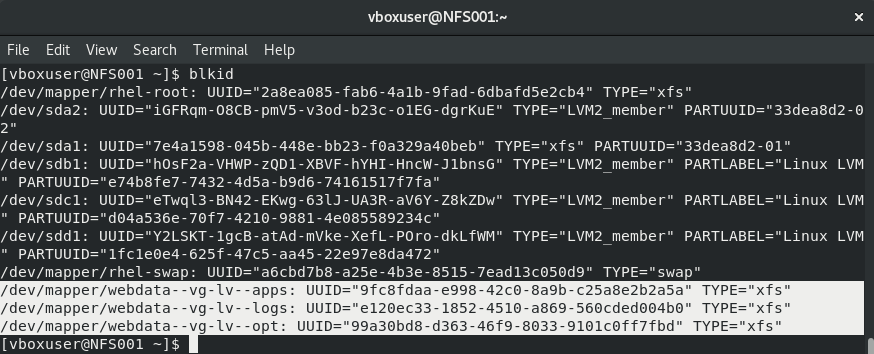

  - Populate `fstab` with the necessary details

  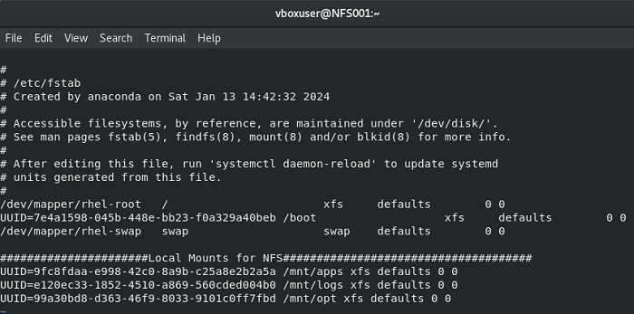

**Step 5: Install NFS Server, configure it to start on reboot, and ensure it is up and running**

```
sudo yum -y update
sudo yum install nfs-utils -y
sudo systemctl start nfs-server.service
sudo systemctl enable nfs-server.service
sudo systemctl status nfs-server.service
```


**Step 6: Set permissions that will allow the Web Servers to read, write, and execute files on the NFS Server by running these sets of commands**

```
sudo chown -R nobody: /mnt/apps
sudo chown -R nobody: /mnt/logs
sudo chown -R nobody: /mnt/opt

sudo chmod -R 777 /mnt/apps
sudo chmod -R 777 /mnt/logs
sudo chmod -R 777 /mnt/opt

sudo systemctl restart nfs-server.service
```
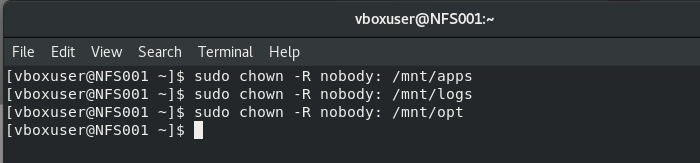

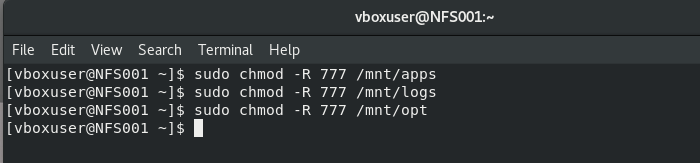

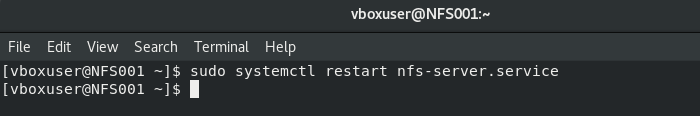

**Step 7: Configure access to NFS for clients within the same subnet by running the following commands**

*For this project, the subnet cidr for the Web Servers and the NFS Server is `10.19.0.0/24`*

```
sudo vi /etc/exports

/mnt/apps <Subnet-CIDR>(rw,sync,no_all_squash,no_root_squash)
/mnt/logs <Subnet-CIDR>(rw,sync,no_all_squash,no_root_squash)
/mnt/opt <Subnet-CIDR>(rw,sync,no_all_squash,no_root_squash)
```
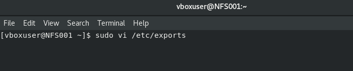

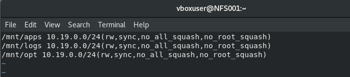

- Save the changes to the file, then run the following command `sudo exportfs -arv`

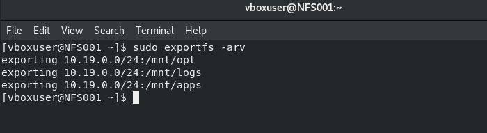

- Check which ports are being used by NFS by running the command `rpcinfo -p | grep nfs`

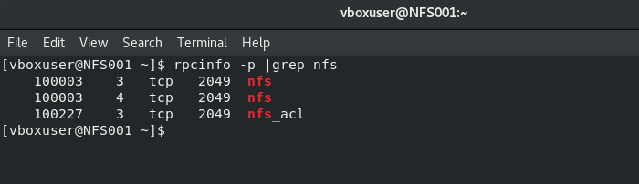

- Open the above ports by adding firewall rules to allow the NFS Server to be accessible from the clients. It's important to open ports `TCP 111`, `UDP 111`, and `UDP 2049`, in addition to `TCP 2049`. The steps to do this are as follows:

    - Create a new zone to accommodate this configuration by running the command `sudo firewall-cmd --new-zone=special --permanent`, and reload the firewall confirguration by running `sudo firewall-cmd --reload`

    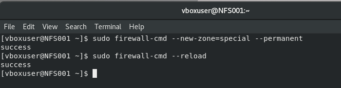

    - Add the source ip/cidr to the firewall rule by running the command `sudo firewall-cmd --zone=special --permanent --add-source=10.19.0.0/24`

    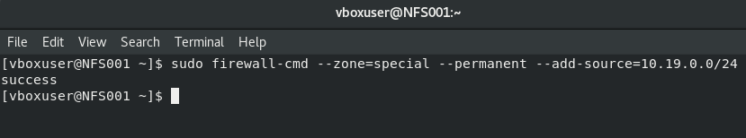

    - Add the various ports to the firewall rule by running the `sudo firewall-cmd --zone=special --permanent --add-port=111/tcp` and other commands accordingly.

    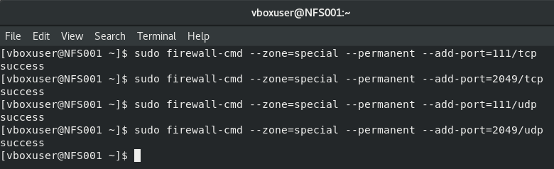

    - Reload the firewall confirguration by running `sudo firewall-cmd --reload`

    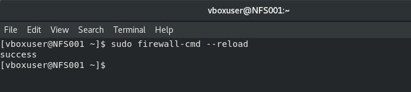

    - Check if our new zone is now active with the rules in place by running the command `sudo firewall-cmd --zone=special --list-all`

    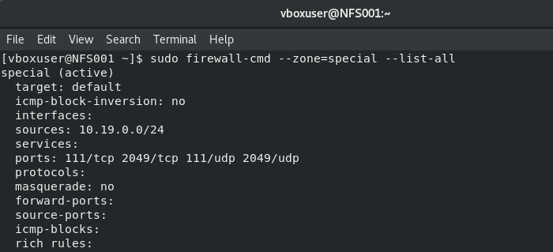


### Configuring a Backend Database as Part of the 3-Tier Architecture

To install and configure a MySQL DBMS on our Database Server to work with the remote Web Servers, we need to do the following:

**Step 1: Install MySQL Server on the Database Server**

- First thing to do is to update the Ubuntu DB Server by running the `sudo apt update` command

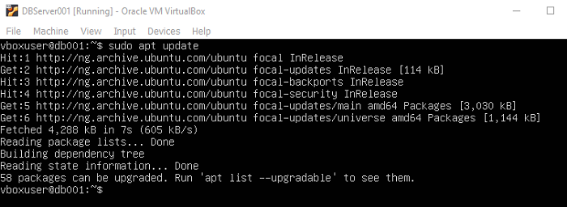

- Then we can run the `sudo apt install mysql-server -y` command

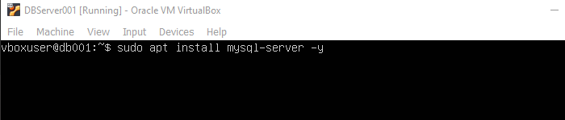

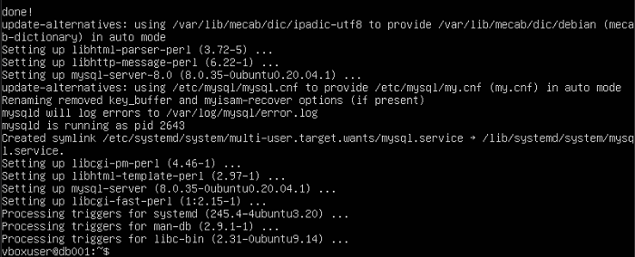

*Step 2: Create a database and name it `tooling`

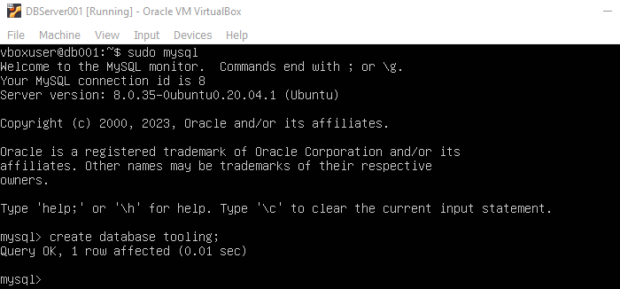

*Step 3: Create a database user and name it `webaccess` and grant it permission to the `tooling` database to do anything only from the webservers `subnet cidr` 

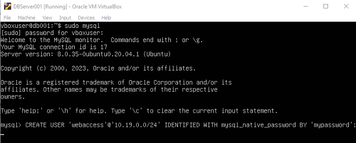

 - Confirm that the database has been created

 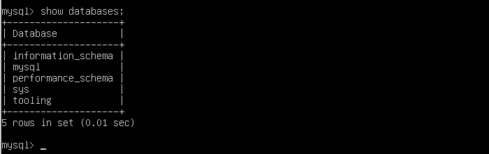

 ### Preparing the Web Servers

 We need to ensure that the Web Servers can share the same content from our shared storage solutions namely the NFS Server and the MySQL database. For storing the shared files to be used by the Web Servers, we'll use the NFS Server and mount the logical volume created earlier `lv-apps` to `/var/www` where Apache stores files that it serves to users.

 In this setup, our Web Servers are `stateless` - we can remove them or add new ones at anytime without affecting the integrity of the data on the NFS or in the database.

 Our steps are as follows:

 **Step 1: Configure the NFS Client on the Web Servers**

 - Install the NFS client on the Web Servers by running the command `sudo yum install nfs-utils nfs4-acl-tools -y`

 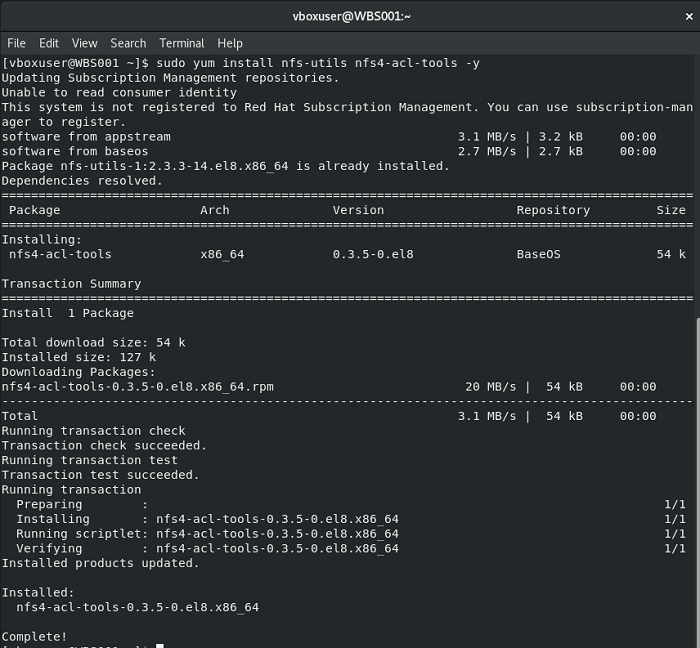

 **Step 2: Create the `/var/www` directory and mount the `/mnt/apps` directory from the NFS Server on it**

  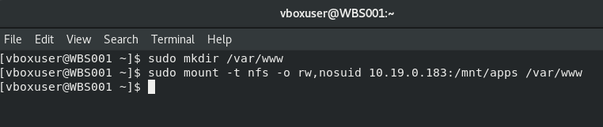

  **Step 3: Verify that the NFS was mounted by running the `df -h` command

  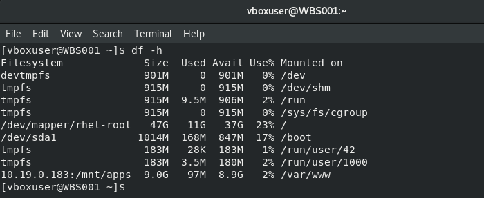

  **For WebServer002:**

  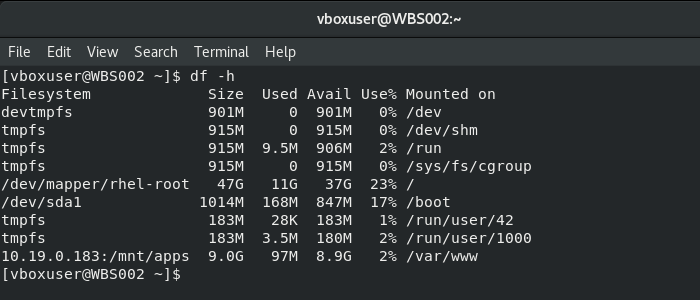

  **For WebServer003:**

  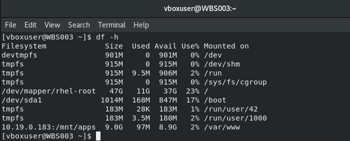

  **Step 3: Add the changes to `fstab` to ensure that they are persistent and will stay after reboot by running the command `sudo vi /etc/fstab` and adding the following line `<NFS-Server-Private-IP-Address>:/mnt/apps /var/www nfs defaults 0 0`**

  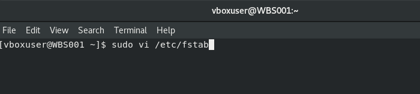

  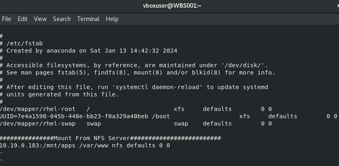

  **For WebServer002:**

  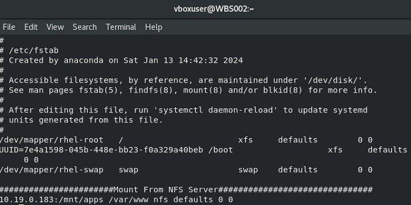
  
  **For WebServer003:**

  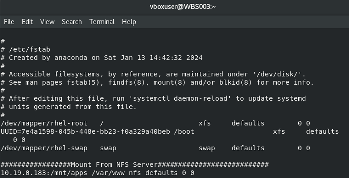

  **Step 4: Install Apache and PHP**

  Run the block of code below on the Web Servers to install Apache and PHP on them

  ```
  sudo yum install httpd -y

sudo yum install https://dl.fedoraproject.org/pub/epel/epel-release-latest-8.noarch.rpm

sudo yum module reset php

sudo yum install php php-opcache php-gd php-curl php-mysqlnd

sudo systemctl start php-fpm

sudo systemctl enable php-fpm

sudo systemctl status php-fpm

sudo setsebool -P httpd_execmem 1
  ```
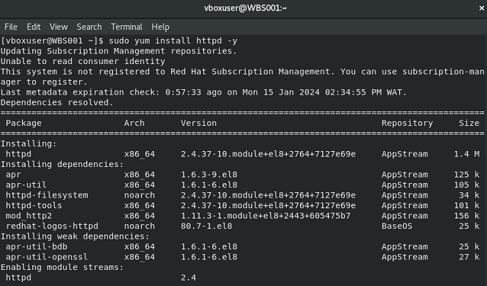

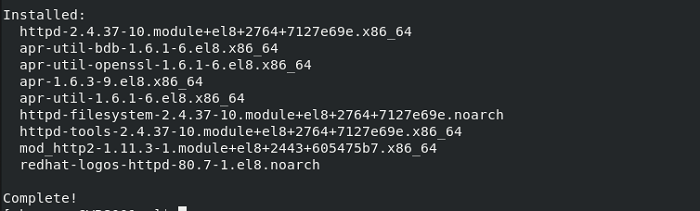

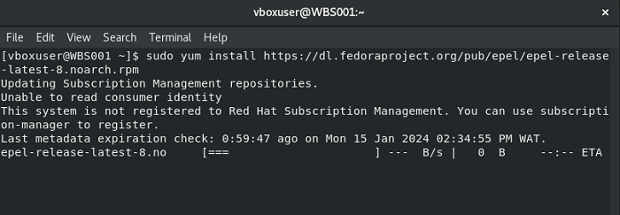

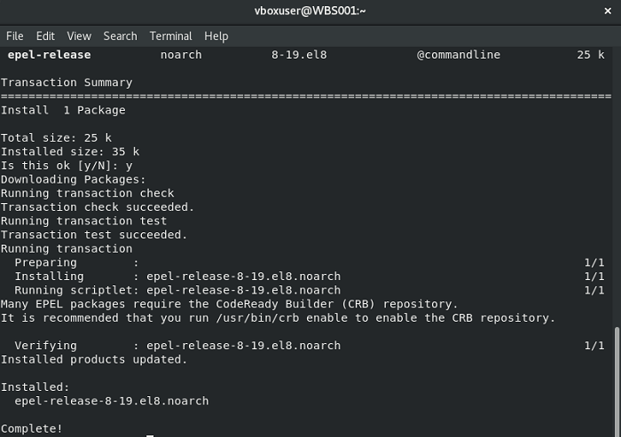

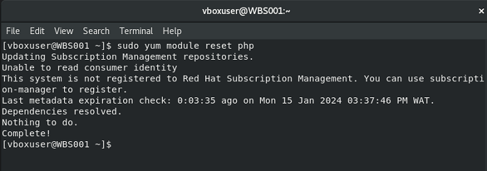

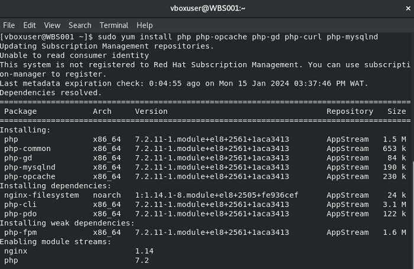

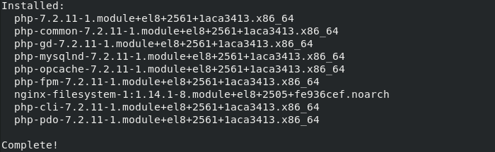

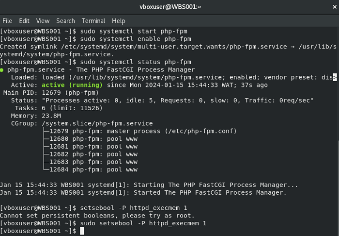

**For WebServer002:**

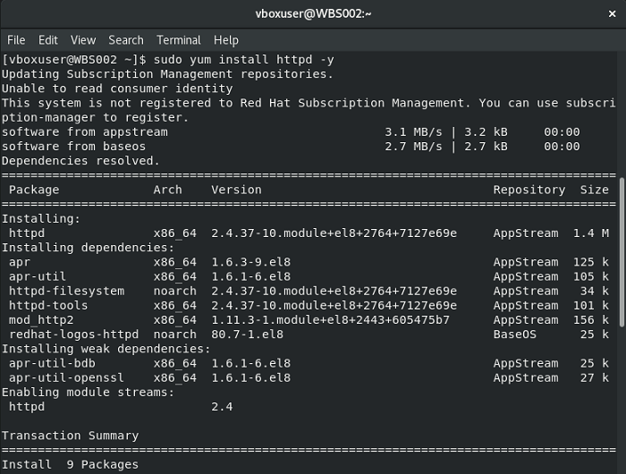

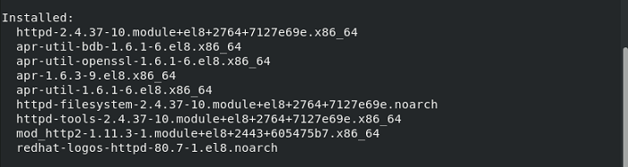

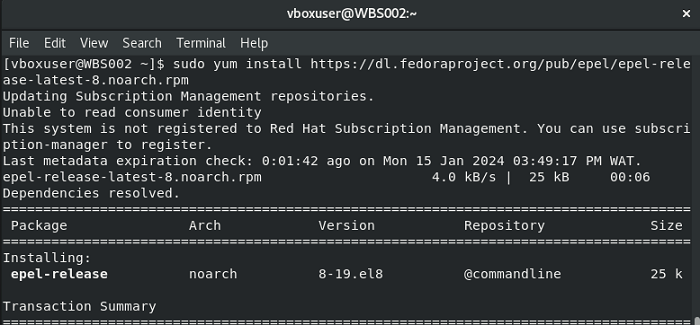

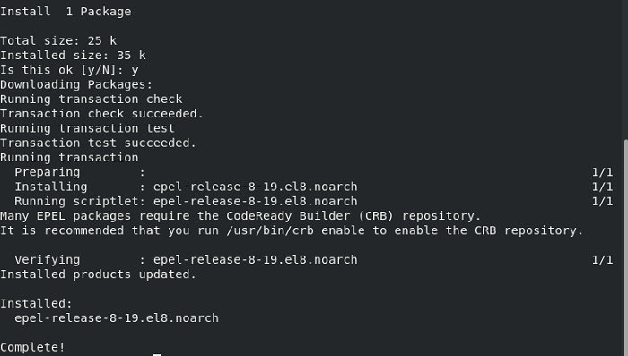

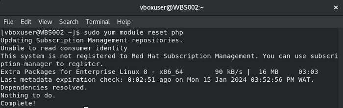

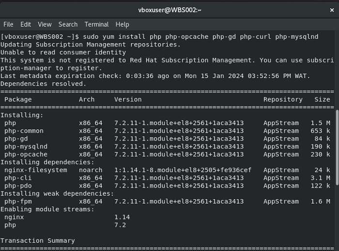

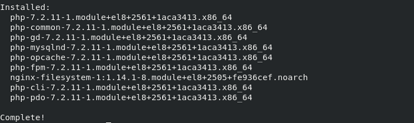


**For WebServer003:**

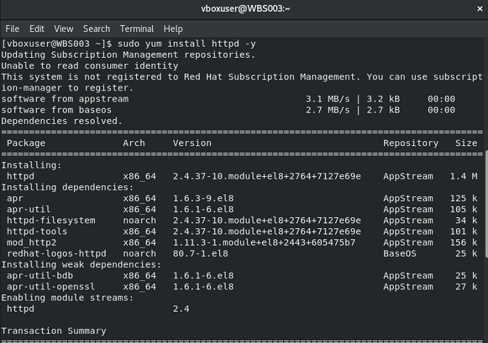

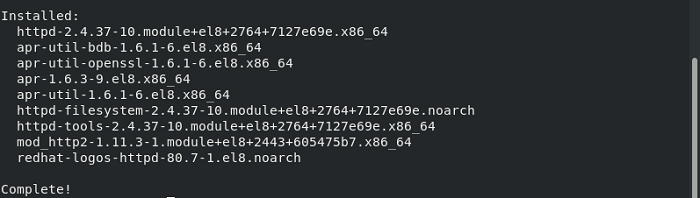

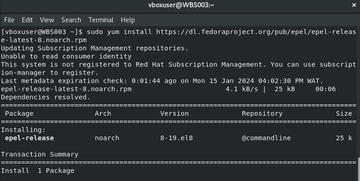

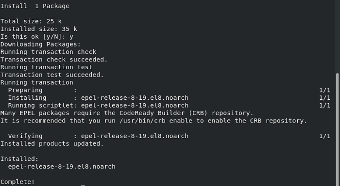

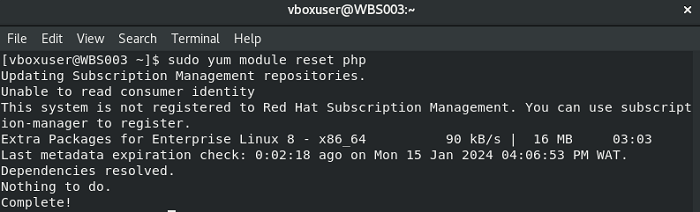

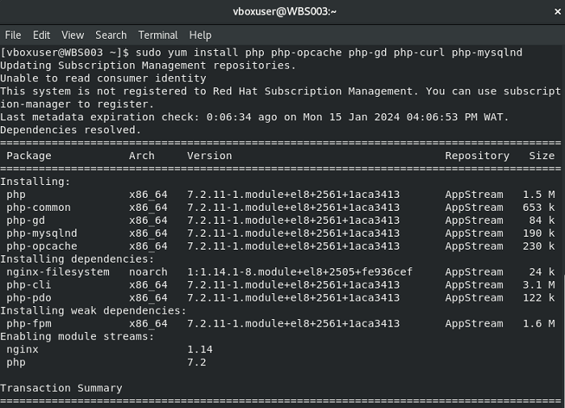


**Step 5: Confirm that the Apache files and directories are available in the Web Servers in the `/var/www` directory, and in the NFS Server in `/mnt/apps`**


**On WebServer02:**


**On WebServer03:**


**On NFS Server:**


**Step 6: Mount the `/mnt/logs` directory from the NFS Server on the `/var/log/httpd` directory of the Web Servers**


**On WebServer02:**


**On WebServer03:**


- Add the change to `fstab` to ensure that it is persistent and will stay after reboot


    


