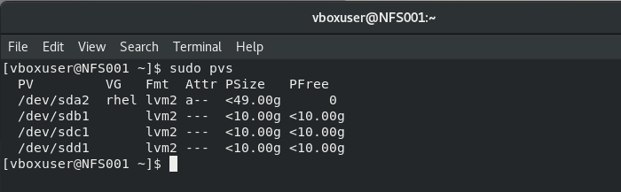

## Implementing a DevOps Tooling Website Solution

As a DevOps Engineer, it's important to know how to implement a tooling website solution that can allow easy and seamless access to DevOps tools within a corporate infrastructure.

For this project, our DevOps tooling website will be running on a 3-tier architecture, which is essentially a client-server architecture that separates the user interface (presentation layer), application processing (application layer), and data management (data layer) into three distinct tiers or layers. 

This DevOps tooling website will consist of the following tools:

1. [Jenkins](https://jenkins.io/) - this is an automation server used to build CI/CD pipelines. It is free and open source.

2. [Kubernetes](https://kubernetes.io/) - used for container orchestration. It is useful for automating computer application deployment, scaling, and management. It is also an open source software.

3. [Jfrog Artifactory](https://jfrog.com/artifactory/) - this is a Universal Repository Manager with support for all major packaging formats, build tools, and CI servers.

4. [Rancher](https://www.rancher.com/) - an open source software platform that allows organizations run and manage [Docker](https://www.docker.com/) and Kubernetes during production.

5. [Grafana](https://grafana.com/) - this is a multi-platform analytics and interactive visualisation web application. It is open source.

6. [Prometheus](https://prometheus.io/) - this is an open-source monitoring system that features a dimensional data model, flexible query language, efficient time-series database, and modern alert systems.

7. [Kibana](https://www.elastic.co/kibana) - this software allows users to visualize Elastic Search data and navigate the Elastic Stack.

The tooling components in this project will be running on the following infrastructure:

1. **Infrastructure**: Oracle VM VirtualBox

2. **Web Servers**: Red Hat Enterprise Linux 8

3. **Database Server**: Ubuntu 20.04 + MySQL

4. **Storage (NFS) Server**: Red Hat Enterprise Linux 8 + NFS Server

5. **Programming Language**: PHP

6. **Code Repository**: [GitHub](https://github.com/darey-io/tooling)

The diagram below shows a pictorial representation of the 3-tier architecture setup for this project:


The diagram above shows three (3) Web Servers sharing a common Database while at the same time having access to a Network File System (NFS) Server as a shared file storage. Even though the NFS is situated on a completely separate hardware, it acts as a local file system through which the Web Servers can access the same files.

Our setup for this project includes three (3) Web Servers running on RHEL8, One (1) Storage Server running on RHEL8 with NFS Server installed, and one (1) Ubuntu Server (ubuntu 20.04) with MySQL installed, which is our Database Server. The diagram below shows the required systems:


### Implementing a Website using NFS for the Backend File Storage

To prepare our NFS Server for the tooling solution, we'd need to do the following:

**Step 1: Create three (3) Virtual Hard Disks of 10GiB each named xvdf.vdi, xvdg.vdi, and xvdh.vdi in the Hard Disk Selector panel of Oracle VM VirtualBox Manager**


**Step 2: Add the Virtual Hard Disks that were created in the last step to the NFS Server Virtual Machine**


**Step 3: Launch the NFS Server machine**


**Step 4: Configure LVM on the NFS Server**

- Run the `lsblk` command to check the block devices attached to the NFS Server (NFS001)**


- Use the `df -h` command to see all mounts and free space on the Server


- Create a single partition on each of the three (3) disks using the `gdisk` utility


- Use the `lsblk` command to view the newly-configured partitions on the disks


- Run `sudo lvmdiskscan` command to check for available partitions


- Mark each of the three partitions as Physical Volumes (PVs) to be used by LVM by running the command `sudo pvcreate /dev/partition`


- Confirm that the PVs have been created by running the command `sudo pvs`



- Add all 3 Physical Volumes (PVs) to a Volume Group (VG) named `webdata-vg` by running the command `sudo vgcreate webdata-vg /dev/sdb1 /dev/sdc1 /dev/sdd1`


- Check if the VG has been successfully created, by running the command `sudo vgs`


- Create three (3) logical volumes `lv-apps`, `lv-logs`, and `lv-opt` by running the `sudo lvcreate` command


- Verify that the Logical Volume (LV) has been created successfully by running `sudo lvs`


- Verify the complete setup by running the commands `sudo vgdisplay -v` and `sudo lsblk`


- Format the Logical Volumes to the `xfs` filesystem by running the command `sudo mkfs -t xfs <path to logical volume>`


- Create mount points `/mnt/apps`, `/mnt/logs`, and `/mnt/opt` on `/mnt` using the `mkdir` command as follows:

```
sudo mkdir /mnt/apps
sudo mkdir /mnt/logs
sudo mkdir /mnt/opt
```


- Mount the created mount points as follows:

```
sudo mount /dev/webdata-vg/lv-apps /mnt/apps
sudo mount /dev/webdata-vg/lv-logs /mnt/logs
sudo mount /dev/webdata-vg/lv-opt /mnt/opt
```


**Step 5: Install NFS Server, configure it to start on reboot, and ensure it is up and running**

```
sudo yum -y update
sudo yum install nfs-utils -y
sudo systemctl start nfs-server.service
sudo systemctl enable nfs-server.service
sudo systemctl status nfs-server.service
```


