## Implementing Ansible Configuration Management: Ansible-Automate Project

This project aims to give us a better appreciation of DevOps tools by using Ansible Configuration Management to automate a lot of our routine tasks. We'll be automating our processes from Project 7 to 10 and writing code using `YAML`.

For this project, our architecture will include:

- Jump Server (Bastion Host), which is essentially an intermediary server that provides access to an internal network. It shields the servers within the internal network against direct access from the internet or through direct `SSH` connections. This will also be our Ansible Client where we'll be running Playbooks.   

- Two (2) Web Servers

- One (1) Database Server

- One (1) NFS Server

- One (1) Load Balancer Server 

Our architecture will be running on the following infrastructure components:

1. **Infrastructure**: Oracle VM VirtualBox

2. **Jenkins/Ansible Server**: Ubuntu 20.04 + Jenkins + Ansible

3. **Web Servers**: Red Hat Enterprise Linux 8

4. **Database Server**: Ubuntu 20.04 + MySQL

5. **Storage (NFS) Server**: Red Hat Enterprise Linux 8 + NFS Server

6. **Load Balancer**: Ubuntu 20.04 + Nginx

7. **GitHub**: For creating our repository

8. **Visual Studio Code**: For preparing our development environment

### Install and Configure a Jenkins/Ansible Server

With our Jenkins/Ansible server (JAN001) already installed and running Ubuntu 20.04, we can go ahead to install Jenkins on the server as follows:

**Step 1: Install Java - a key requirement for Jenkins to work**

- Install the latest Java JRE by running the command `sudo apt install default-jre`

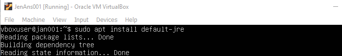

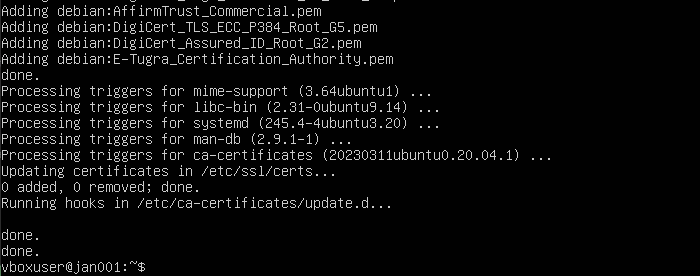

- To compile and run some specific Java-based software, we'll need to install Java JDK by running the command `sudo apt install default-jdk`

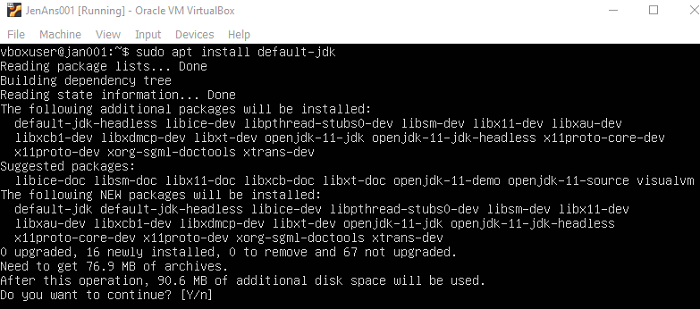

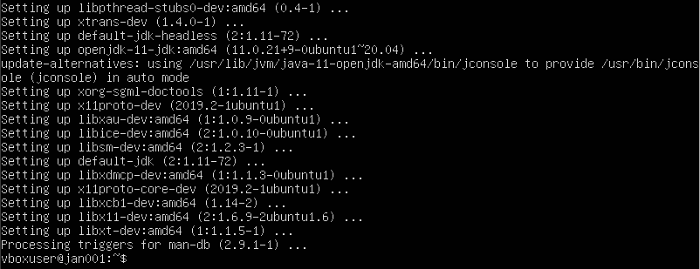

**Step 2: Install Jenkins**

To install Jenkins on `JAN001`, we'll need to do the following:

- Add the Jenkins repository key to the server by running the command `curl -fsSL https://pkg.jenkins.io/debian-stable/jenkins.io-2023.key | sudo tee /usr/share/keyrings/jenkins-keyring.asc > /dev/null`

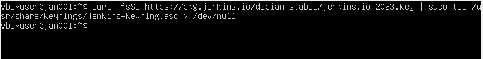

- Append the Debian package repository address to the Server's `sources.list` by running the command `echo deb [signed-by=/usr/share/keyrings/jenkins-keyring.asc] https://pkg.jenkins.io/debian-stable binary/ | sudo tee /etc/apt/sources.list.d/jenkins.list > /dev/null`

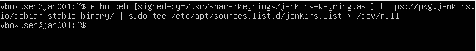

- Update the server by running the `sudo apt update` command


- Install Jenkins by running the `sudo apt install jenkins` command

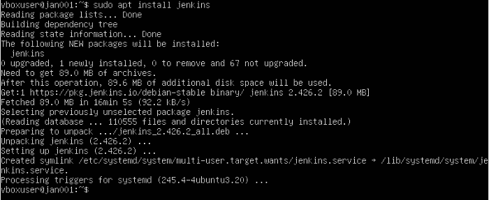

- Start Jenkins by running the command `sudo systemctl start jenkins` and check if Jenkins is running by using the command `sudo systemctl status jenkins`

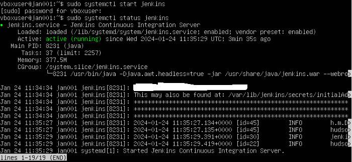

- Open up Jenkin's default port `8080` on the firewall by running the command `sudo ufw allow 8080`

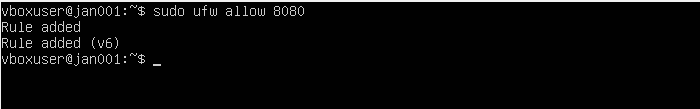

- Check firewall status by running the command `sudo ufw status`

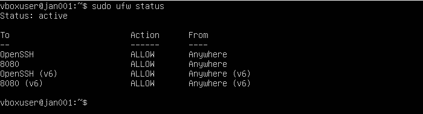

- Set up the Jenkins installation by visiting Jenkins using the domain name or IP address of `JAN001` along with port `8080`. For our server this will be `10.19.0.119:8080` This takes us to the `Unlock Jenkins` page


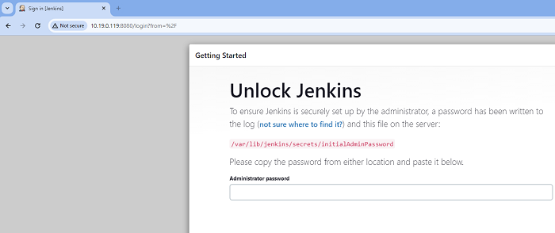

- Display the password in `JAN001` terminal by running the command `sudo cat /var/lib/jenkins/secrets/initialAdminPassword` 


- Copy the password from the terminal and paste it into the Administrator password field, then click Continue.

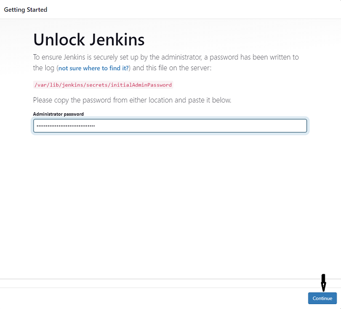

- Customize Jenkins by installing the suggested plugins

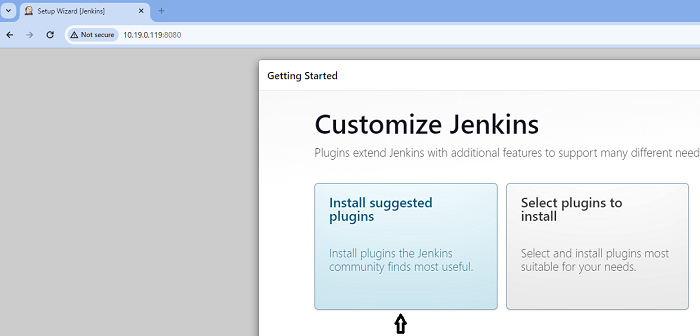

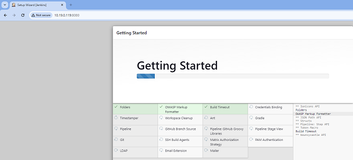

- Once the installation is complete, create the first administrative user by filling out the form with the necessary details, then click on `save and continue`

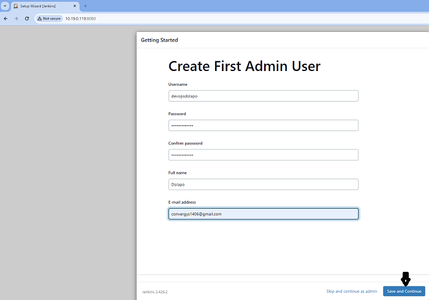

- On the `Instance Configuration` page, confirm the preferred URL for your Jenkins instance. Use either the domain name for your server or the server’s IP address, then click on `Save and Finish`

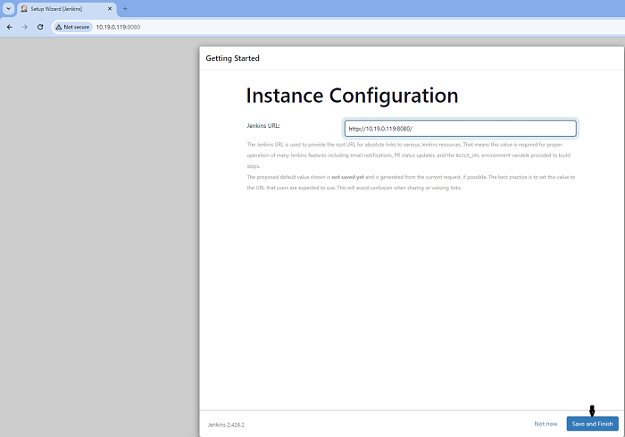

- After confirming the appropriate information, click Save and Finish. You’ll receive a confirmation page confirming that “Jenkins is Ready!”

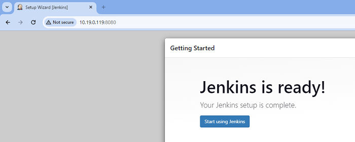

- Click on `Start using Jenkins` to visit the main Jenkins dashboard:

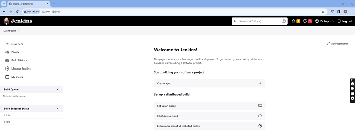

**Step 3: Install and Configure Ansible on the Jenkins/Ansible Server**

- Create a new repository called `ansible-config-mgt` in GitHub

    - Login into GitHub and go to the repositories page. Click on `New` on the right hand side of the page.

    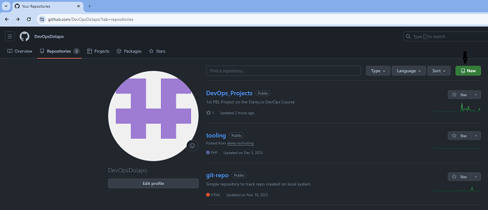

    - On the `Create a new repository` page, fill in all the details for the new repository and click on `Create repository` at the bottom of the page

    

    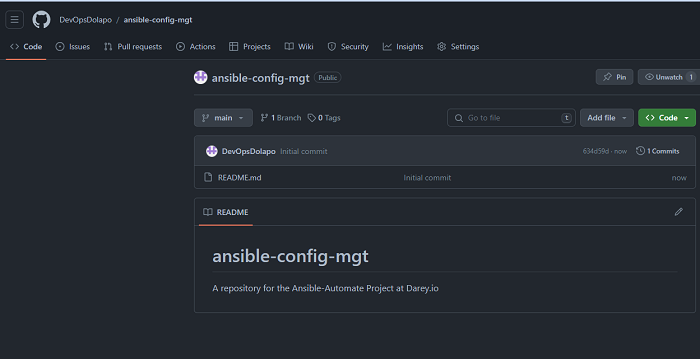

- Install Ansible in `JAN001` by running the commands `sudo apt update` and `sudo apt install ansible`

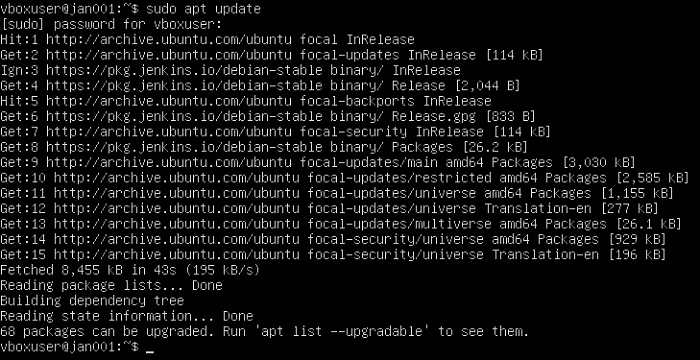

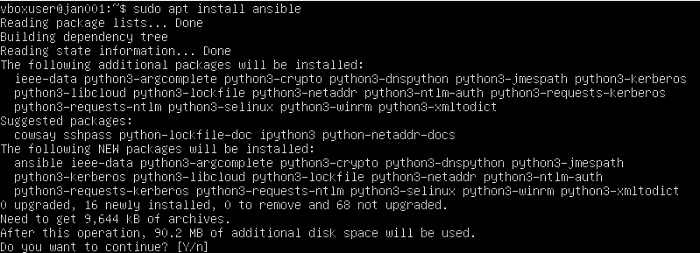

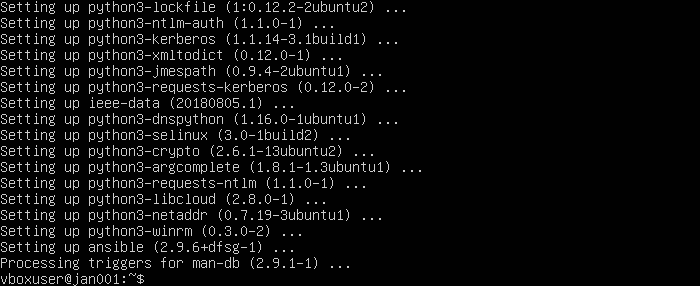

- Check the version of Ansible running by using the command `ansible --version`

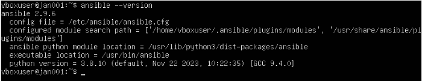

At this stage, the setup looks like this:

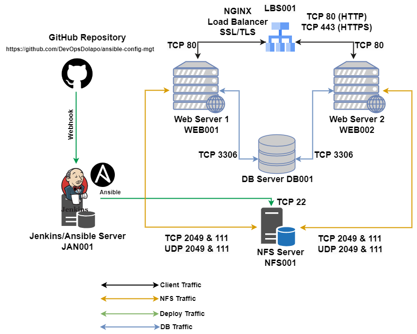

**Step 4: Configure a Jenkins Build Job to Archive the `ansible-config-mgt` Repository**

This job archives the repository content every time a change is made to it.

- Create a new Freestyle project `ansible` in Jenkins and connect it to the `ansible-config-mgt` repository

    - Login into Jenkins and click on `Create a job` in the dashboard

    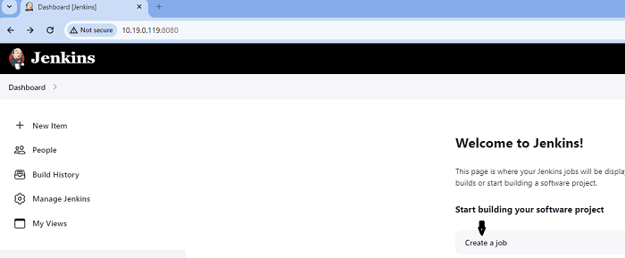

    - Fill in the name of the job - `ansible`, select on `Freestyle project` and click on `OK`

    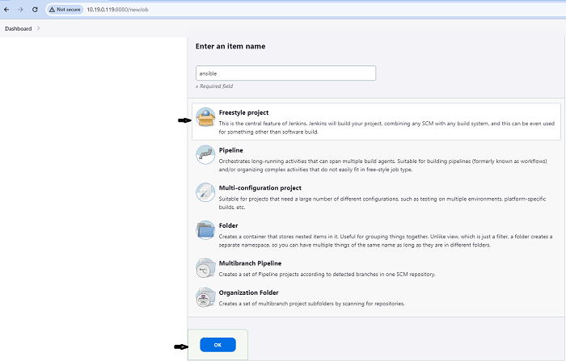

    - Copy the URL of the `ansible-config-mgt` repository from GitHub, then select `Git` under `Source Code Management` in Jenkins and add the URL

    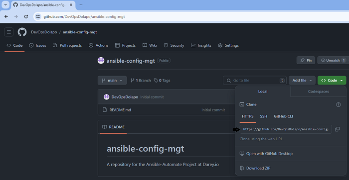

    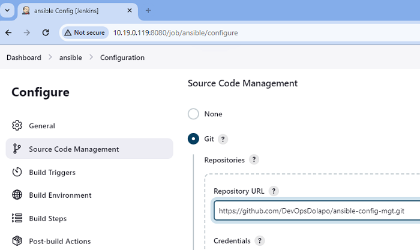

    - Under the `Branches to build` section, change the Branch specifier to `main`

    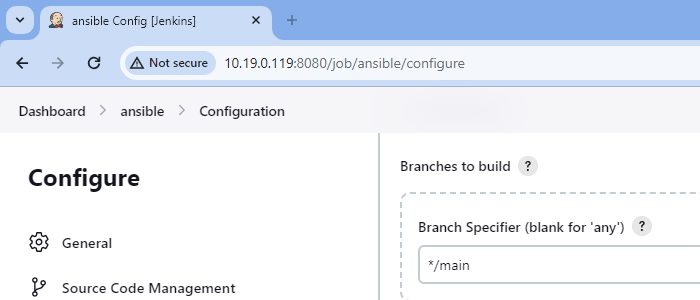

    - Scroll down to `Build Triggers` and click on `GitHub hook trigger for GITScm polling`

    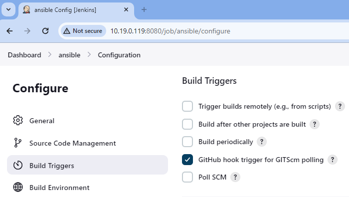

    - Configure a webhook in GitHub and set the webhook to trigger the `ansible` build. Go to `Settings`, then `Webhooks` and `Add webhook`

    

    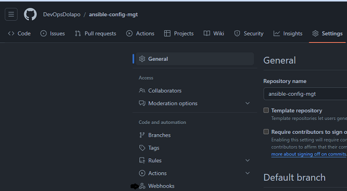

    

    - Under `Payload URL` option, add the `<jenkins_url:8080/github-webhook`. Set `Content type` to `application/json`, and click on `Add webhook` at the bottom of the page.

    *Note: Due to the fact that my setup was on VirtualBox and behind my router firewall, numerous attempts to configure a Webhook from GitHub to Jenkins failed. I had to install a software called `ngrok` on the Jenkins/Ansible Server, which generated a Public IP that GitHub could reach. Also, I had to employ a new set of IPs to work with the current configuration. My Jenkins/Ansible Server is now running on `192.168.0.2:8080`*

    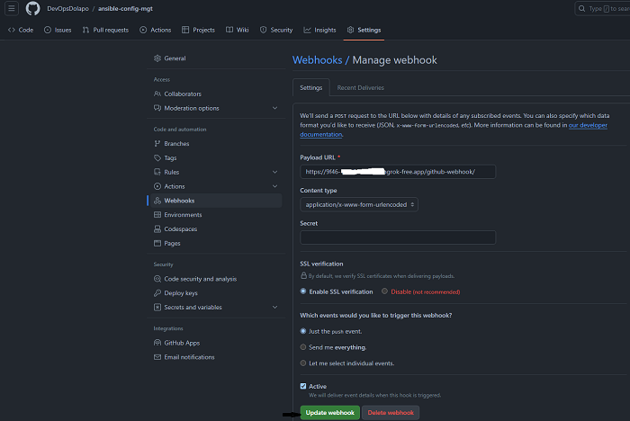

    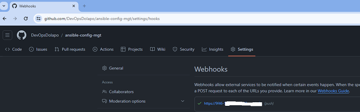

    - Configure a post-build job to archive all artifacts by clicking on `Archive the artifacts` under the `Post-build actions` section. Enter `**` in the field then `Apply` and `Save`

    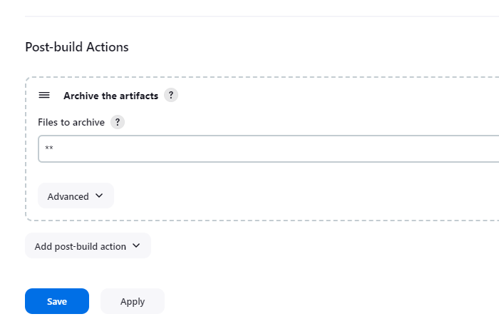

    - Click on `Build Now` to confirm if the setup is fine and check `Build History` for the result of our first build. 

    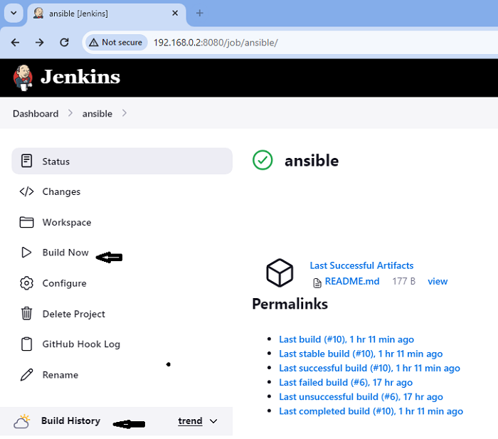

    

    - Test the setup by making some changes in the `README.md` file in the `main` branch on GitHub and ensure that the build starts automatically in Jenkins and the file is saved in the `/var/lib/jenkins/jobs/ansible/builds/<build_number>/archive/` directory on `JAN001`

    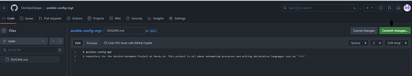

    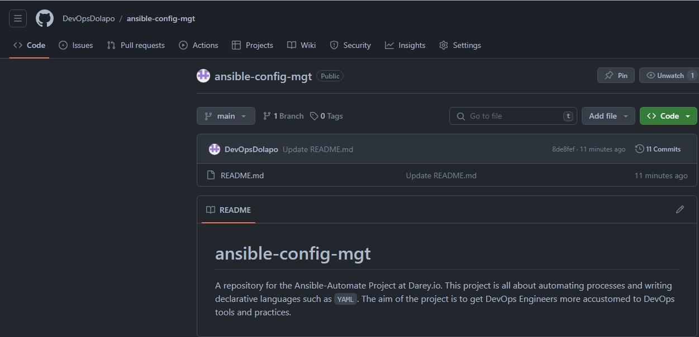

    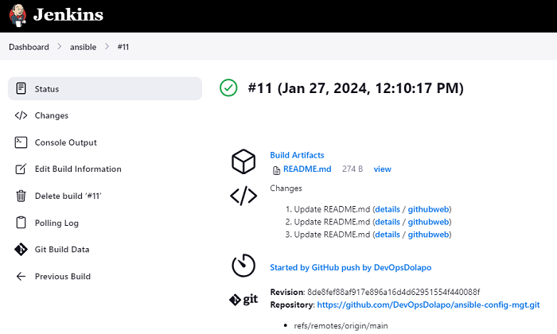

    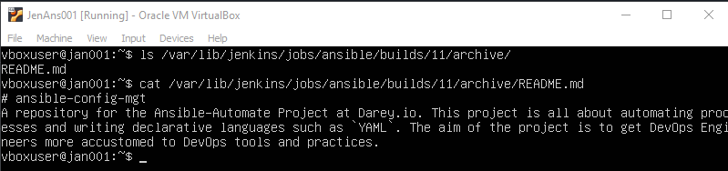

### Prepare a Development Environment using Visual Studio Code

Visual Studio Code is an integrated development environment (IDE) or Source Code Editor for writing and debugging code. To prepare our development environment using VS Code, we need to first install VS Code, then follow these steps:

**Step 1: Install `Remote Development` extension in VS Code**

- In VS Code, go to `Extensions` and search for `Remote Development`, then install it

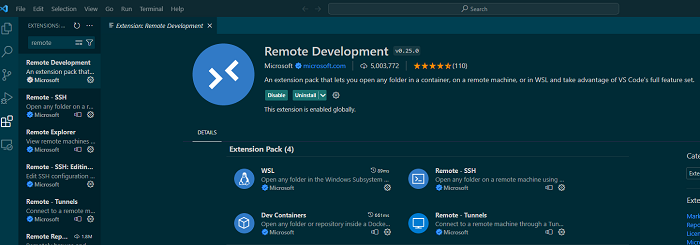

### Carry Out Ansible Development

To begin Ansible development, go through the following steps:

**Step 1: Clone the `ansible-config-mgt` repository from GitHub to VS Code**

- Click on `Clone Repository` in VS Code. Then click on the `Clone from GitHub` drop down that shows up just under the search box at the top of VS Code

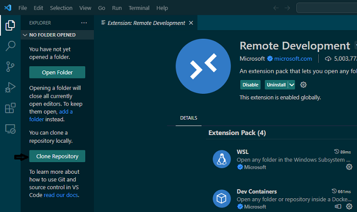

- Choose the repository you want to clone from the list

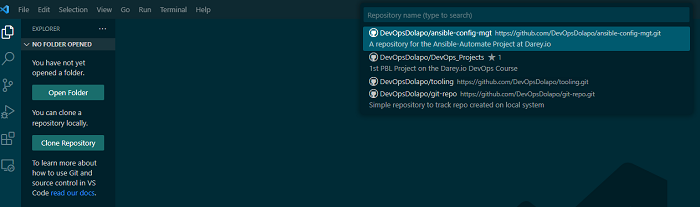

- Choose the repository location from the pop-up box


- The repository is cloned, and the system asks if you want to open it. Click Open

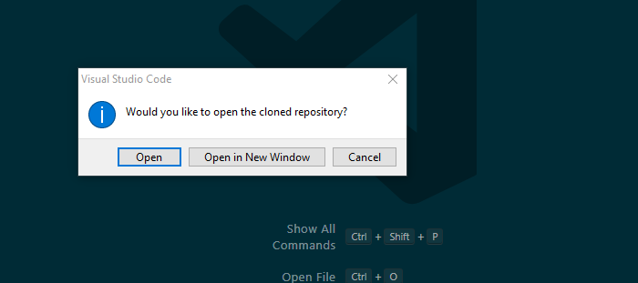

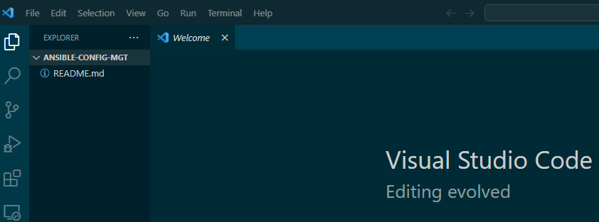

**Step 2: Create a new branch that would be used to develop new features**

- Go to the terminal on VS Code, and run the `git branch` command to confirm the current branch.

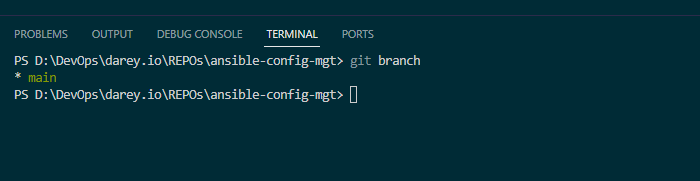

- Run `git status` to check the status of the current branch

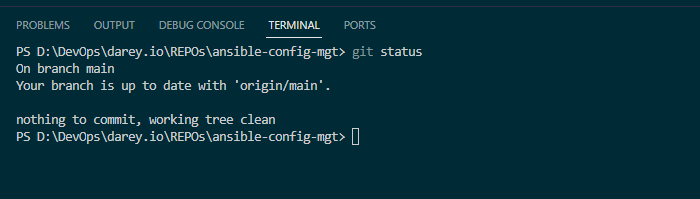

- Run `git checkout -b <new branch name>` to create a new branch

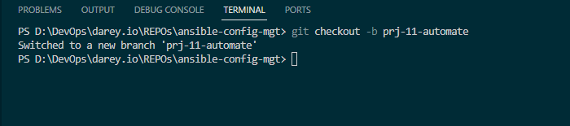

**Step 3: Create a directory `playbooks` in the new branch by running the `mkdir playbooks` command. The directory will be used to store the playbook files**

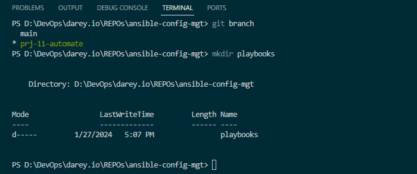

**Step 4: Create a directory `inventory` to organise the hosts, by running the `mkdir inventory` command**

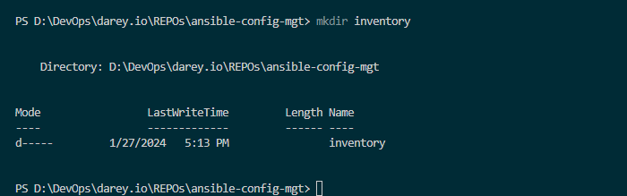

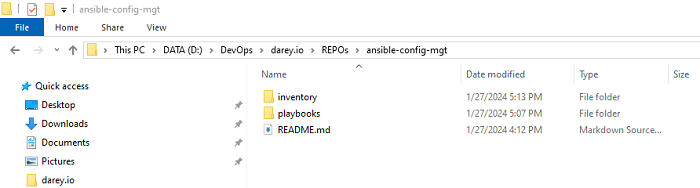

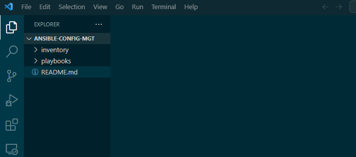

**Step 5: Create a playbook named `common.yml` inside the `playbooks` folder**

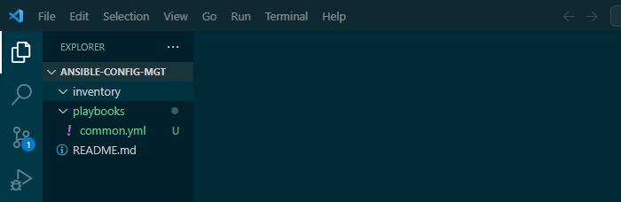

**Step 6: Create an inventory file for each environment (Development, Staging, Testing, and Production) named `dev`, `staging`, `uat`, and `prod`**

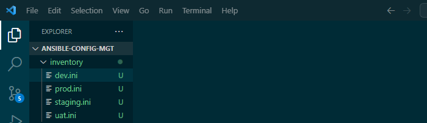

### Set Up an Ansible Inventory

An inventory is where we define the hosts and group of hosts where our playbook will be implementing its commands, tasks, and modules. By default, Ansible uses TCP port 22 so it has to `ssh` into our target servers from the `Jenkins/Ansible Server - JAN001`. For this to work, we'll need to implement the `ssh-agent` concept.

**Step 1: Generate the ssh keypair by running the command `ssh-keygen` on `JAN001`**

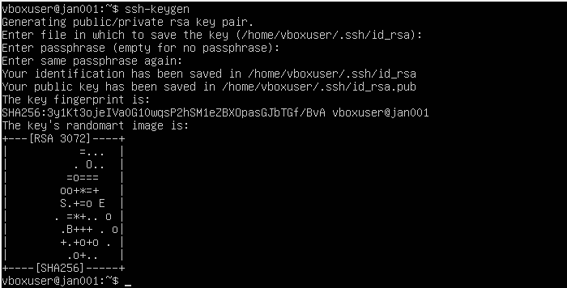

**Step 2: Run the following block of code to setup `ssh-agent`**

```
eval `ssh-agent -s`
ssh-add <path-to-private-key>
```
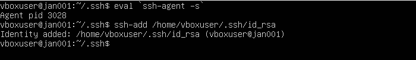

- Confirm the key has been added by running the command `ssh-add -l`


**Step 3: Transfer the public key from `JAN001` to all the other servers in the setup using the `ssh-copy-id` command. This configures `passwordless ssh` from the `Jenkins/Ansible Server` to all the other servers** 

- **For the LoadBalancer:**

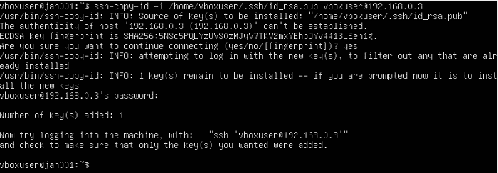

- Confirm that the key has been added

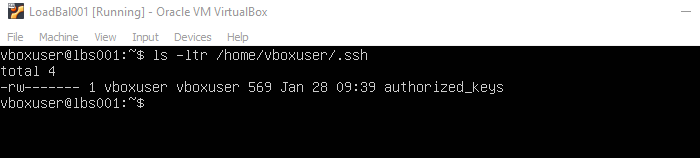

- **For the Database Server:**

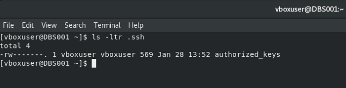

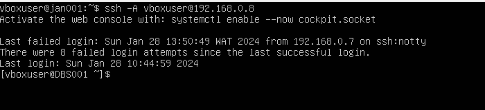

- **For the NFS Server:**

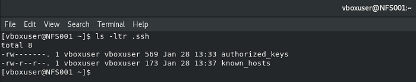

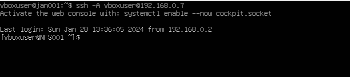

- **For WebServer001:**

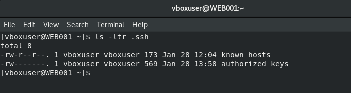

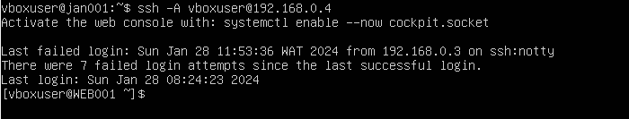

- **For WebServer002:**

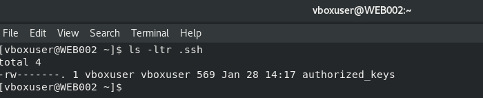

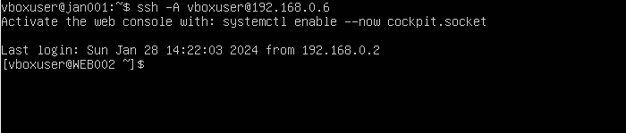

**Step 4: Connect the `Jenkins/Ansible Server - JAN001` to VS Code**

- Open the `Ansible-Config-Mgt` project on VS Code and navigate through `File > Open file` to the `ssh config` file at `C:/Users/Pumping!!!/.ssh/config`. This will open the config file in VS Code

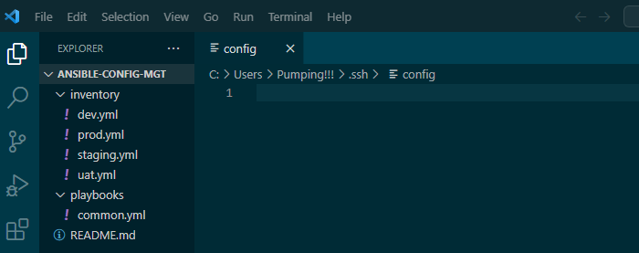

- Fill in the necessary details in the config file
```
Host #Any generic name
HostName #IP Address of the server we're trying to connect to
User #Username of the server account
ForwardAgent
```
- Save and click on the `Open a Remote Window` button at the bottom of the page

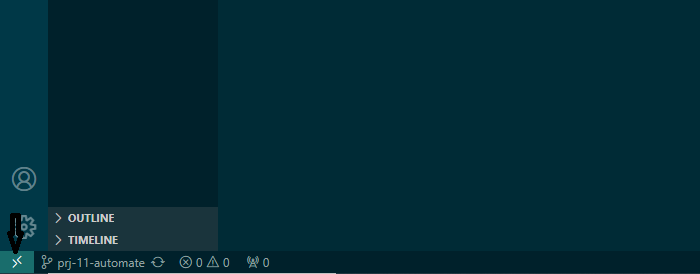

- From the pop-up, click on `Connect to host` and choose the name of the host you entered in the config file

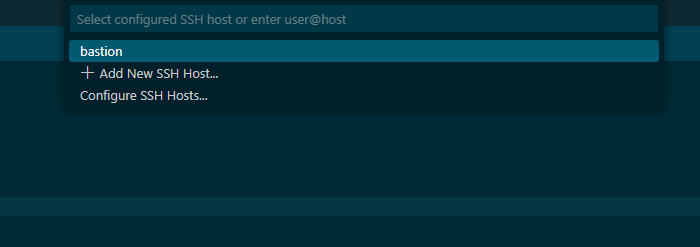

- Choose the platform (OS) of the host you're trying to connect to

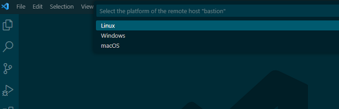

- Enter the user password and the system will connect

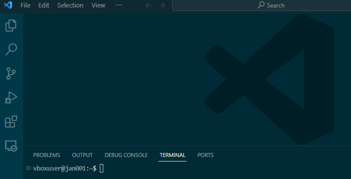

- Test if we can connect to one of the servers through `passwordless ssh`

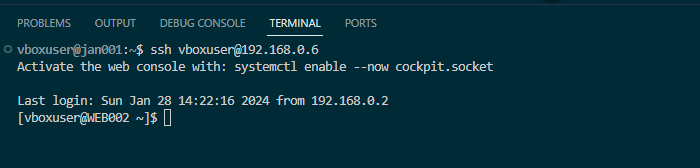

**Step 5: Update the `inventory/dev.yml` file**

- Edit the `dev.yml` file with the block of code below ensuring that the correct details are filled in

```
[nfs]
<NFS-Server-Private-IP-Address> ansible_ssh_user=ec2-user

[webservers]
<Web-Server1-Private-IP-Address> ansible_ssh_user=ec2-user
<Web-Server2-Private-IP-Address> ansible_ssh_user=ec2-user

[db]
<Database-Private-IP-Address> ansible_ssh_user=ec2-user 

[lb]
<Load-Balancer-Private-IP-Address> ansible_ssh_user=ubuntu
```
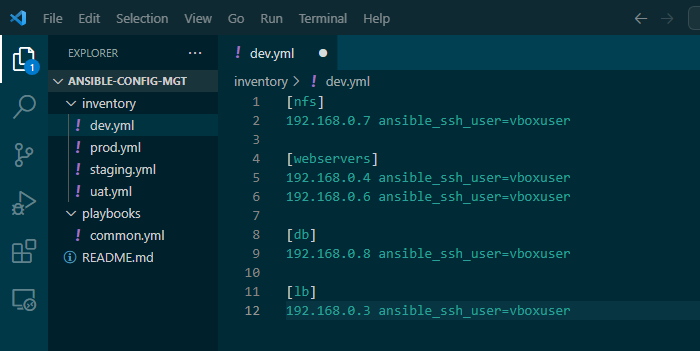

### Create a Common Playbook

We need to create a common playbook to give ansible instructions on the operations we want to perform on the servers in `dev.yml`. The multi-machine tasks in our playbook are common to systems within the infrastructure.

- Update the `playbooks/common.yml` file with the follow block of code

```
---
- name: update web, nfs and db servers
  hosts: webservers, nfs, db
  become: yes
  tasks:
    - name: ensure wireshark is at the latest version
      yum:
        name: wireshark
        state: latest
   

- name: update LB server
  hosts: lb
  become: yes
  tasks:
    - name: Update apt repo
      apt: 
        update_cache: yes

    - name: ensure wireshark is at the latest version
      apt:
        name: wireshark
        state: latest

```
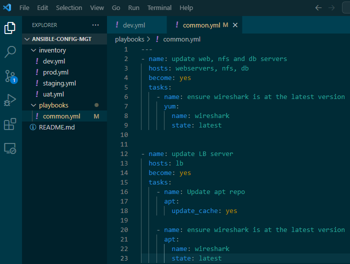

### Update GIT with the Latest Code

We need to push the recent changes we made locally to our `ansible-config-mgt` repository to GitHub

- Using the block of code below use git commands to add, commit, and push the branch to GitHub

```
git status

git add <selected files>

git commit -m "commit message"
```
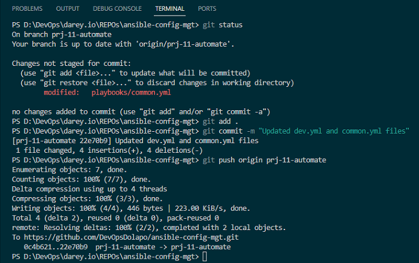

- Create a Pull request for `prj-11-automate` on GitHub

    - Go to the `ansible-config-mgt` repository on GitHub, then click on the button that says `Compare & pull request`

    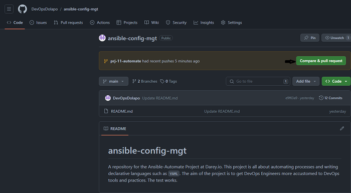

    - On the `Open a pull request` page, click on `Create a pull request` at the bottom of the page

    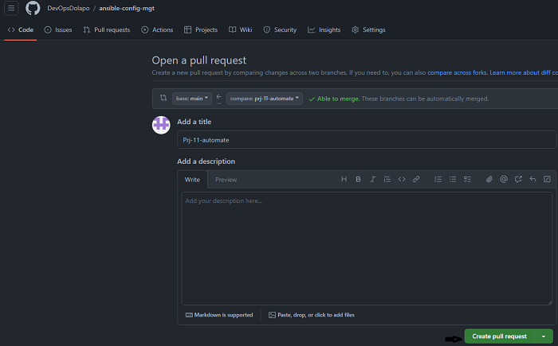

    - Click on `Merge pull request` on the next page

    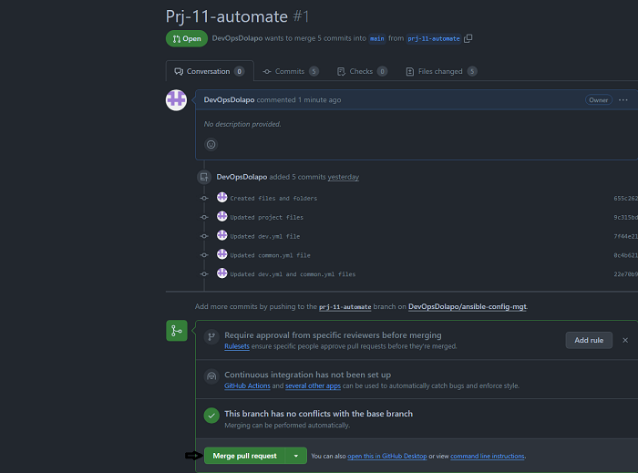

    - Click on `Confirm merge`

    

    - We should get a notification saying our Pull request is successful

    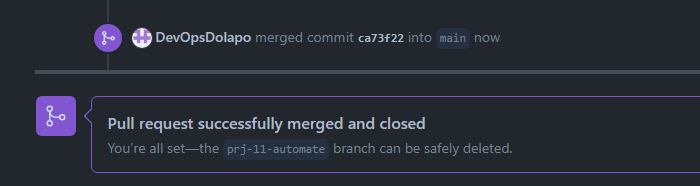

    - Checking on Jenkins to see if the changes made to our repository on VS Code is reflecting

    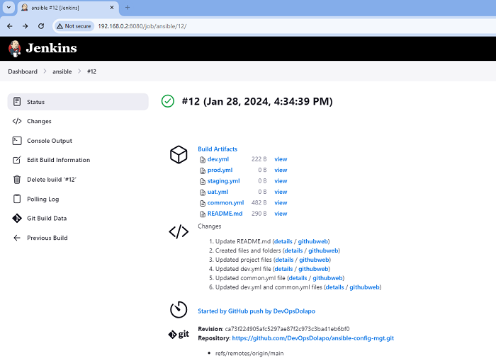

    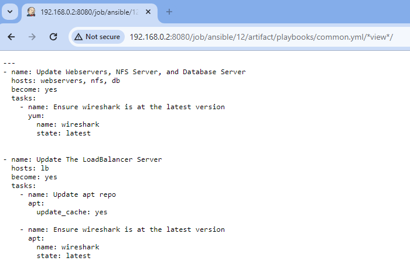

    - Further changes made to our files in the `ansible-config-mgt` repository on VS Code also reflect on Jenkins 

    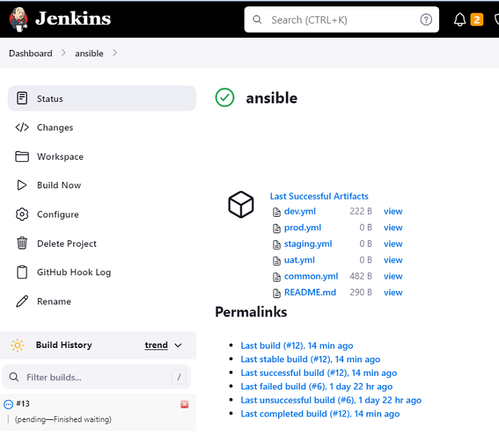

    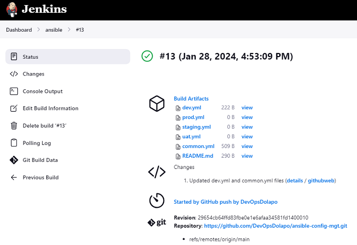

    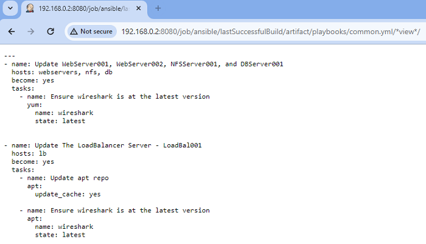

- Confirm if Jenkins has saved all the files (build artifacts) to the `/var/lib/jenkins/jobs/ansible/builds/<build_number>/archive/` directory on `JAN001`. We'll check in `Build 13` as shown in the last build on Jenkins web.

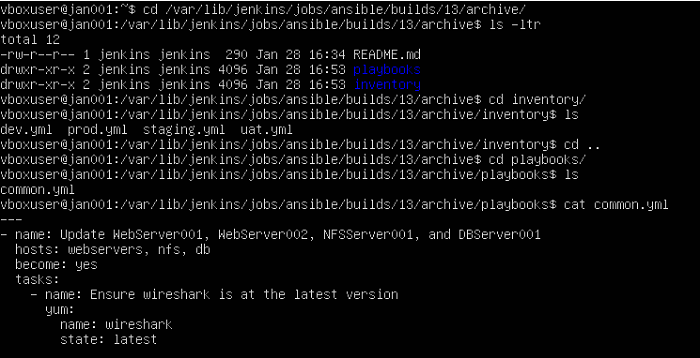

- Checkout from the current branch into the main branch and pull down all the changes into the main branch

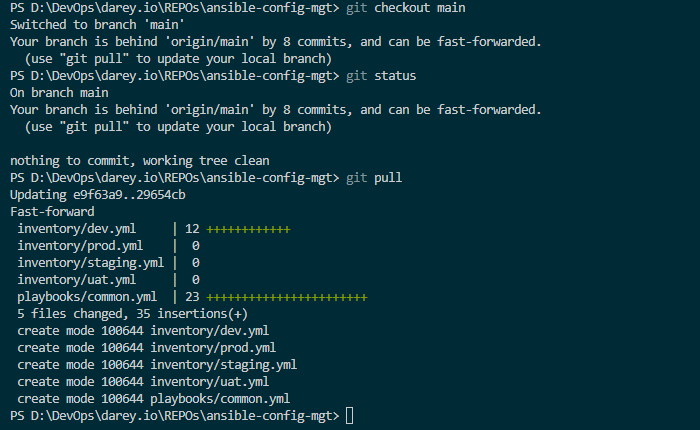

The complete setup looks like this:

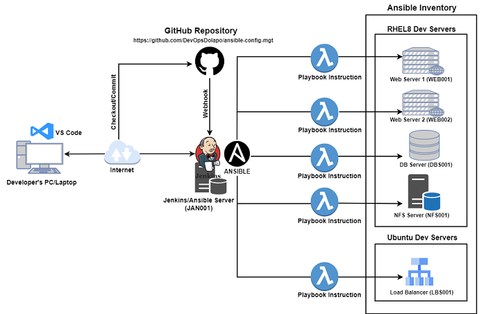

### Run Ansible Tests

Now we can run our first Ansible test by executing the `ansible-playbook` command to confirm that the playbook actually works. 

- Clone the `ansible-config-mgt` repository from GitHub to JAN001 by running the command `git clone <ansible-config-mgt repo link>`

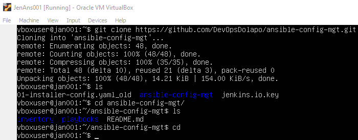

- Reconnect the `Jenkins/Ansible Server - JAN001` to VS Code

- Change Directory to `ansible-config-mgt`

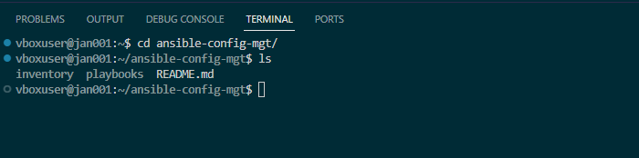

- Run the playbook using the command `ansible-playbook -i inventory/dev.yml playbooks/common.yml`

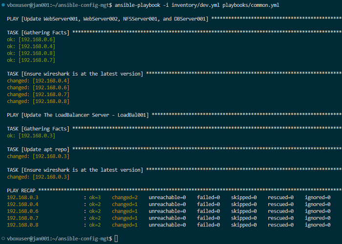

- Confirm that `wireshark` has been installed on the target servers

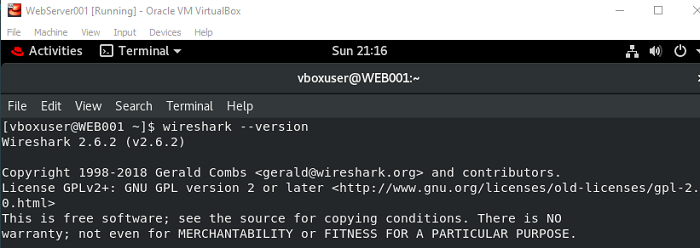

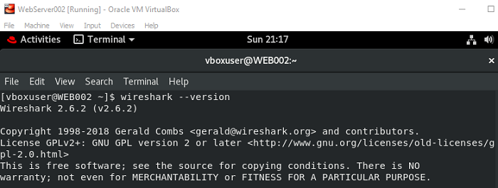

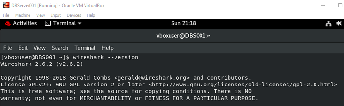

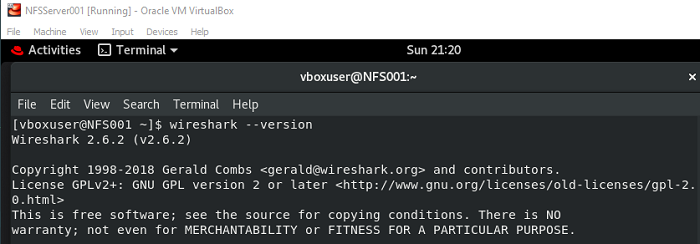

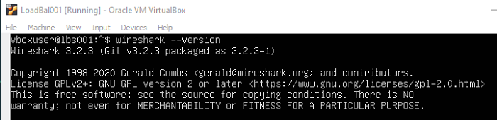

### Additional Ansible Task

Task to check firewall status on the servers. Created a playbook `firewall.yml` and populated with the following code on VS Code:
  ```
  ---
- name: Check Firewall Status on WebServer001, WebServer002, NFSServer001, and DBServer001
  hosts: webservers, nfs, db
  become: yes
  tasks:
    - name: Check firewall status on RHEL servers 
      command: "sudo systemctl status firewalld"
      register: firewall_status

    - name: Print firewall status
      debug:
        msg: "Firewall status on {{ inventory_hostname }} is {{ firewall_status.stdout }}"
   
- name: Check Firewall Status on LoadBalancer Server - LoadBal001
  hosts: lb
  become: yes
  tasks:
    - name: Check firewall status on Ubuntu server
      command: "sudo ufw status"
      register: firewall_status

    - name: Print firewall status
      debug:
        msg: "Firewall status on {{ inventory_hostname }} is {{ firewall_status.stdout }}"
  ```
- Running the `git status` command shows a recent update to the repository

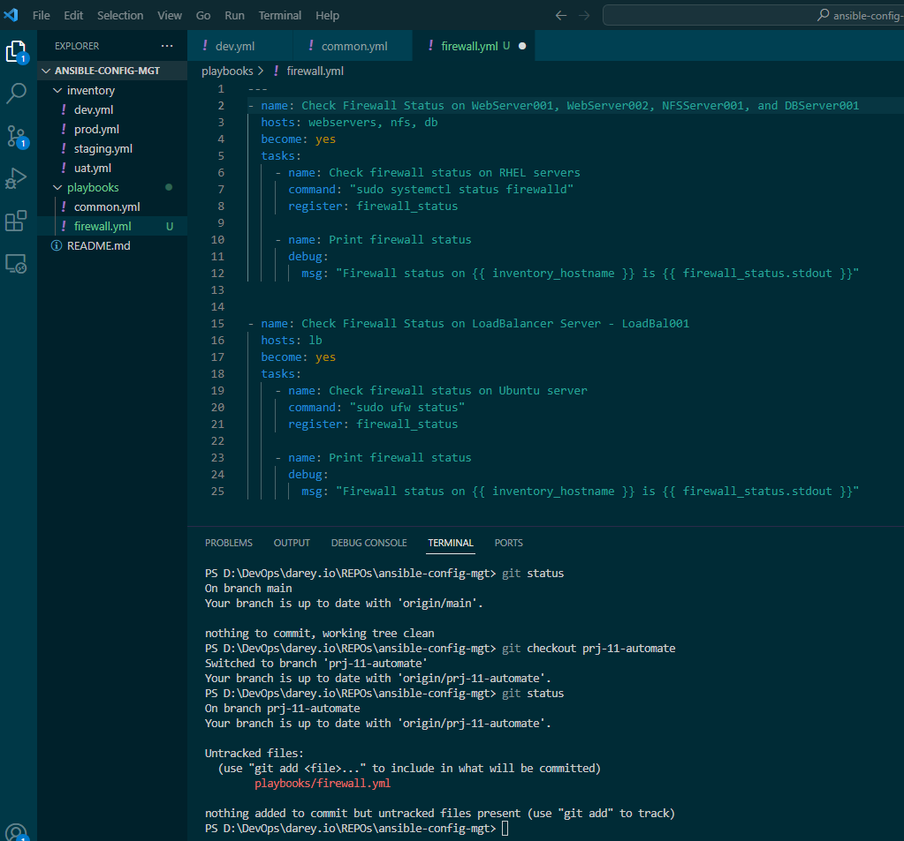