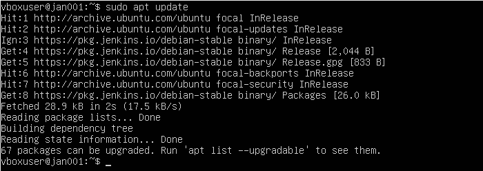
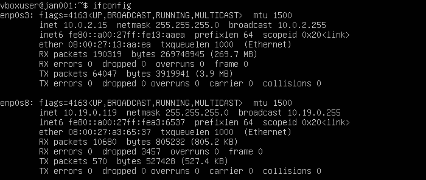
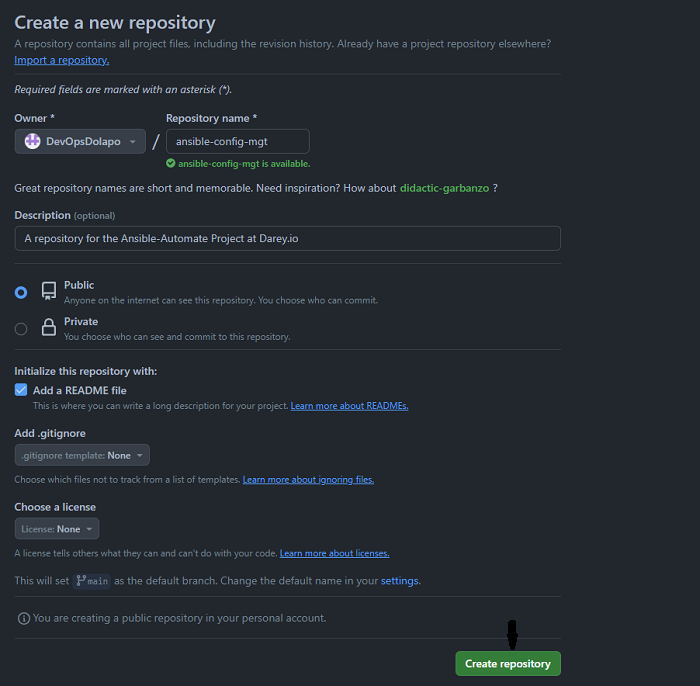
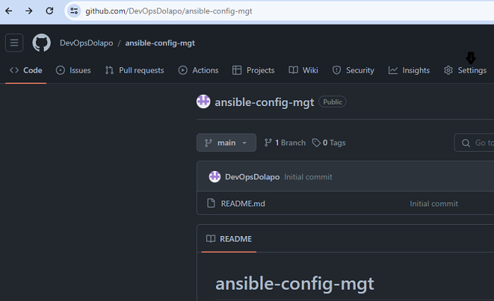
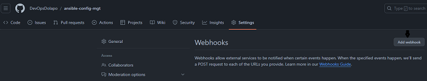
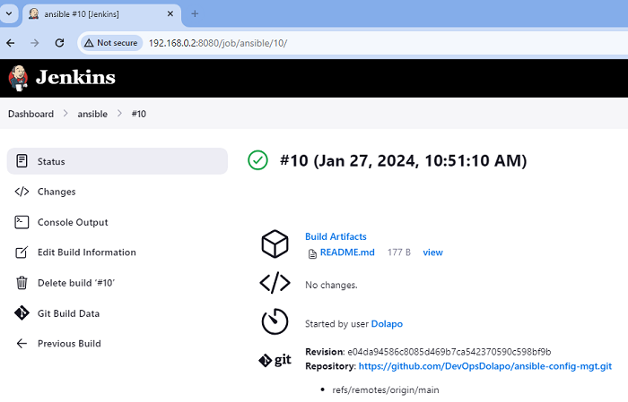
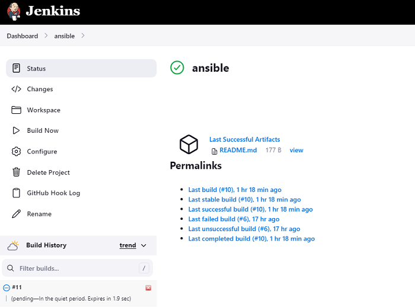
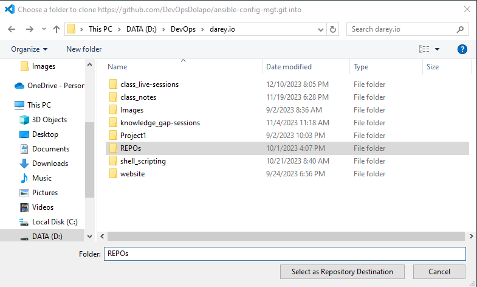
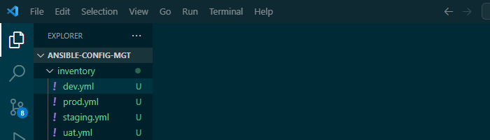

## Implementing Ansible Configuration Management: Ansible-Automate Project

This project aims to give us a better appreciation of DevOps tools by using Ansible Configuration Management to automate a lot of our routine tasks. We'll be automating our processes from Project 7 to 10 and writing code using `YAML`.

For this project, our architecture will include:

- Jump Server (Bastion Host), which is essentially an intermediary server that provides access to an internal network. It shields the servers within the internal network against direct access from the internet or through direct `SSH` connections. This will also be our Ansible Client where we'll be running Playbooks.   

- Two (2) Web Servers

- One (1) Database Server

- One (1) NFS Server

- One (1) Load Balancer Server 

Our architecture will be running on the following infrastructure components:

1. **Infrastructure**: Oracle VM VirtualBox

2. **Jenkins/Ansible Server**: Ubuntu 20.04 + Jenkins + Ansible

3. **Web Servers**: Red Hat Enterprise Linux 8

4. **Database Server**: Ubuntu 20.04 + MySQL

5. **Storage (NFS) Server**: Red Hat Enterprise Linux 8 + NFS Server

6. **Load Balancer**: Ubuntu 20.04 + Nginx

7. **GitHub**: For creating our repository

8. **Visual Studio Code**: For preparing our development environment

### Installing and Configuring a Jenkins/Ansible Server

With our Jenkins/Ansible server (JAN001) already installed and running Ubuntu 20.04, we can go ahead to install Jenkins on the server as follows:

**Step 1: Install Java - a key requirement for Jenkins to work**

- Install the latest Java JRE by running the command `sudo apt install default-jre`

- To compile and run some specific Java-based software, we'll need to install Java JDK by running the command `sudo apt install default-jdk`

**Step 2: Install Jenkins**

To install Jenkins on `JAN001`, we'll need to do the following:

- Add the Jenkins repository key to the server by running the command `curl -fsSL https://pkg.jenkins.io/debian-stable/jenkins.io-2023.key | sudo tee /usr/share/keyrings/jenkins-keyring.asc > /dev/null`

- Append the Debian package repository address to the Server's `sources.list` by running the command `echo deb [signed-by=/usr/share/keyrings/jenkins-keyring.asc] https://pkg.jenkins.io/debian-stable binary/ | sudo tee /etc/apt/sources.list.d/jenkins.list > /dev/null`

- Update the server by running the `sudo apt update` command

- Install Jenkins by running the `sudo apt install jenkins` command

- Start Jenkins by running the command `sudo systemctl start jenkins` and check if Jenkins is running by using the command `sudo systemctl status jenkins`

- Open up Jenkin's default port `8080` on the firewall by running the command `sudo ufw allow 8080`

- Check firewall status by running the command `sudo ufw status`

- Set up the Jenkins installation by visiting Jenkins using the domain name or IP address of `JAN001` along with port `8080`. For our server this will be `10.19.0.119:8080` This takes us to the `Unlock Jenkins` page

- Display the password in `JAN001` terminal by running the command `sudo cat /var/lib/jenkins/secrets/initialAdminPassword` 

- Copy the password from the terminal and paste it into the Administrator password field, then click Continue.

- Customize Jenkins by installing the suggested plugins

- Once the installation is complete, create the first administrative user by filling out the form with the necessary details, then click on `save and continue`

- On the `Instance Configuration` page, confirm the preferred URL for your Jenkins instance. Use either the domain name for your server or the server’s IP address, then click on `Save and Finish`

- After confirming the appropriate information, click Save and Finish. You’ll receive a confirmation page confirming that “Jenkins is Ready!”

- Click on `Start using Jenkins` to visit the main Jenkins dashboard:

**Step 3: Install and Configure Ansible on the Jenkins/Ansible Server**

- Create a new repository called `ansible-config-mgt` in GitHub

    - Login into GitHub and go to the repositories page. Click on `New` on the right hand side of the page.

    

    - On the `Create a new repository` page, fill in all the details for the new repository and click on `Create repository` at the bottom of the page

    

    

- Install Ansible in `JAN001` by running the commands `sudo apt update` and `sudo apt install ansible`

- Check the version of Ansible running by using the command `ansible --version`

**Step 4: Configure a Jenkins Build Job to Archive the `ansible-config-mgt` Repository**

This job archives the repository content every time a change is made to it.

- Create a new Freestyle project `ansible` in Jenkins and connect it to the `ansible-config-mgt` repository

    - Login into Jenkins and click on `Create a job` in the dashboard

    

    - Fill in the name of the job - `ansible`, select on `Freestyle project` and click on `OK`

    

    - Copy the URL of the `ansible-config-mgt` repository from GitHub, then select `Git` under `Source Code Management` in Jenkins and add the URL

    

    

    - Under the `Branches to build` section, change the Branch specifier to `main`

    

    - Scroll down to `Build Triggers` and click on `GitHub hook trigger for GITScm polling`

    

    - Configure a webhook in GitHub and set the webhook to trigger the `ansible` build. Go to `Settings`, then `Webhooks` and `Add webhook`

    

    

    

    - Under `Payload URL` option, add the `<jenkins_url:8080/github-webhook`. Set `Content type` to `application/json`, and click on `Add webhook` at the bottom of the page.

    *Note: Due to the fact that my setup was on VirtualBox and behind my router firewall, numerous attempts to configure a Webhook from GitHub to Jenkins failed. I had to install a software called `ngrok` on the Jenkins/Ansible Server, which generated a Public IP that GitHub could reach. Also, I had to employ a new set of IPs to work with the current configuration. My Jenkins/Ansible Server is now running on `192.168.0.2:8080`*

    

    

    - Configure a post-build job to archive all artifacts by clicking on `Archive the artifacts` under the `Post-build actions` section. Enter `**` in the field then `Apply` and `Save`

    

    - Click on `Build Now` to confirm if the setup is fine and check `Build History` for the result of our first build. 

    

    

    - Test the setup by making some changes in the `README.md` file in the `main` branch on GitHub and ensure that the build starts automatically in Jenkins and the file is saved in the `/var/lib/jenkins/jobs/ansible/builds/<build_number>/archive/` folder on `JAN001`

    

    

    

    

### Preparing a Development Environment using Visual Studio Code

Visual Studio Code is an integrated development environment (IDE) or Source Code Editor for writing and debugging code. To prepare our development environment using VS Code, we need to first install VS Code, then follow these steps:

**Step 1: Install `Remote Development` extension in VS Code**

- In VS Code, go to `Extensions` and search for `Remote Development`, then install it

- Clone the `ansible-config-mgt` repository from GitHub to JAN001 by running the command `git clone <ansible-config-mgt repo link>`

### Carry Out Ansible Development

To begin Ansible development, go through the following steps:

**Step 1: Clone the `ansible-config-mgt` repository from GitHub to VS Code**

- Click on `Clone Repository` in VS Code. Then click on the `Clone from GitHub` drop down that shows up just under the search box at the top of VS Code

- Choose the repository you want to clone from the list

- Choose the repository location from the pop-up box

- The repository is cloned, and the system asks if you want to open it. Click Open

**Step 2: Create a new branch that would be used to develop new features**

- Go to the terminal on VS Code, and run the `git branch` command to confirm the current branch.

- Run `git status` to check the status of the current branch

- Run `git checkout -b <new branch name>` to create a new branch

- Create a directory `playbooks` in the new branch by running the `mkdir playbooks` command. The directory will be used to store the playbook files.

- Create a directory `inventory` to organise the hosts, by running the `mkdir inventory` command

- Create a playbook named `common.yml` inside the `playbooks` folder

- Create an inventory file for each environment (Development, Staging, Testing, and Production) named `dev`, `staging`, `uat`, and `prod`

    

    

 