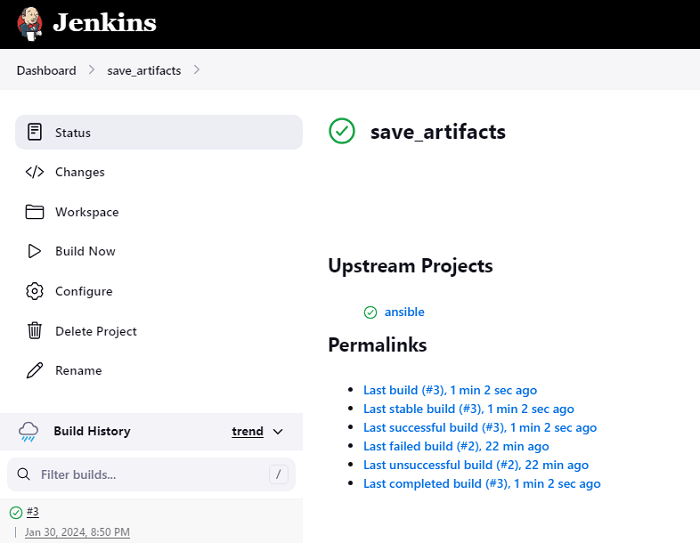

## Implementing Ansible Refactoring and Static Assignments

Code Refactoring means making changes to the source code without changing expected behaviour of the software. The main thrust of refactoring is to improve code readability, increase maintainability and extensibility, reduce complexity, add proper comments without affecting the logic. 

In this project, we'll move things around a little bit in the code, but the overall state of the infrastructure remains the same.

Our architecture will be running on the same infrastructure components as Project 11, but we'll be configuring two (2) more RHEL 8 servers as our UAT Webservers:

1. **Infrastructure**: Oracle VM VirtualBox

2. **Jenkins/Ansible Server**: Ubuntu 20.04 + Jenkins + Ansible

3. **Web Servers**: Red Hat Enterprise Linux 8

4. **Database Server**: Ubuntu 20.04 + MySQL

5. **Storage (NFS) Server**: Red Hat Enterprise Linux 8 + NFS Server

6. **Load Balancer**: Ubuntu 20.04 + Nginx

7. **GitHub**: For creating our repository

8. **Visual Studio Code**: For preparing our development environment

9. **UAT Web Servers**: Red Hat Enterprise Linux 8

### Improving Jenkins Pipeline To make it Neater

In our current Jenkins setup, every new change in the codes creates a separate directory which is not very convenient when we want to run some commands from one place. Besides, each subsequent change consumes space on the Jenkins server. We'll improve this setup by using the `Copy Artifact` plugin.

**Step 1: Create a new directory called `ansible-config-artifact` in the Jenkins/Ansible server (JAN001) where we will store all artifacts after every build**

- Run the command `sudo mkdir /home/vboxuser/ansible-config-artifact` to create the directory

- Change permissions to this directory, so Jenkins can save files there by running the command `sudo chmod -R 0777 /home/vboxuser/ansible config-artifact`

- On the Jenkins web console, go to -> Manage Jenkins -> Plugins -> Available Plugins, then search for `Copy Artifact` and install this plugin without restarting Jenkins

- Create a new Freestyle project and name it `save_artifacts`

- Apply the appropriate settings, then save

**Step 2: The main idea of `save_artifacts` project is to save artifacts into the `/home/vboxuser/ansible-config-artifact` directory. To achieve this, we need to create a Build step and choose `Copy artifacts from other project`, specify `ansible` as the source project and `/home/vboxuser/ansible-config-artifact` as the target directory**

- Click on `Apply` then `Save`

**Step 3: Run a test by editing the `README` file for `ansible-config-mgt` repository. Both Jenkins jobs should complete one after the other**

- The initial state of both Jenkins jobs is shown below

    

    

