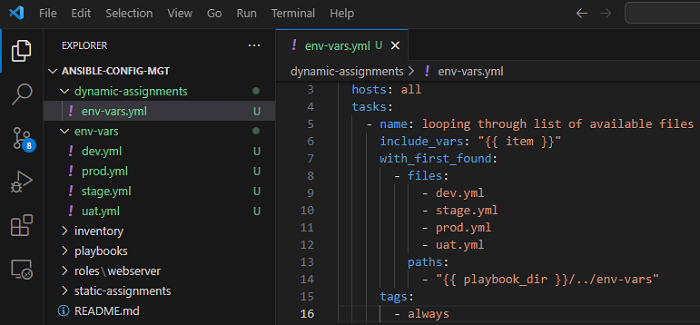
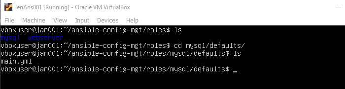
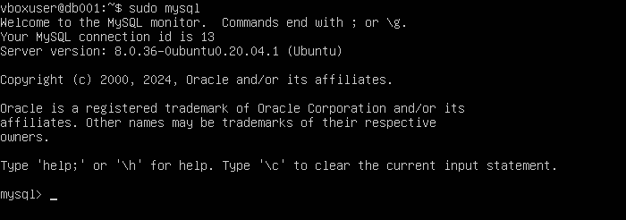

## Implementing Ansible Dynamic Assignments (Include) and Community Roles

In this project, we will introduce `dynamic assignments` by using the `include` module. The major difference between static and dynamic assignments is that static assignments use the `import` Ansible module, while dynamic assignments use `include` module.

When the `import` module is used, all statements are pre-processed at the time playbooks are parsed, which means that Ansible will process all the playbooks referenced during the time it is parsing the statements. This also means that, during actual execution, if any statement changes, such statements will not be considered. Hence, it is static.

On the other hand, when the `include` module is used, all statements are processed only during execution of the playbook. Which means that after the statements are parsed, any changes to the statements encountered during execution will be used.

Generally, the recommendation is to use static assignments for playbooks, because it is more reliable. Debugging playbook problems in dynamic assignments can be difficult due to its dynamic nature. However, dynamic assignments can be used for environment specific variables.

### Introducing Dynamic Assignment into The Current Structure

**Step 1: Create a new branch `dynamic-assignments` in the `https://github.com/DevOpsDolapo/ansible-config-mgt.git` GitHub repository**


- Create a new folder and name it `dynamic-assignments`, and inside the folder, create a new file and name it `env-vars.yml`


**Step 2: Since we'll be configuring multiple environments with unique attributes such as servername, ip-address etc., we'll need a way to set values to variables per specific environment** 

- Create a folder `env-vars` to keep each environment's variables file, then for each environment, create new YAML files to set variables

    

- Paste the code block below into the `env-vars.yml` file
```
---
- name: collate variables from env specific file, if it exists
  hosts: all
  tasks:
    - name: looping through list of available files
      include_vars: "{{ item }}"
      with_first_found:
        - files:
            - dev.yml
            - stage.yml
            - prod.yml
            - uat.yml
          paths:
            - "{{ playbook_dir }}/../env-vars"
      tags:
        - always

```


### Updating site.yml with Dynamic Assignments

- Update the site.yml file with the code block below
```
---
- hosts: all
- name: Include dynamic variables 
  tasks:
  import_playbook: ../static-assignments/common.yml 
  include: ../dynamic-assignments/env-vars.yml
  tags:
    - always

- hosts: uat-webservers
- name: Webserver assignment
  import_playbook: ../static-assignments/uat-webservers.yml
```


### Create a community role for MySQL database to install the MySQL package, create a database, and configure users. 

*Note: Rather than creating a new role, we'll be taking advantage of tons of roles that have already been developed by other open source engineers out there. These roles are actually production ready, and dynamic to accomodate most Linux flavours. With `Ansible Galaxy` again, we can simply download a ready to use ansible role.*

- We will be using a MySQL role developed by geerlingguy. To do that, run the below code block inside `ansible-config-mgt` directory on the Jenkins-Ansible Server (JAN001)
```
git init
git pull https://github.com/<your-name>/ansible-config-mgt.git
git remote add origin https://github.com/<your-name>/ansible-config-mgt.git
git branch roles-feature
git switch roles-feature
```


- Inside the `roles` directory create your new MySQL role with `ansible-galaxy install geerlingguy.mysql` and rename the folder to `mysql` by running the command `mv geerlingguy.mysql/ mysql`


- Edit the roles configuration to use correct credentials for MySQL required for the `tooling` website

  - Type `cd /mysql/defaults` 

  

  - Edit the `main.yml` file by running `sudo vi main/yml`. Edit the `Databases` and `Users` sections

  

  - Change the permission of the `roles` folder recursively so every user can access it

    

- Upload the changes to GitHub by running the code block below
```
git add .
git commit -m "Commit new role files into GitHub"
git push --set-upstream origin roles-feature
```


- Create a Pull Request and merge it to main branch on GitHub


- Create a `db.yml` file in the `static assignments` folder 


- Refer the `db role` in `site.yml`


- Remove the `ansible.builtin.` parameter from the entries in `main.yml` file in the `/roles/mysql/defaults` folder


- Edit the `dev.yml` file in the inventory folder to comment out all the other server instances, leaving only the database instance


- Install the MySQL package, create a database, and configure users by running the code `ansible-playbook -i inventory/dev.yml playbooks/site.yml`


- Check if MySQL is installed and running on the Database Server `DB001` and the `tooling` database is created




