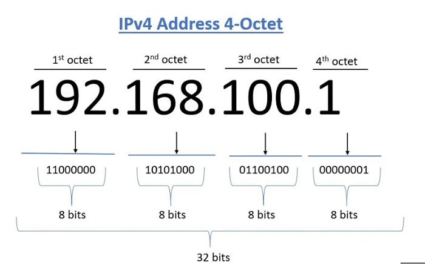
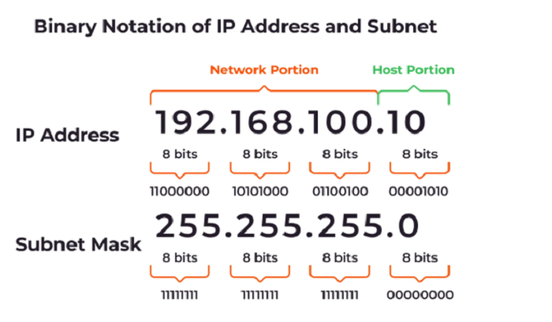

## Understanding IP Addresses and CIDR Notation

The Understanding IP Addresses and CIDR Notation course is a program designed to provide DevOps Engineers with a clear understanding of IP addresses and CIDR (Classless Inter-Domain Routing) notation. The course aims to guide us through the essentials of IP addressing and CIDR notation by taking us on a step-by-step journey into the world of IP addresses and CIDR notation. 

### What are IP Addresses?

IP addresses are unique addresses that identify devices on the internet or a local network. IP stands for "Internet Protocol," which is the set of rules governing the format of data sent via the internet or local network. 

In essence, IP addresses are identifiers that allow information to be sent between devices on a network, because they contain location information and make devices accessible for communication.

The internet needs a way to differentiate between different computers, routers, and websites. IP addresses provide a way of doing so and form an essential part of how the internet works.

IP addresses are expressed as a set of four numbers separated by periods. An example IP address is 192.158.1.38. Each number in the set can range from 0 to 255, giving a full IP addressing range from 0.0.0.0 to 255.255.255.255. 

IP addresses are not random numbers. They are mathematically produced and allocated by the Internet Assigned Numbers Authority (IANA), a division of the Internet Corporation for Assigned Names and Numbers(ICANN). ICANN is a non-profi t organization that was established in the United States in 1998 to help maintain the security of the internet and allow it to be usable by all. Each time anyone registers a domain on the internet, they go through a domain name registrar, who pays a small fee to ICANN to register the domain.

The image below shows a 4-Octet IPV4 Address

### Subnetting and Subnet Masks

#### What is Subnetting?

Subnetting is the practice of dividing a network into two or smaller networks. It increases routing efficiency, which helps to enhance the security of the network and reduces the size of the broadcast domain. 

IP Subnetting designates high-order bits from the host as part of the network prefix, thus dividing a network into smaller subnets. It helps to reduce the size of the routing tables, which is stored in routers, and to extend the existing IP address base & restructure the IP address.

#### What is a Subnet Mask?

A subnet mask is a 32 bits address used to distinguish between a network portion and a host portion in an IP address. A subnet mask identifies which part of an IP address is the network address and the host address.They are not shown inside the data packets traversing the Internet. They carry the destination IP address, which a router will match with the subnet.

The image below shows the binary notation of an IP Address and Subnet

### CIDR Notation and Address Aggregation

#### What is CIDR?

Classless Inter-Domain Routing (CIDR) is an IP address allocation method that improves data routing efficiency on the internet. Every machine, server, and end-user device that connects to the internet has a unique number, called an IP address, associated with it. It represents a block of IP addresses. 

Devices find and communicate with one another by using these IP addresses. Organizations use CIDR to allocate IP addresses flexibly and efficiently in their networks. To get the number of addresses a CIDR block represents, you calculate 232-prefix, where prefix is the number after the slash. For instance, /16 contains 232-16 = 216 = 65,536 addresses.
