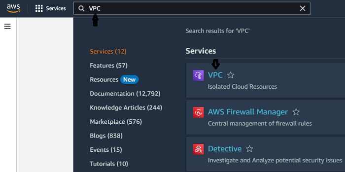
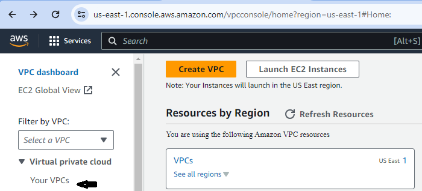
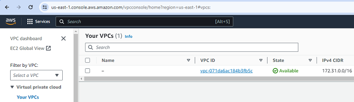

## AWS Networking Implementation (VPC, Subnets, IG, NAT, Routing)

### What is an Amazon VPC?

An Amazon Virtual Private Cloud (VPC) is like your own private section of the Amazon cloud, where one can place and manage resources (like servers or databases). You control who and what can go in and out, just like a gated community. 

#### The Default VPC

The Default VPC is like a starter pack provided by Amazon for cloud resources. It's a pre-configured space in the Amazon cloud where one can immediately start deploying applications or services. It has built-in security and network settings to help one get up and running quickly, but these can be adjusted as necessary.

Default VPCs are provided in each region (think of a region as a separate city), and they are like a pre-built house in that city that comes with some default settings.

To show the Default VPC for my region (us-east-1):

**Step 1: Type in `VPC` in the search bar and select `VPC` under Services**

**Step 2: Click on `Your VPCs` on the left-hand side of the page and that would show the Default VPC for the `us-east-1` region**

- Creating a new VPC
- Creating and configuring subnets