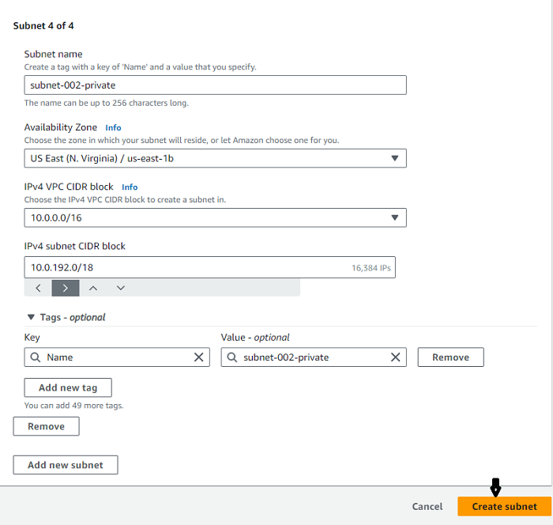
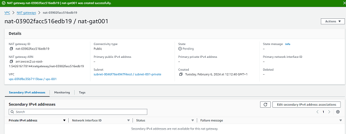
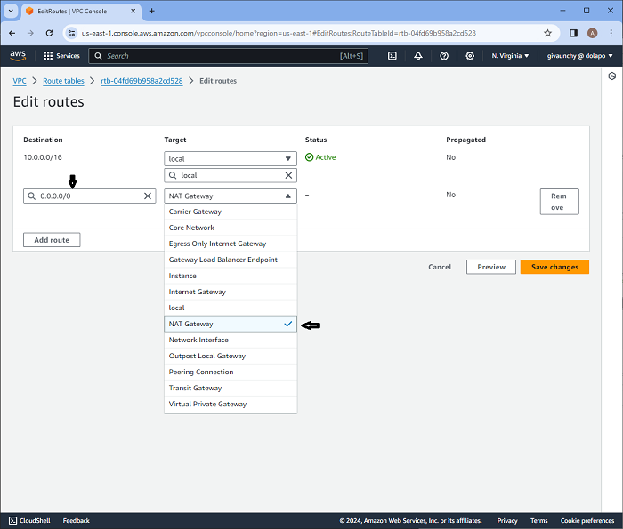
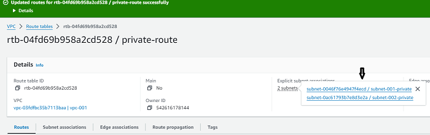

## AWS Networking Implementation (VPC, Subnets, IG, NAT, Routing)

### What is an Amazon VPC?

An Amazon Virtual Private Cloud (VPC) is like your own private section of the Amazon cloud, where one can place and manage resources (like servers or databases). You control who and what can go in and out, just like a gated community. 

#### The Default VPC

The Default VPC is like a starter pack provided by Amazon for cloud resources. It's a pre-configured space in the Amazon cloud where one can immediately start deploying applications or services. It has built-in security and network settings to help one get up and running quickly, but these can be adjusted as necessary.

Default VPCs are provided in each region (think of a region as a separate city), and they are like a pre-built house in that city that comes with some default settings.

To show the Default VPC for my region (us-east-1):

**Step 1: Type in `VPC` in the search bar and select `VPC` under Services**


**Step 2: Click on `Your VPCs` on the left-hand side of the page and that would show the Default VPC for the `us-east-1` region**


#### Creating a New VPC

**Step 1: From the `Your VPCs` page, click on `Create VPC` on the top-right**


**Step 2: On the `Create VPC` page, select the `VPC Only` radio button, fill out the details and click on `Create VPC` at the bottom of the page:**
```
Name tag - "vpc-001"
IPv4 CIDR block - "IPV4 CIDR manual input"
IPv4 CIDR - "10.0.0.0/16"
IPv6 CIDR block - "No IPv6 CIDR block"
Tenancy - "Default"
Tags - Leave as default
```


As soon as the VPC is created, it's assigned with a `vpc-id` and there's a route table created that serves as the main route table - `rtb-068178a3c221db617` below.


Now we have a VPC and a route table, but won't be able to put anything inside or create an EC2 instance because it requires subnets.

### Creating and Configuring Subnets

#### What are Subnets?

Subnets are like smaller segments within a VPC that helps us organize and manage resources. Subnets are like dividing an office building into smaller sections, where each section represents a department. Subnets are created to organize and manage the network effectively.

To create Subnets:

**Step 1: Go to `VPC > Subnets > Create subnet` and select the VPC that was created previously**


**Step 2: Fill out the details under `Subnet settings`. Don't click the `Create subnet` button just yet, click the `Add new subnet` button to add the number of subnets you want to create, then after completing all the required subnets, click on `Create subnet`**





All the subnets just created will be visible on the console


*Note: It's possible to deploy EC2 instances into the VPC by selecting one of the subnets, but the public subnet doesn't have any Internet access at this stage. When we select a public subnet > route, it uses the main route table and only has the local route, no default route for Internet access.*

### Understanding Public and Private Subnets in AWS VPC - Internet Gateway and Routing Table

In the world of AWS VPC, subnets are individual plots in a piece of land (VPC). Some of these plots (subnets) have direct road access (internet access) - these are public subnets. Others are more private, tucked away without direct road access - these are private subnets.

Just like in a real city, in our virtual city (VPC), we need roads (Internet Gateway) for people (data) to come and go. And we also need a map or GPS (Routing Table) to tell people (data) which way to go to reach their destination.

#### What is an Internet Gateway?

An Internet Gateway in AWS is like a road that connects our city (VPC) to the outside world (the internet). Without this road, people (data) can't come in or go out of your city (VPC).

#### Public Subnets

We'll need these to make our subnets work as public subnets:

- An Internet Gateway (IGW) attached to the VPC
- Route table with default route towards the IGW
- Public IP assigned to the AWS resources (e.g., EC2 instances)

##### Creating a Public Subnet

This is like creating a plot of land with direct road (internet) access. Here's how it is done:

1.  Go to the AWS VPC page
2.  Find 'Subnets', click on it, then click 'Create subnet'
3.  Give this new plot a name, select the big plot (VPC) you want to divide, and leave the IP settings as they are
4.  Create an internet gateway if there are no existing ones
5.  Attach an Internet Gateway to the VPC
6.  Edit the route table, add a default route to the Internet Gateway (IGW)
7.  Update subnet associations to allow traffic to flow to and from the internet

**Steps 1 to 3** have been done in the previous section, so we'll do **Steps 4 to 7**

**Step 4: Click on `Internet gateways`, then `Create internet gateway` on the Internet gateways page**


- Give the gateway a name tag and click on `Create internet gateway`


**Step 5: Attach the Internet Gateway to the VPC**

- Go to the `Internet gateways` page, select the newly-created Internet gateway and under `Actions` click on `Attach to VPC`


- Select the VPC created earlier under `Available VPCs`, then click on `Attach internet gateway`


**Step 6: Edit the route table, and add a default route to the Internet Gateway (IGW)**

- Click on `route tables`, select the route table for the `VPC` created earlier and under `Actions` select `Edit routes`


- Click on `Add route`, select `0.0.0.0/0`. Choose `Internet Gateway` from the drop down and select the Internet gateway created earlier, then click on `Save Changes`


**Step 7: Update subnet associations to allow traffic to flow to and from the internet**

- Go to the `Subnet associations` tab and click "Edit subnet associations", select the subnets we want to give internet (the ones marked 'public') and click "Save associations"


We can run EC2 instances in the public subnets if they need Internet access.

### Introduction to Private Subnets and NAT Gateway

In our AWS Virtual Private Cloud (VPC), private subnets are secluded areas where we can place resources that should not be directly exposed to the internet. But what if these resources need to access the internet for updates or downloads? This is where the NAT Gateway comes in.

A private subnet in AWS is like a secure room inside the house (VPC) with no windows or doors to the street (internet). Anything we place in this room (like a database) is not directly accessible from the outside world.

#### Understanding NAT Gateway
A Network Address Translation (NAT) Gateway acts like a secure door that only opens one way. It allows your resources inside the private subnet to access the internet for things like updates and downloads, but it doesn't allow anything from the internet to enter your private subnet.

A Network Address Translation (NAT) allows instances in our private subnet to connect to outside services like Databases but restricts external services from connecting to these instances.

#### Creating a Private Subnet

Since we've associated the only route table created earlier with the `Public subnets` for intenet access. We would need to create another route table for the `Private subnets` that doesn't have internet access (a private route table)

**Step 1: Go to `Route Tables` > `Create route table`**


**Step 2: On the `Create route table` page, fill in the route table name, attach it to the existing VPC, and click on `Create route table`**


- Click on `Subnet associations` and `Edit subnet associations`


- Select the subnets we want to associate with the private route and click on `save association`


#### Creating a NAT Gateway and Linking It to a Private Subnet

This guide gives a step-by-step on how to create a NAT Gateway and how to link it to our private subnet. We'll also cover how to configure a route in our routing table to direct outbound internet traffic from our private subnet to the NAT
Gateway.

**Step 1: Go to `VPC` > `NAT Gateways` and click on `Create NAT Gateway`**


**Step 2: Create a NAT Gateway named under one of the private subnets by filling in the necessary details. It's mandatory to allocate an Elastic IP to our NAT Gateway. Click on `Create NAT gateway` when done**
```
Name - choose a name for the NAT Gateway
Subnet - choose one of the existing private subnets
Connectivity type - Public
Elastic IP - Click on `Allocate Elastic IP` to generate one if non exists
```




**Step 3: Edit the route table created earlier for the private subnet and add a default route to the Network Address Translation (NAT) Gateway**

- Click on `Route tables` and then click on the `Route table ID` for `private-route`


- Click on `Edit routes`, then `Add routes`. Select `0.0.0.0/0`, choose `NAT Gateway` from the drop down and select the NAT Gateway created earlier, then click on `Save Changes` 





- Our route table is already associated with the two private subnets



- Our VPC Resource map is shown below


### - Understanding the Differences between Security Groups and Network Access Control Lists

Security groups and Network Access Control Lists (ACLs) are both important tools for securing our network on the AWS cloud, but they serve different purposes and have different use cases.

#### Security Groups

Security groups can be likened to a bouncer at a club who controls the flow of traffic to and from the resources in a cloud computing environment. Imagine you have a club, and you want to ensure that only authorized individuals can enter
and exit. In this analogy, the club represents your cloud resources (such as virtual machines or instances), and the bouncer represents the security group.

Just like a bouncer checks the IDs and credentials of people at the club's entrance, a security group examines the IP addresses and ports of incoming and outgoing network traffic. It acts as a virtual firewall that filters traffic based on predefined rules. These rules specify which types of traffic are allowed or denied. For example, a security group can be configured to allow incoming HTTP traffic (on port 80) to a web server, but block all other types of incoming traffic. Similarly, it can permit outgoing traffic from the web server to external databases on a specific port, while restricting all other outbound connections.

By enforcing these rules, security groups act as a line of defense, helping to protect our resources from unauthorized access and malicious attacks. They ensure that only the traffic that meets the defined criteria is allowed to reach our resources, while blocking or rejecting any unauthorized or potentially harmful traffic.

It's important to note that security groups operate at the instance level, meaning they are associated with specific instances and can control traffic at a granular level. They can be customized and updated as needed to adapt to changing
security requirements. 

Overall, security groups provide an essential layer of security for our cloud resources by allowing you to define and manage access control policies, much like a bouncer regulates who can enter and exit a club.


#### Network Access Control Lists (NACLs)

Network ACLs (Access Control Lists) can be likened to a security guard for a building, responsible for controlling inbound and outbound traffic at the subnet level in a cloud computing environment. Imagine you have a building with multiple rooms and entry points, and you want to ensure that only authorized individuals can enter and exit. In this analogy, the building represents your subnet, and the security guard represents the network ACL. 

Similar to a security guard who verifies IDs and credentials before allowing entry into the building, a network ACL examines the IP addresses and ports of incoming and outgoing network traffic. It serves as a virtual barrier or perimeter
security, defining rules that dictate which types of traffic are permitted or denied.

For instance, a network ACL can be configured to allow incoming SSH (Secure Shell) traffic (on port 22) to a specific subnet, while blocking all other types of incoming traffic. It can also permit outgoing traffic from the subnet to a specific range of IP addresses on a certain port, while disallowing any other outbound connections.

By implementing these rules, network ACLs act as a crucial line of defense, safeguarding your entire subnet from unauthorized access and malicious attacks. They ensure that only traffic meeting the specified criteria is allowed to enter
or exit the subnet, while blocking or rejecting any unauthorized or potentially harmful traffic.

It's important to note that network ACLs operate at the subnet level, meaning they control traffic for all instances within a subnet. They provide a broader scope of security compared to security groups, which operate at the instance level. Network ACLs are typically stateless, meaning that inbound and outbound traffic is evaluated separately, and specific rules must be defined for both directions.

In summary, network ACLs function as a virtual security guard for your subnet, regulating inbound and outbound traffic at a broader level. They operate similarly to a security guard who controls access to a building by examining IDs, ensuring that only traffic meeting the defined rules is allowed to pass, and thereby providing protection against unauthorized access and malicious activities for your entire subnet.


In summary, security groups and network ACLs are both important tools for securing your network on the AWS cloud, but they serve different purposes and have different use cases. Security groups are like a bouncer at a club controlling inbound and outbound traffic to and from your resources at the individual resource level. Network ACLs, on the other hand, are like a security guard for a building, controlling inbound and outbound traffic at the subnet level.


