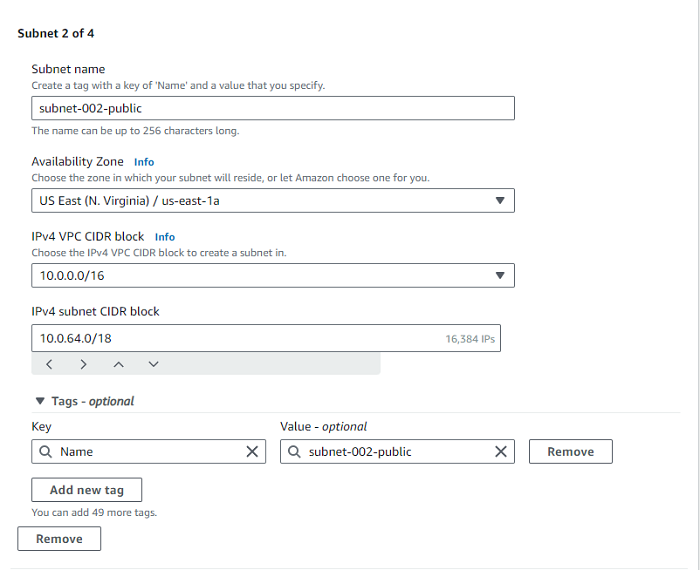

## AWS Networking Implementation (VPC, Subnets, IG, NAT, Routing)

### What is an Amazon VPC?

An Amazon Virtual Private Cloud (VPC) is like your own private section of the Amazon cloud, where one can place and manage resources (like servers or databases). You control who and what can go in and out, just like a gated community. 

#### The Default VPC

The Default VPC is like a starter pack provided by Amazon for cloud resources. It's a pre-configured space in the Amazon cloud where one can immediately start deploying applications or services. It has built-in security and network settings to help one get up and running quickly, but these can be adjusted as necessary.

Default VPCs are provided in each region (think of a region as a separate city), and they are like a pre-built house in that city that comes with some default settings.

To show the Default VPC for my region (us-east-1):

**Step 1: Type in `VPC` in the search bar and select `VPC` under Services**


**Step 2: Click on `Your VPCs` on the left-hand side of the page and that would show the Default VPC for the `us-east-1` region**


#### Creating a New VPC

**Step 1: From the `Your VPCs` page, click on `Create VPC` on the top-right**


**Step 2: On the `Create VPC` page, select the `VPC Only` radio button, fill out the details and click on `Create VPC` at the bottom of the page:**
```
Name tag - "vpc-001"
IPv4 CIDR block - "IPV4 CIDR manual input"
IPv4 CIDR - "10.0.0.0/16"
IPv6 CIDR block - "No IPv6 CIDR block"
Tenancy - "Default"
Tags - Leave as default
```


As soon as the VPC is created, it's assigned with a `vpc-id` and there's a route table created that serves as the main route table - `rtb-068178a3c221db617` below.


Now we have a VPC and a route table, but won't be able to put anything inside or create an EC2 instance because it requires subnets.

#### Creating and Configuring Subnets

##### What are Subnets?

Subnets are like smaller segments within a VPC that helps us organize and manage resources. Subnets are like dividing an office building into smaller sections, where each section represents a department. Subnets are created to organize and manage the network effectively.

To create Subnets:

**Step 1: Go to `VPC > Subnets > Create subnet` and select the VPC that was created previously**


**Step 2: Fill out the details under `Subnet settings`. Don't click the `Create subnet` button just yet, click the `Add new subnet` button to add the number of subnets you want to create, then after completing all the required subnets, click on `Create subnet`**





All the subnets just created will be visible on the console


*Note: It's possible to deploy EC2 instances into the VPC by selecting one of the subnets, but the public subnet doesn't have any Internet access at this stage. When we select a public subnet > route, it uses the main route table and only has the local route, no default route for Internet access.*

#### Understanding Public and Private Subnets in AWS VPC - Internet Gateway and Routing Table

In the world of AWS VPC, subnets are individual plots in a piece of land (VPC). Some of these plots (subnets) have direct road access (internet access) - these are public subnets. Others are more private, tucked away without direct road access - these are private subnets.

Just like in a real city, in our virtual city (VPC), we need roads (Internet Gateway) for people (data) to come and go. And we also need a map or GPS (Routing Table) to tell people (data) which way to go to reach their destination.

#### What is an Internet Gateway?

An Internet Gateway in AWS is like a road that connects our city (VPC) to the outside world (the internet). Without this road, people (data) can't come in or go out of your city (VPC).

#### Public Subnets

We'll need these to make our subnets work as public subnets:

- An Internet Gateway (IGW) attached to the VPC
- Route table with default route towards the IGW
- Public IP assigned to the AWS resources (e.g., EC2 instances)

##### Creating a Public Subnet

This is like creating a plot of land with direct road (internet) access. Here's how it is done:

- Go to the AWS VPC page
- Find 'Subnets', click on it, then click 'Create subnet'
- Give this new plot a name, select the big plot (VPC) you want to divide, and leave the IP settings as they are
- Create an internet gateway if there are no existing ones
- Attach an Internet Gateway to the VPC
- Edit the route table, add a default route to the Internet Gateway (IGW)
- Update subnet associations to allow traffic to flow to and from the internet

**Steps 1 to 3** have been done in the previous section, so we'll do **Steps 4 to 7**

**Step 4: Click on `Internet gateways`, then `Create internet gateway` on the Internet gateways page**


- Give the gateway a name tag and click on `Create internet gateway`


**Step 5: Attach the Internet Gateway to the VPC**

- Go to the `Internet gateways` page, select the newly-created Internet gateway and under `Actions` click on `Attach to VPC`


- Select the VPC created earlier under `Available VPCs`, then click on `Attach internet gateway`


**Step 6: Edit the route table, and add a default route to the Internet Gateway (IGW)**

- Click on `route tables`, select the route table for the `VPC` created earlier and under `Actions` select `Edit routes`


- Click on `Add route`, select `0.0.0.0/0`. Choose `Internet Gateway` from the drop down and select the Internet gateway created earlier, then click on `Save Changes`


**Step 7: Update subnet associations to allow traffic to flow to and from the internet**

- Go to the `Subnet associations` tab and click "Edit subnet associations", select the subnets we want to give internet (the ones marked 'public') and click "Save associations"


We can run EC2 instances in the public subnets if they need Internet access.

##### Creating a Private Subnet

Since we've associated the only route table created earlier with the `Public subnets` for intenet access. We would need to create another route table for the `Private subnets` that doesn't have internet access (a private route table)

**Step 1: Go to `Route Tables` > `Create route table`**


**Step 2: On the `Create route table` page, fill in the route table name, attach it to the existing VPC, and click on `Create route table`**


- Click on `Subnet associations` and `Edit subnet associations`


- Select the subnets we want to associate with the private route and click on `save association`


