# Documentation for the Git Project

## What is Git?

Git is a Version Control or Source Control System. Its main benefit is that it provides a solution to the problem of keeping track of the changes software developers make to source code. It also ensures that source code is shared efficiently amongst developers.

Git is popularly used in software development, however, before the advent of Git, developers used other Source Control Systems such as SVN. The problem with SVN is that it runs on a central repository which makes it difficult for multiple developers to make changes to code at the same time as changes could only be made one after the other. Besides, anytime SVN's central repository goes down, it becomes unavailable thereby stopping developers from working.

However, Git is a distributed system, so it enhances collaboration between developers by allowing them make their own version or copy of the central repository. 

## How to Initialize a Git Repository

Before initialiizing a Git repository (or repo for short), we would need to install Git on the computer. The steps to install Git on a Windows system are shown below:

- **Download Git from the website `https://git-scm.com/download/win`**

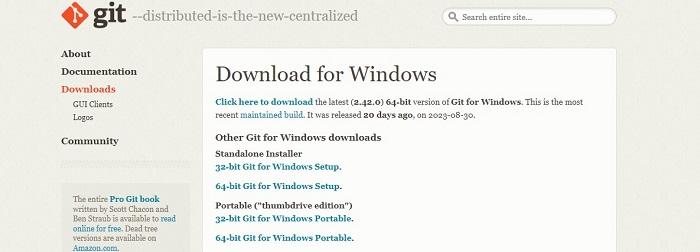

- **Installing Git on the system**

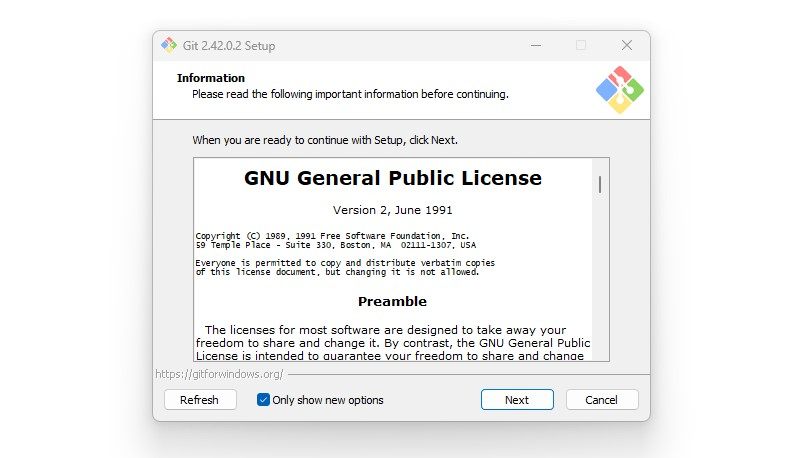 

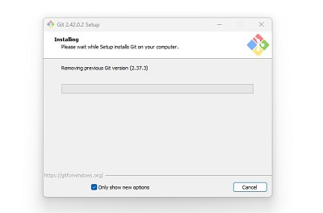

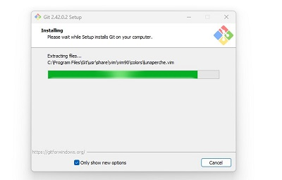

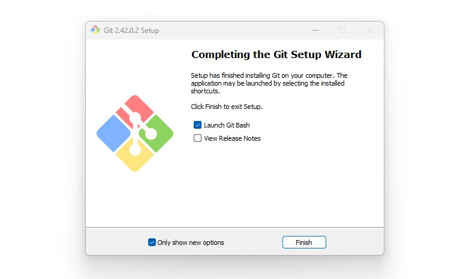

The steps to initialize Git are as follows:

1. Open a Git bash terminal on the computer**

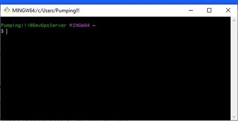

2. Using the `mkdir` command, a directory **Test_Repo** is created in the DevOps directory

3. The command `cd Test_Repo` is issued to move into the Test_Repo directory

4. While inside the Test_Repo directory, the `git init` command is invoked. The repository is initiated and designated as the **main** repository.

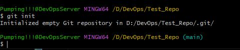

## How to Make Commits

In Git, making a commit is essentially saving the changes we've made to the files in our repository. These changes could be adding, deleting, or modifying files, folders, or text.

During a commit, Git takes a snapshot of the current state of the repository and saves a copy in the .git folder inside the repository.

To make a commit in the working directory:

1. Run `touch class_list.txt` to create a file in the working directory

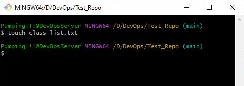

2. Add a sentence to the file using the `echo` command

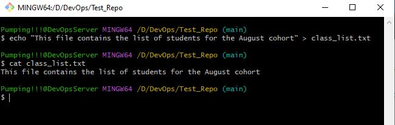

3. Move the file to the git staging area (same as saving the file) using the `git add .` command

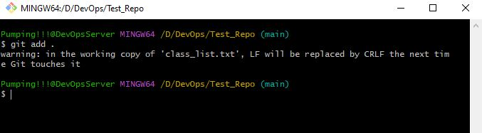

4. Commit the changes to git by running the command `git commit -m "Commit Message"`. The -m flag in the command allows us to add a commit message which provides some context about the commit.

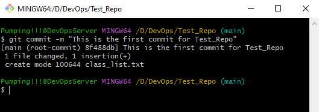

## How to Work with Branches

In Git, branches allow developers to edit and work on bug fixes, issues, and features of a software code without affecting the main codebase. Developers are allowed to create different branches for this purpose and once they are done with the edits or bug fixes, they can converge all the different codes into one branch (the main branch).

- **Make a new Git branch**

The command to make a new branch is `git checkout -b`. The `-b` flag helps you create the new branch and change into it.

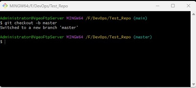

- **List your Git branches**

The command to list the branches on a local git directory is `git branch`. The * alongside the master branch signifies that it's the current working branch.

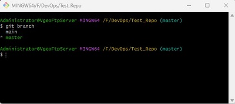

- **Switch or change to another branch**

The command to switch or change to another branch is `git checkout <branch name>`

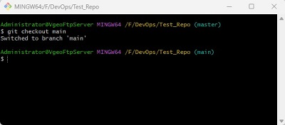

- **Merging a Branch into another Branch**

Sometimes it might be necessary to merge one branch into another. This essentially means adding the content of one branch into another. For instance to merge the contents of *master* into *main*.

1. Change to branch main

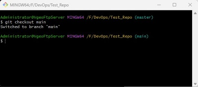

2. Run the command `git merge master`

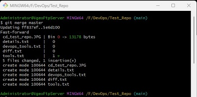

- **Deleting a Branch in Git**

Sometimes it might be necessary to delete a branch in Git. The command to do that is `git branch -d <branch name>`

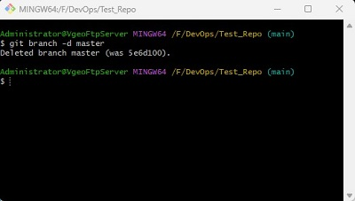

## How to Collaborate with Remote Repositories

Due to the fact that Git is used for collaboration amongst remote teams residing in different locations, it's essential that the code they are working on does not reside on a local computer. This led to the advent of Github, a web-based platform where repositories are hosted. 

Github allows us to host our local repository in a public repository on the internet, thus enabling access to people from different locations to work on the same codebase. 

### How to create a Github account and create a new repository

1. Create a Github account

- Visit https://github.com/ to create an account

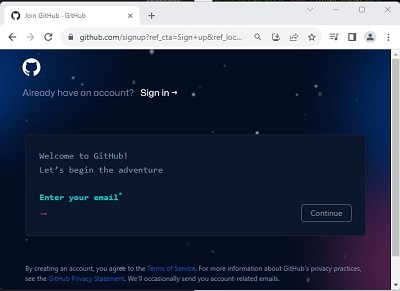

- Enter the required details

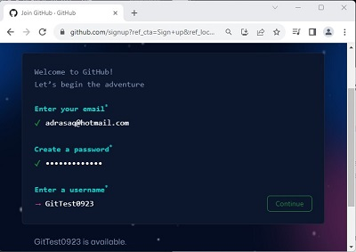

- Verify your account

- After submitting the verification puzzles, you can create an account

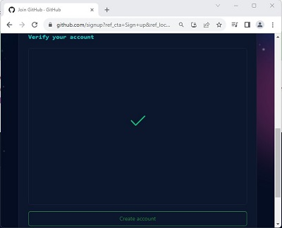

- A code is sent to the registered email address

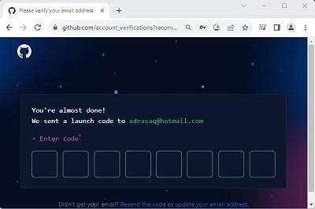

- Choose the required answers to personalize the experience or skip this page

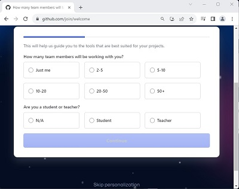

2. Create a Github Repository

- The Github dashboard after logging in

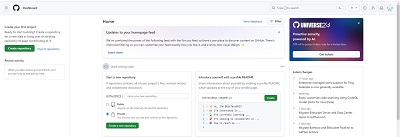

- To create a new repository ***GitTestRepo1***, click on *Create Repository* on the upper-left corner of the dashboard page and fill out the necessary details, then click on *Create Repository* at the bottom of this page

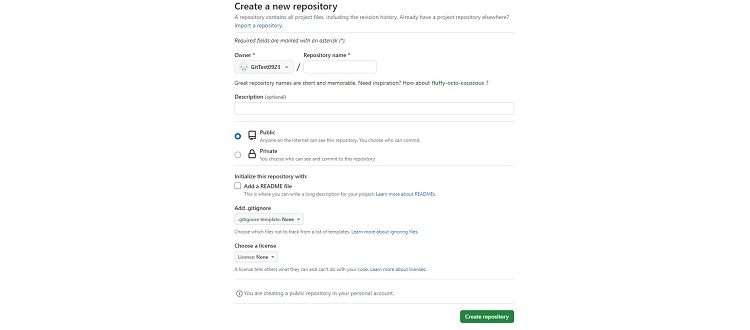

### How to Push a Local Git repository to a Remote Github repository

After creating a Github account and a new repository, we can push the local repository to the repository in Github by follwing these steps.

1. Copy the Github repository link. The link can be copied from the new repository page

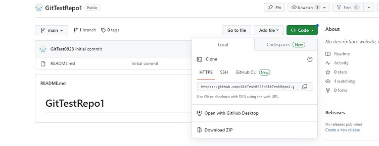

2. Add the remote repository to the local repository, using the command `git remote add origin <link to your github repo>`

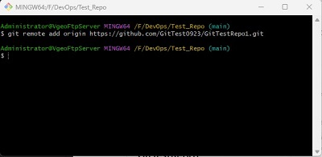

3. Push the contents of the local repository to the remote repository using the command `git push origin <branch name>`

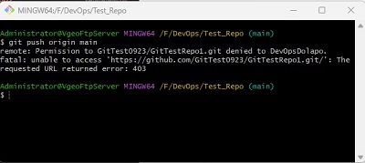

The above error is due to the fact that the computer has saved a git username and password so if you shift to another account the error 403 will appear.

The solution on a Windows system is to remove the Github keys.

Go to control panel > user accounts > credential manager > Windows credentials > Generic credentials 

Then remove the Github keys

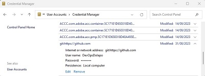

After removing the Github keys running `git push origin <branch name>` again popped up another error as seen below

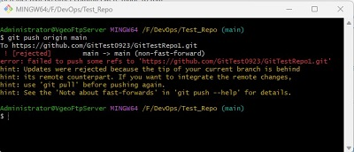

The above error means there are changes on the remote branch that are not on the local repository. A `git pull` command needs to be run.

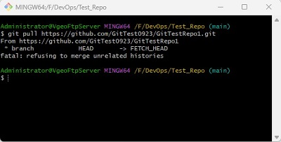

The git pull command also throws up an error as seen in the screenshot. This error occurs because the two repositories we're trying to merge have no connection in their histories or no shared starting point.

To fix this error, run `git pull origin <branch-name> --allow-unrelated-histories`

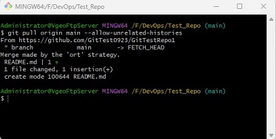

Finally, we can re-run the `git push origin <branch name>` command

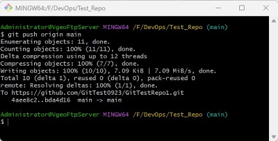

Checking the repository on Github shows that the files have been copied from the local repository to the remote repository.

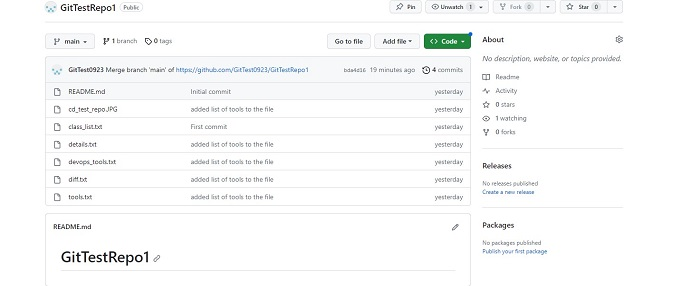

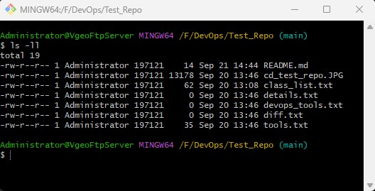

### How to Clone a Remote Git Repository

Cloning a Git repository allows us to copy a remote Github repository to our local machine. It is essentially downloading a remote repository onto our local machine.

The command to clone a remote repository is `git clone <link to your remote repository>`

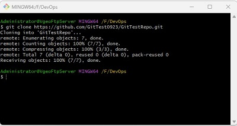

A copy of the remote repository on the local machine is shown in the screenshots below

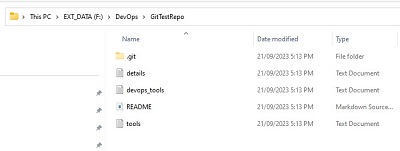

## Using the Markdown Syntax for Branch Management and Tagging

Markdown syntax is an easy-to-use Markup language used for formatting plain text. It is used to add formatting elements such as headings, bulleted lists, code, and URLs to plain text. The syntax is used in the creation of README files, web pages, and forum posts. Markdown syntax is an alternative to HTML.

Examples of Markdown syntax elements are:

1. Headings

# Heading 1 - This is a Git Project

## Heading 2 - This is a Git Project

### Heading 3 - This is a Git Project

2. Text Emphasis

*italic* or *_italic_*

Example: *Git project* or _Git project_

**bold** or __bold__ 

Example: **Git project** or __Git project__

3. Lists

We can create both ordered and unordered lists using Markdown syntax

Unordered list:
- Chair
- Table
- Desk

Ordered list:

