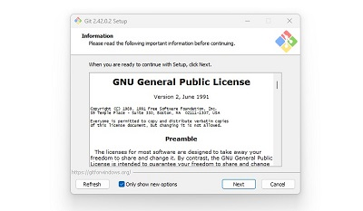

# Documentation for the Git Project

## What is Git?

Git is a Version Control or Source Control System. Its main benefit is that it provides a solution to the problem of keeping track of the changes software developers make to source code. It also ensures that source code is shared efficiently amongst developers.

Git is popularly used in software development, however, before the advent of Git, developers used other Source Control Systems such as SVN. The problem with SVN is that it runs on a central repository which makes it difficult for multiple developers to make changes to code at the same time as changes could only be made one after the other. Besides, anytime SVN's central repository goes down, it becomes unavailable thereby stopping developers from working.

However, Git is a distributed system, so it enhances collaboration between developers by allowing them make their own version or copy of the central repository. 

## How to Initialize a Git Repository

Before initialiizing a Git repository (or repo for short), we would need to install Git on the computer. The steps to install Git on a Windows system are shown below:

- **Download Git from the website `https://git-scm.com/download/win`**

- **Installing Git on the system**

 

The steps to initialize Git are as follows:

1. Open a Git bash terminal on the computer**

2. Using the `mkdir` command, a directory **Test_Repo** is created in the DevOps directory

3. The command `cd Test_Repo` is issued to move into the Test_Repo directory

4. While inside the Test_Repo directory, the `git init` command is invoked. The repository is initiated and a branch **main** created.

## How to Make Commits

In Git, making a commit is essentially saving the changes we've made to the files in our repository. These changes could be adding, deleting, or modifying files, folders, or text.

During a commit, Git takes a snapshot of the current state of the repository and saves a copy in the .git folder inside the repository.

To make a commit in the working directory:

1. Run `touch class_list.txt` to create a file in the working directory

2. Add a sentence to the file using the `echo` command

3. Move the file to the git staging area (same as saving the file) using the `git add .` command

4. Commit the changes to git by running the command `git commit -m "Commit Message"`. The -m flag in the command allows us to add a commit message which provides some context about the commit.

## How to Work with Branches

