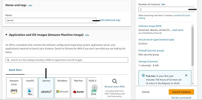
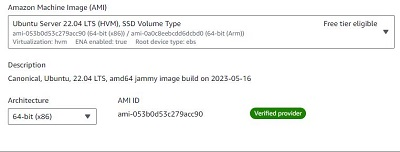

# Documentation for the LEMP Stack Implementation Project

The LEMP Stack is one of the most popular Technology Stacks used in the development of software, applications, and websites. A great working knowledge of this Web Stack is an essential addition to a DevOps Engineer's skill set.

The term Technology Stack was defined in the previous project, but here is a quick recap:

What is a Technology Stack?

A technology stack is a set of tools and frameworks used to build or develop software products. They are specifically used together in the creation of functional software or applications. These technology stacks are named using the acronyms of the individual technologies involved in developing a particular product.

Examples of technology stacks are:

- LEMP (Linux, NginX, MySQL, PHP (or Python or Perl))

- LAMP (Linux, Apache, MySQL, PHP (or Python or Perl))

- MERN (MongoDB, ExpressJS, ReactJS, NodeJS)

- MEAN (MongoDB, ExpressJS, AngularJS, NodeJS)

## Introduction to LEMP Stack Architecture

The LEMP stack is made up of Linux OS, Nginx Server, MySQL Database, and PHP. Its components are also all open-source just like the LAMP stack and is used to create dynamic web applications.

The acronym LEMP can be broken down as follows:

- L (Linux operating system)
Linux is an open-source operating system. In this case the webserver runs on the Linux operating system.

- E (Nginx web server)
This is pronounced as “Engine X”. It is a very popular web server. While it is open source just like Apache, it is faster in certain situations and comes with better security.

- M (MySQL database server)
A SQL-based relational database system.

- P (PHP)
PHP is a server-side scripting language that communicates with the database and server. 

### How the LEMP Stack Works

**Nginx**: Works similarly to Apache in the LAMP stack. It processes user requests and responds with suitable output.

**PHP**: Processes requests, communicates with the database, carries out user authentication, etc.

**MySQL**: Handles database requests.

**Linux**: The Operating System that runs at the base of this stack.

## Spinning up an EC2 instance and Creating an Ubuntu Linux Server OS

Amazon Web Services (AWS) is a cloud services provider that facilitates on-demand delivery of IT resources over the internet through a pay-as-you-go pricing template.

For this project, I'll be using free-tier servers on the AWS platform known as EC2 (Elastic Compute Cloud) running on the Ubuntu Server OS.

To spin up the required EC2 instances for my project, I'll need to log into my AWS account

To create the EC2 instances, follow these steps;

1. Clicked on 'Launch a Virtual Machine'

2. On the 'Launch an instance' page, fill in the details for my servers and the number of instances I need, then select Ubuntu as my preferred OS.

3. Select a 'free-tier eligible' AMI (Amazon Machine Image) 

4. Create a key pair for secure connection to my EC2 instances or select an existing (saved) key pair

5. Click on 'Launch instance' at the bottom of the page to launch the EC2 instances

6. The two EC2 instances have been created and they are both running on the Ubuntu Server OS

7. The servers can be renamed to indicate their individual identities

## Connecting to the Nginx EC2 Instance

To connect to the Nginx server I just created on AWS, I'll be using a software known as Termius.

To connect to the Nginx server, follow the steps 1 to 6 below:

1. Click on 'NEW HOST' on the termius software

2. Copy the Public IPV4 address from the Nginx server instance on AWS

3. Paste the IP address in the New Host configuration pane in Termius

4. Set the Username as 'ubuntu', and import the key file saved earlier from AWS. Note that SSH uses TCP port 22 for connections and this is usually open by default on our EC2 instance.

5. Save the imported key file

 
 6. Launch the server by double-clicking on the host created in Termius

 

 Successful connection to the Nginx EC2 instance:

  

## Installing the Nginx Web Server and Updating the Firewall

To install Nginx on the Ubuntu server, we need to follow these steps:

1. Update the list of packages using the Ubuntu package manager by running the `sudo apt update` package

