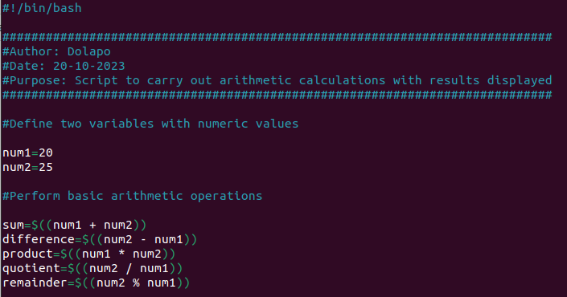
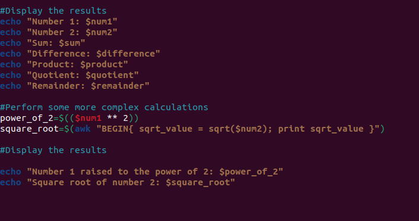
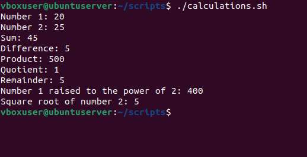
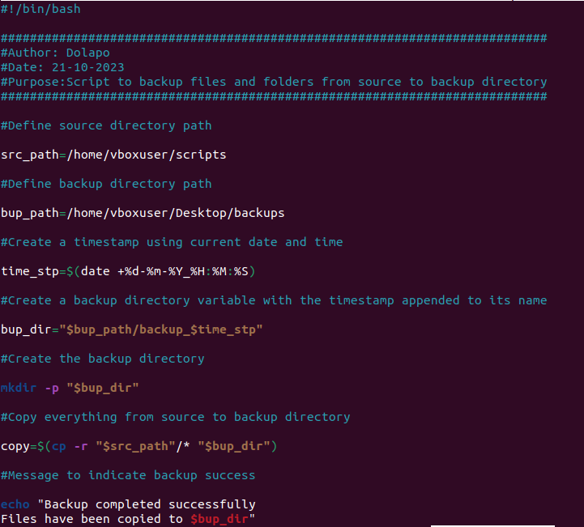
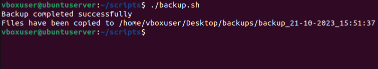
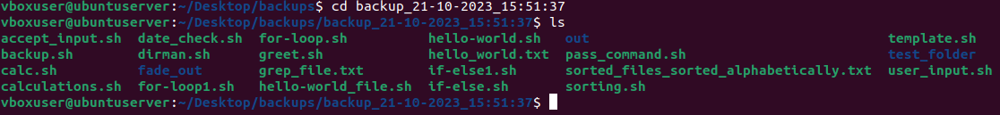
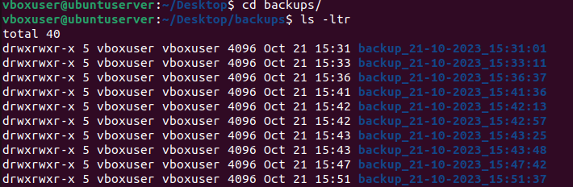

# Documentation for the Shell Scripting Hands-On Project

A shell script is a text file that contains a succession of UNIX-based operating system commands. It is known as a shell script because it combines a succession of commands that would normally have been typed into a keyboard one at a time, into a single-file script.

The Shell of the UNIX-based operating system functions as its Command Line Interface (CLI) and interpreter for the commands that are used to communicate with the system.

For a DevOps Engineer, shell scripting is particularly important because it helps automate repititive tasks. Shell scripts are created in a text file with a `.sh` extension and are executed directly on the command line or called from other scripts.

## Introduction to Shell Scripting and User Input

Shell scripting uses the same syntax in a script as it would on the command line. Let's look at some elements of a shell scripting syntax.

### Shell Scripting Syntax Elements

1. **Variables**: Variables store different types of data such as strings, numbers, and arrays. Values are usually assigned to variables using the `=` operator. The value in a variable can be accessed by using the variable name preceded by the `$` sign.

To define a variable `name` and assign a value `David` to the variable using the command `name=David`:


To retrieve the value from the variable run the command `echo $name`:


2. **Control Flow**: Control flow statements like `while loops`, `for loops`, `case`, and `if-else` statements are used to control the flow of execution in a script. With these statements, we can make iterations over lists, make decisions, and execute commands based on conditions.

a. **if-else**

Example: Using if-else to execute a script based on conditions, the script is as follows:
```
#!/bin/bash

######################################################################
#Author: Dolapo
#Date: 18-10-2023
#Purpose: Script to check age and whether users are eligible to drive
######################################################################

read -p "Please input your age: " input_age

if [ $input_age -lt 18 ];

then 

echo "You are too young to drive"

elif [ $input_age -ge 18 ] && [ $input_age -le 80 ];

then

echo "You are eligible to drive"

else

echo "You are too old to drive"

fi
```


Running the if-else script in the CLI:


b. **for loop**

Example: Iterating through a list using the `for loop` script:

```
#!/bin/bash

###################################################
#Author: Dolapo
#Date: 19-10-2023
#Purpose: Script to iterate through numbers 1 to 10
###################################################

for number in {1..10}

do

echo $number
sleep 2 #delay the iteration between numbers by 2 seconds

number=($number ++)

done

echo "The iteration has ended"
```


Running the for-loop script in the CLI:


c. **command substitution**

This allows us to capture the output of a command and use it as a value in our script. A sample of this type of script is shown below:

```
#!/bin/bash

##########################################################
#Author: Dolapo
#Date: 19-10-2023
#Purpose: Script to use the result of a command as a value
##########################################################

#Using the date command to display current date and time only

date +%Y-%m-%d-%T

#Define a variable current_date using the above command as value

current_date=$(date +%Y-%m-%d-%T)

echo $current_date
```


d. **input and output**

Bash can handle input and output. The read command is used to accept user input, while the echo command is used to print output to console.

**Script to *accept user input***

```
#!/bin/bash

###################################################
#Author: Dolapo
#Date: 19-10-2023
#Purpose: Script to accept input and read the input
###################################################

echo "Please input your name:"

read name
```


**Script to *output text to terminal***

```
#!/bin/bash

###################################################
#Author: Dolapo
#Date: 19-10-2023
#Purpose:Script to display text in terminal
###################################################

echo "Hello World"
```


**Script to *output the result of a command into a file***

```
#!/bin/bash

#########################################################
#Author: Dolapo
#Date: 19-10-2023
#Purpose:Script to output the result of a command to file
#########################################################

echo "Hello World. This output should go into a file" >> hello_world.txt
```


**Script to *pass the content of a file as input to a command***

The content of the input file is shown below:


Here's the result from running the command


**Script to *pass the result of a command as input to another command***

```
#!/bin/bash

###################################################
#Author: Dolapo
#Date: 19-10-2023
#Purpose: Script to pass the result of a command as input to another command
###################################################

echo "Hello, this is a test command" 
```


Running the command:


e. **Functions**

With Functions, we can modularize our codes and make them more reusable. Functions can also be used to group unrelated commands together. To define a function, use the `function` keyword or declare the function name followed by parentheses.

Here's a function script:

```
#!/bin/bash

###################################################
#Author: Dolapo
#Date: 19-10-2023
#Purpose: Script to define a function and call it
###################################################

#Define a function 'greet' to say hello to a user

greet() {

	echo "Hello, $2! Nice to meet you."
#The $number option above indicates that the function should call the user in line 2
}

#Call the function and pass a name to it

greet "Tunde" "James" "Dave"
```


Result of running the script


**1. Script to prompt for name and say hello**

```
#!/bin/bash

###################################################
#Author: Dolapo
#Date: 19-10-2023
#Purpose:Script to prompt for your name and say hello
###################################################

#Prompt for user to enter their name

read -p "Please input your name: " name

#Display a greeting using the entered name

echo "Hello, $name! Nice meet to you"!
```


Running the script in the terminal:


## Directory Manipulation and Navigation

To show directory manipulation and navigation in the Linux file system:

- write a script to display the current directory
- create a new directory called "my_directory"
- change to the new directory and create two files inside the directory
- list the files in the directory, move back one level up, and remove "my_directory" and its contents
- list the files in the current directory

The script is detailed below:

```
#!/bin/bash

##############################################
#Author: Dolapo
#Date: 19-10-2023
#Purpose:Script to show directory manipulation
##############################################

#Display current directory

echo "THE CURRENT DIRECTORY IS: $PWD"

#Create a new directory

dir=my_directory

sleep 2

mkdir $dir

sleep 2

echo "A NEW DIRECTORY $dir HAS BEEN CREATED IN $PWD"

#Change to the new directory

sleep 2

cd $dir

echo "CHANGED TO $dir SUCCESSFULLY"

#Create two files

sleep 2

touch file{1..2}

echo "file1 AND file2 HAVE BEEN CREATED IN $dir"

#List the files

echo "LISTING THE CONTENTS OF $dir"

sleep 2

ls -ltr

#Move back one level up

sleep 2

cd ..

echo "MOVED ONE LEVEL UP SUCCESSFULLY"

#Remove the directory created earlier

sleep 2

rm -rf $dir

echo "DIRECTORY $dir HAS BEEN DELETED SUCCESSFULLY"

#List the files and folders in current directory

sleep 2

echo "THE CURRENT DIRECTORY IS: $PWD"

sleep 2

echo "THE CONTENTS OF THIS DIRECTORY ARE:"

sleep 2

ls -ltr
```


Running the script in the terminal:


## File Operations and Sorting

To implement File Operations and Sorting:

- write a script to create 3 files
- display the files in their current order
- sort them alphabetically and save the sorted files as sorted_files.txt
- display the sorted files and remove the original files
- rename the sorted files to sorted_files_sorted_alphabetically.txt
- display the contents of the final sorted file

Here's the script showing file operations and sorting:

```
#!/bin/bash

######################################################################
#Author: Dolapo
#Date: 20-10-2023
#Purpose:Script to create files, display, and sort them alphabetically
######################################################################

#Create 3 files and populate them with text

echo "Creating files..."

echo "This is file number 3" >> file3.txt

echo "This is the first file" >> file1.txt

echo "This is the second file" >> file2.txt

echo "Files created."

#Display the files in their current folder

echo "Here are the files in their current folder:"

ls

#Sort the files alphabetically

echo "Sorting the files alphabetically..."

ls | sort > sorted_files.txt

echo "Files sorted"

#Display the sorted files

echo "Sorted files:"

cat sorted_files.txt

#Remove the original files

echo "Removing the original files..."

rm file1.txt file2.txt file3.txt

echo "Original files removed"

#Rename the sorted file to a more descriptive name

echo "Renaming sorted file..."

mv sorted_files.txt sorted_files_sorted_alphabetically.txt

echo "File renamed"

#Display the final sorted file

echo "Final sorted file:"

cat sorted_files_sorted_alphabetically.txt
```


Running the script gives the following results:


## Working with Numbers and Calculations

To work with numbers and calculations:

- write a script to perform arithmetic operations (addition, subtraction, multiplication, modulus, and division)
- display the results
- perform complex calculations with the results displayed

The script showing the calculations:

```
#!/bin/bash

############################################################################
#Author: Dolapo
#Date: 20-10-2023
#Purpose: Script to carry out arithmetic calculations with results displayed
############################################################################

#Define two variables with numeric values

num1=20
num2=25

#Perform basic arithmetic operations

sum=$((num1 + num2))
difference=$((num2 - num1))
product=$((num1 * num2))
quotient=$((num2 / num1))
remainder=$((num2 % num1))

#Display the results
echo "Number 1: $num1"
echo "Number 2: $num2"
echo "Sum: $sum"
echo "Difference: $difference"
echo "Product: $product"
echo "Quotient: $quotient"
echo "Remainder: $remainder"

#Perform some more complex calculations
power_of_2=$(($num1 ** 2))
square_root=$(awk "BEGIN{ sqrt_value = sqrt($num2); print sqrt_value }")

#Display the results

echo "Number 1 raised to the power of 2: $power_of_2"
echo "Square root of number 2: $square_root"
```




The results from running the script:



## File Backup and Timestamping

As a DevOps Engineer, having backups of important data is very important. 

For this script, we'll:

- define source directory and backup directory paths
- create a timestamp using current date and time
- create a backup directory with the timestamp appended to its name
- the script should then copy everything from the source directory to the backup directory using the `cp -r` command for a recursive copy.
- the script should dispay a message indicating that the backup has been completed successfully
- the script should show the path of the backup directory with the timestamp

The backup script is shown below:

```
#!/bin/bash

###########################################################################
#Author: Dolapo
#Date: 21-10-2023
#Purpose:Script to backup files and folders from source to backup directory
###########################################################################

#Define source directory path

src_path=/home/vboxuser/scripts

#Define backup directory path

bup_path=/home/vboxuser/Desktop/backups

#Create a timestamp using current date and time

time_stp=$(date +%d-%m-%Y_%H:%M:%S)

#Create a backup directory variable with the timestamp appended to its name

bup_dir="$bup_path/backup_$time_stp"

#Create the backup directory

mkdir -p "$bup_dir"

#Copy everything from source to backup directory

copy=$(cp -r "$src_path"/* "$bup_dir")

#Message to indicate backup success

echo "Backup completed successfully
Files have been copied to $bup_dir"
```



The result from running the script:



Checking the contents of the backup directory:



Checking the backup directory shows backups done with different timestamps:




