# Documentation for the Shell Scripting Hands-On Project

A shell script is a text file that contains a succession of UNIX-based operating system commands. It is known as a shell script because it combines a succession of commands that would normally have been typed into a keyboard one at a time, into a single-file script.

The Shell of the UNIX-based operating system functions as its Command Line Interface (CLI) and interpreter for the commands that are used to communicate with the system.
The Shell of the UNIX-based operating system functions as its Command Line Interface (CLI) and interpreter for the commands that are used to communicate with the system.

For a DevOps Engineer, shell scripting is particularly important because it helps automate repititive tasks. Shell scripts are created in a text file with a `.sh` extension and are executed directly on the command line or called from other scripts.

## Introduction to Shell Scripting and User Input

Shell scripting uses the same syntax in a script as it would on the command line. Let's look at some elements of a shell scripting syntax.

### Shell Scripting Syntax Elements

1. **Variables**: Variables store different types of data such as strings, numbers, and arrays. Values are usually assigned to variables using the `=` operator. The value in a variable can be accessed by using the variable name preceded by the `$` sign.

To define a variable `name` and assign a value `David` to the variable:

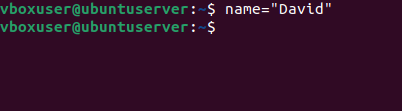

To retrieve the value from the variable run the command `echo $name`:

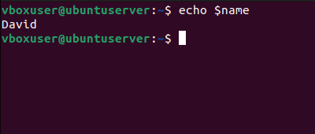

2. **Control Flow**: Control flow statements like `while loops`, `for loops`, `case`, and `if-else` statements are used to control the flow of execution in a script. With these statements, we can make iterations over lists, make decisions, and execute commands based on conditions.

a. **if-else**

Example: Using if-else to execute a script based on conditions:

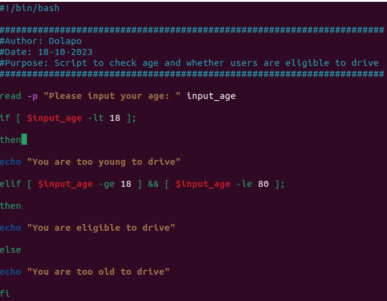

Running the if-else script in the CLI:

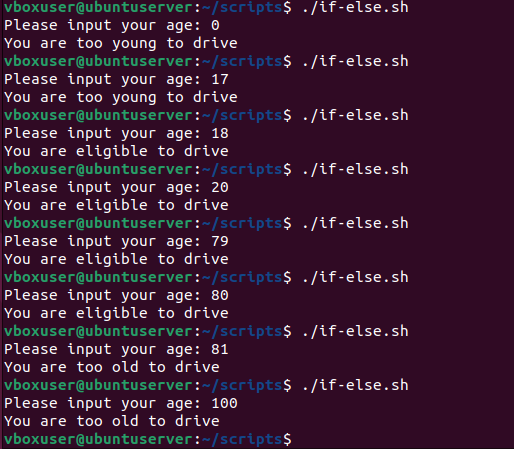

b. **for loop**

Example: Iterating through a list using the `for loop`:

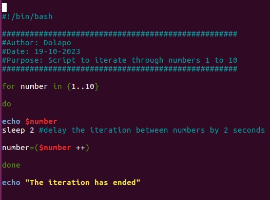

Running the for-loop script in the CLI:

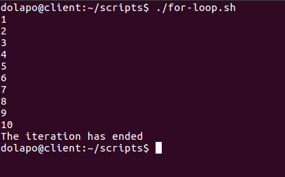

c. **command substitution**

This allows us to capture the output of a command and use it as a value in our script. 

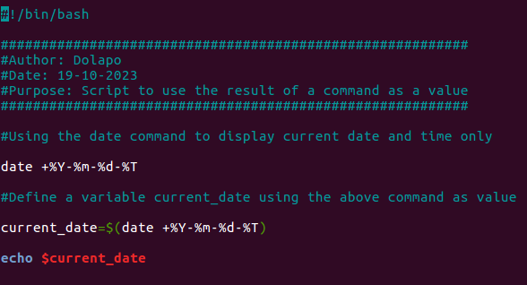

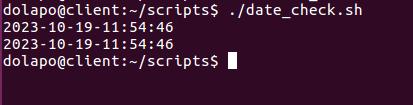

d. **input and output**

Bash can handle input and output. The read command is used to accept user input, while the echo command is used to print output to console.

Script to *accept user input*

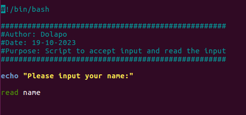

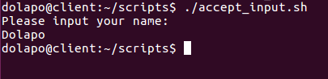

Script to *output text to terminal*

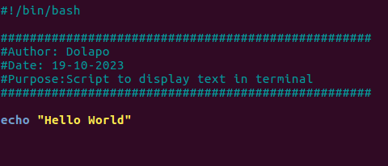

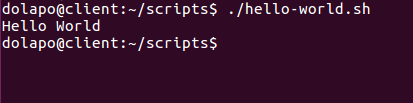

Script to *output the result of a command into a file*

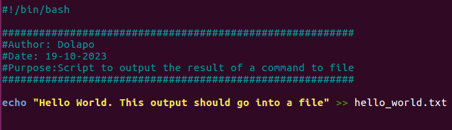

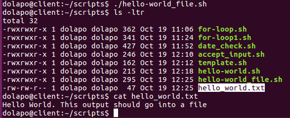

Script to *pass the content of a file as input to a command*

The content of the input file is shown below:

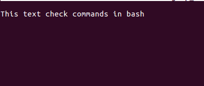

Here's the result from running the command

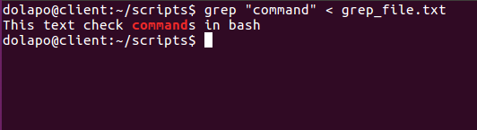

Script to *pass the result of a command as input to another command*

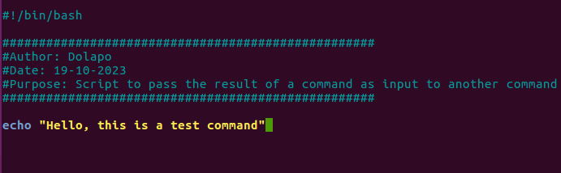

Running the command:

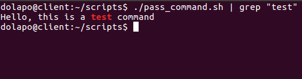

e. **Functions**

With Functions, we can modularize our codes and make them more reusable. Functions can also be used to group unrelated commands together. To define a function, use the `function` keyword or declare the function name followed by parentheses.

Here's a function script

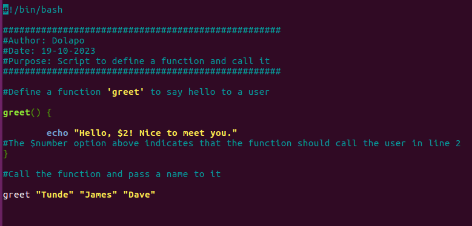

Result of running the script

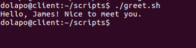

**1. Script to prompt for name and say hello**

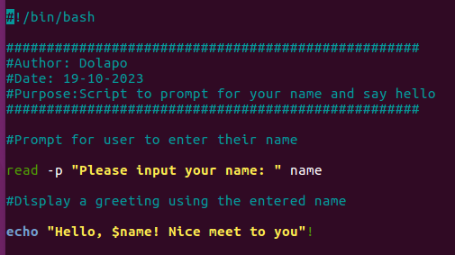

Running the script in the terminal:

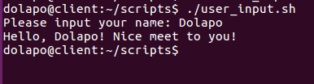

## Directory Manipulation and Navigation

To show directory manipulation and navigation in the Linux file system, we'll write a script to display the current directory, create a new directory called "my_directory", change to that directory, create two files inside the directory, list the files, move back one level up, remove the "my_directory" and its contents, and finally list the files in the current directory again.

The script is detailed below:

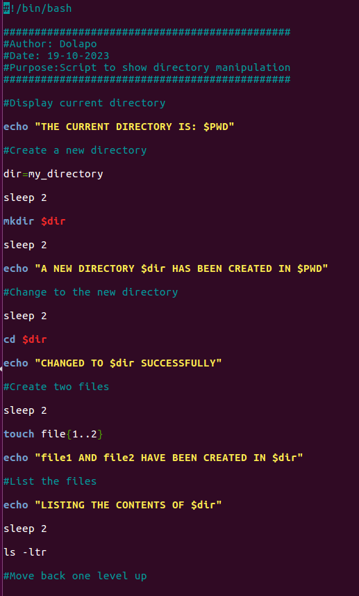
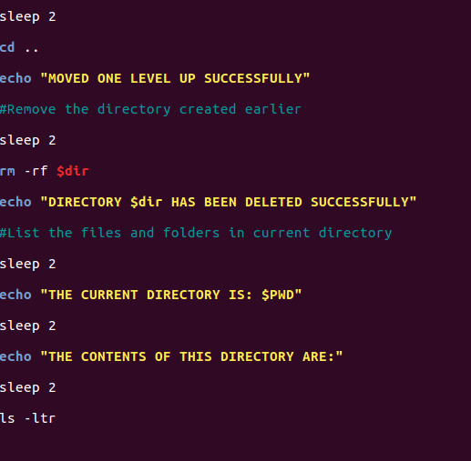

Running the script in the terminal:

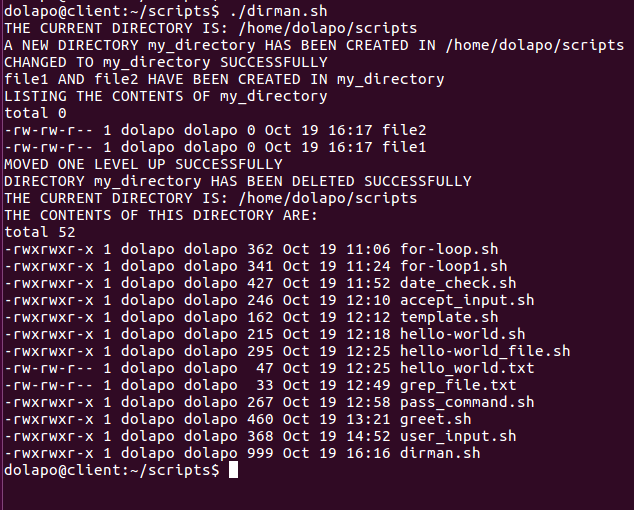

## File Operations and Sorting

To implement File Operations and Sorting, we'll be writing a script to create 3 files, display the files in their current order, sort them alphabetically, save the sorted files as sorted_files.txt, display the sorted files, remove the original files, rename the sorted files to sorted_files_sorted_alphabetically.txt, and finally display the contents of the final sorted file.

Here's the script showing file operations and sorting:

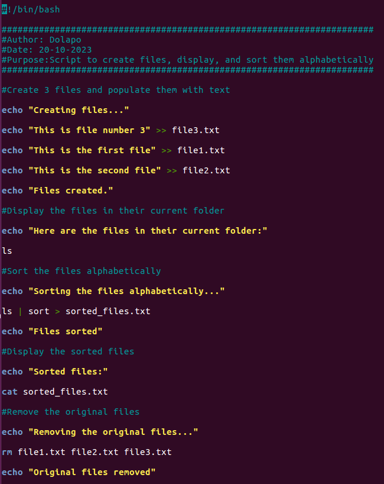
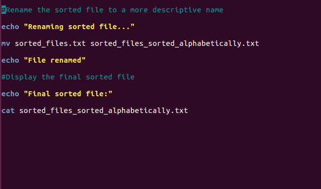

Running the script gives the following results:

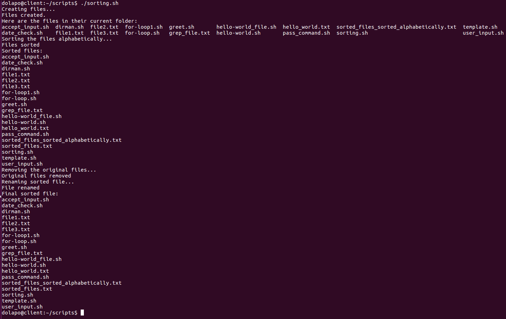

## Working with Numbers and Calculations

In this section, we'll be writing a script to perform arithmetic operations (addition, subtraction, multiplication, modulus, and division) and display the results. Our script will also be performing complex calculations with the results displayed.

