# Understanding Client-Server Architecture with MYSQL as RDBMS

Client-Server architecture refers to a model where two or more computers are connected together over a network to send and receive requests (information or data) between one another. 

During communications, each machine in a Client-Server architecture has its own role with the machine sending requests known as the "Client" and the machine responding to those requests (serving the requests) is known as the "Server".

Here are some of the characteristics of client-server architectures:

- Client and server machines usually require different hardware and software components

- A single computer server can provide multiple services at the same time, although each service requires a separate server program

- Both client and server applications interact directly through the transport layer protocol (TCP) - with the help of lower level protocols. This process facilitates communication and allows the devices to send and receive information.

## Visualizing Client-Server Architecture

Basically, in a client-server architecture, the client sends a GET request for data, while the server accepts and serves the request via a GET response, sending the data back in the form of packets to the user who has requested them.

Here's a diagram representing Client-Server architecture:

In the diagram above, the client tries to access a website through a web browser by sending a http request to the web server (with Apache, Nginx, or IIS, etc. installed) over the internet. The web server responds by serving the website back to the client.

The above architecture can be enhanced with the addition of a database server. That gives us the architecture shown below:

In the diagram above, the web server acts as a "client" that reads and writes data to/from a Database server (MySQL, MongoDB, or SQL server, etc.) through a local network before serving the client that has requested the data through an internet connection.

In simple terms, if we go on a browser and type in `www.propitixhomes.com`, the browser is considered as the "client" that sends a request to the remote server which in turn responds with the requested website. A demonstration of the Client-server communication is shown below by using the `curl -Iv www.propitixhomes.com` command in a linux terminal.

The `curl` package is not installed, so that needs to be installed first.

The result of running the `curl` command to the propitixhomes web page is shown below:

In the above example, the linux terminal is the client while the www.propitixhomes.com is the server. As seen from the request result, the ip address of the computer functioning as the server is `75.2.115.196` on port `80`. The server is also running on the `nginx` web server software.

## Implementing a Client-Server Architecture using MySQL Database Management System (DBMS)

To demonstrate a basic client-server architecture using MySQL RDBMS, we would have to the following:

**1. Create and configure two linux-based virtual servers using EC2 instances on AWS and connect to them**

(a) To create two EC2 instances on AWS, login into AWS and then click on `Launch instance` on the EC2 Dashboard

(b) On the 'Launch an instance' page, fill in the details of the EC2 instance you want to create. It's possible to create two instances at once by specifying the number of instances as '2'

(c) Check that the instances are up and running

(d) Rename the instances to match the specific names we want to give them.

(e) Connect to the EC2 instances using the Termius software

(f) Confirm that connection to the servers is successful

**2. Install MySQL server software on the `mysql server` database engine**

To install the MySQL server software on the EC2 instance:

(a) Update the OS packages on the Ubuntu server by running the `sudo apt update` command:

(b) Install the MySQL server software by running `sudo apt install mysql-server`

(c) It's important to run a security script on the MySQL server installation to remove insecure default settings and lockdown access to the database management system.

The command to run to set the MySQL password of this installation is `ALTER USER 'root'@'localhost' IDENTIFIED WITH mysql_native_password BY '********.***'`. For security purposes, the actual password is hidden in asterisks.

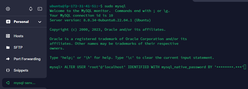

(d) Start the interactive script by running `sudo mysql_secure_installation`

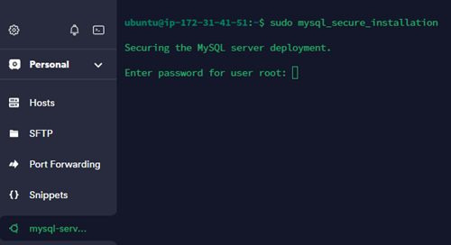

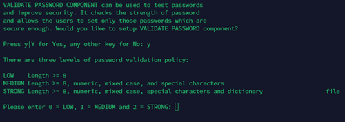

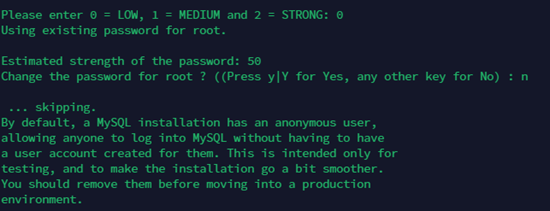

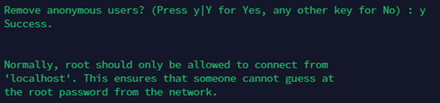

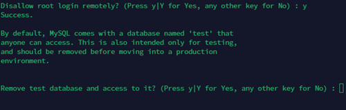

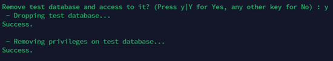

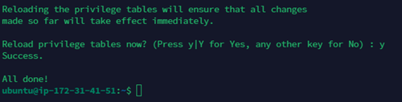

(e) Run the command `sudo mysql -p` to check access to the MySQL console using the prescribed password.

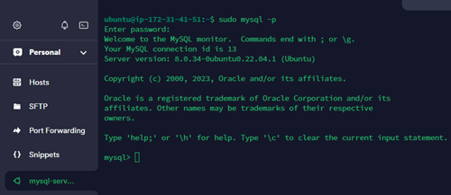

**3. Install MySQL Client software on the `mysql client`**

To install the MySQL client software on the EC2 instance:

(a) Update the OS packages by running the `sudo apt update` command

(b) Install the MySQL client software by running the command `sudo apt install mysql-client`

**4. Edit inbound rules on `mysql server`  to allow communications with `mysql client`**

To edit inbound rules on the `mysql server`:

(a) Log into AWS console and spin up the EC2 instances. Then edit the security tab on the `mysql server` instance to open TCP port 3306

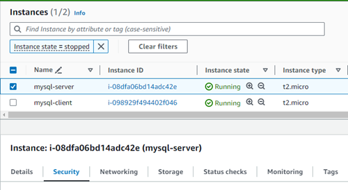

(b) Choose the 'inbound rules' tab

(c) Click on 'Edit inbound rules'

(d) For added security, grant access to the private IP address of the `mysql client` by clicking on 'Add rule'

(e) Add details of the private IP of the `mysql client`

**5. Configure `mysql server` to allow connections from remote hosts**

For the `mysql server` to allow connections from remote hosts:

(a) Edit the `mysqld.cnf` file by running the command `sudo nano /etc/mysql/mysql.conf.d/mysqld.cnf`, then replacing `127.0.0.1` with `0.0.0.0` in the `bind-address` setting of the file

(b) Ensure to restart the mysql service on the `mysql server` by running the command `sudo systemctl restart mysql`

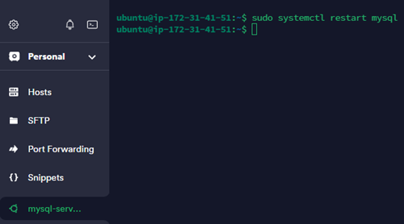

**6. Connect remotely to `mysql server` from `mysql client` using the `mysql` utility and check that the connection is successful**

To connect remotely:

(a) Create a user that will have access to assigned databases on the `mysql server` using the command `CREATE USER 'example_user'@'%' IDENTIFIED WITH mysql_native_password BY 'Password';` where 'example_user' is the name of the new user and 'Password' is the user's password. For this purpose, a user `dolapo` will be created.

(b) Connect to the `mysql server` using the `mysql` utility from the `mysql client`. Ensure to use the private IP address of the `mysql server`

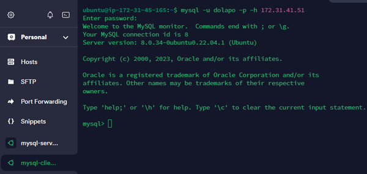

**7. Perform SQL queries to test remote connection between the `mysql client` and `mysql server`**

To perform SQL queries on our `mysql server`:

(a) Connect to the MYSQL database using the `mysql` command from the `mysql client`

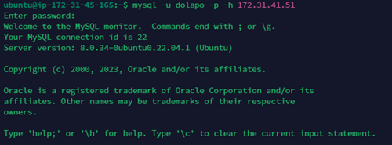

(b) Grant access to the user so it can have access to all databases on the `mysql server`

(c) Run the `show databases` command to check that the user can run commands

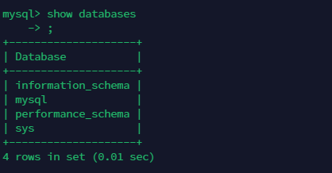

**8. To test further**

(a) Create two databases on the `mysql server`

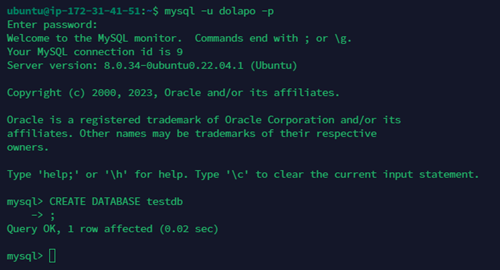

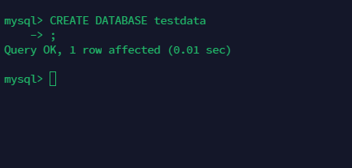

(b) Insert records into the databases

To insert records into the database:

(i) Create a table named travel_list in the testdb database by running the command `CREATE TABLE testdb.travel_list (item_id INT AUTO_INCREMENT,content VARCHAR(255),PRIMARY KEY(item_id))`

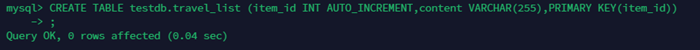

(ii) Create a table named todo_list in the testdata database by running the command `CREATE TABLE testdata.todo_list (item_id INT AUTO_INCREMENT,content VARCHAR(255),PRIMARY KEY(item_id))`

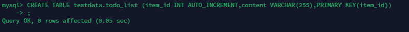

(iii) Populate the travel_list table with data by inserting some rows of content into the table

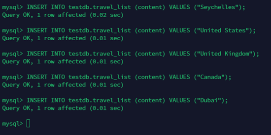

(iv) Confirm that the data was successfully added to the table by running the command `SELECT * FROM testdb.travel_list;`

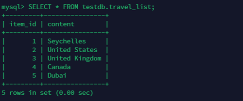

(v) Populate the todo_list table with data by inserting some rows of content into the table

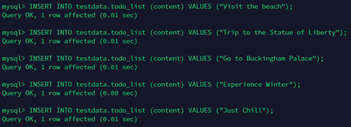

(vi) Confirm that the data was successfully added to the table by running the command `SELECT * FROM testdata.todo_list;`

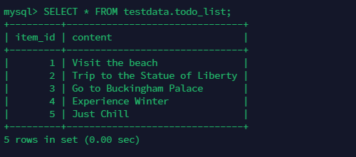

(c) Selecting records from the databases from the `mysql client`

(i) To select the 'item id' entries from the 'todo_list' table, run the command `SELECT item_id FROM testdata.todo_list`

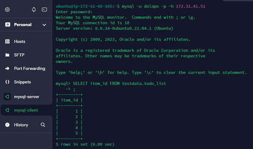

(ii) To select the 'content' entries from the 'travel_list' table, run the command `SELECT content FROM testdb.travel_list` 

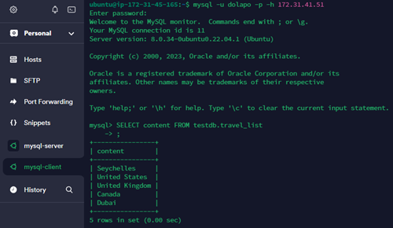

