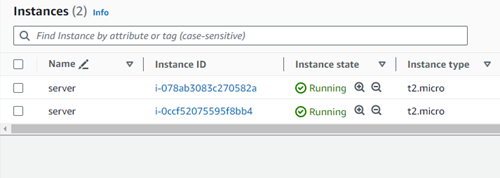
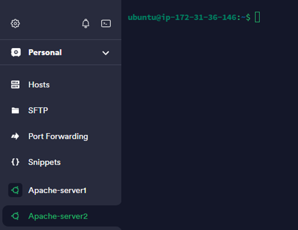
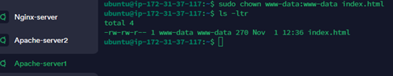
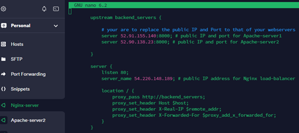

# Implementing Load Balancers with Nginx

Load balancing is an important technique used in computing to maximize resource utilization and guarantee that no single resource in a network is overwhelmed by traffic. In this project, we'll be looking at how we can achieve load balancing with Nginx, a software that can act as a load balancer, webserver, and reverse proxy.

## Introduction to Load Balancing and Nginx

Load balancing allows systems or server admins to distribute workloads across various computing resources such as servers, virtual machines, or containers to achieve improved performance, scalability, and availability. 

For instance, if we have a set of webservers serving a website or application, a load balancer needs to be deployed to share the traffic equally across the webservers. The load balancer sits in front of the webservers and receives all the traffic first before distributing the traffic across the set of webservers. This ensures that none of the webservers gets overworked and consequently improves system performance. 

The diagram below shows a load balancer setup:


### Load Balancing Algorithms

There are techniques used to distribute incoming network traffic or workload amongst multiple servers. These techniques are known as load balancer algorithms. Some of them are:

**1. Round Robin:** The round robin algorithm shares requests successively to each server in the pool. It is easy to deploy and ensures an equal distribution of traffic. This algorithm is best when all servers have identical capabilities and resources.

**2. Weighted Round Robin:** This is similar to the round robin technique, but here, servers are assigned requests based on their capabilities. Servers with more capacities receive more requests. This is best when servers have different performance levels or abilities.  

**3. Least Connections:** This algorithm sends new requests to the server with the least number of active connections. It works best when servers have different workloads or capacities because it sends traffic to the server that's least busy.

**4. Weighted Least Connections:** This is similar to the least connections algorithm. However, servers are assigned requests based on their abilities. Servers with higher capacities receive more requests. This balances traffic based on server capabilities.

**5. IP Hash:** This algorithm employs a hash function based on a client's IP address to constantly map the client to a particular server. This ensures that the same client always connects to the same server, which can be useful for maintaining session data or active connections.

## Setting Up a Basic Load Balancer

To set up a basic load balancer, we'll need to follow the steps below:

### 1. Create EC2 Instances

We need to create three (3) EC2 instances with the Ubuntu operating system. The first two EC2 instances will host the Apache webserver, while the third EC2 instance will host the Nginx server (the load balancer).

To provision the Apache EC2 instances, follow these steps:

**Step 1**

Login into AWS and then click on `Launch instance` on the EC2 Dashboard


**Step 2**

On the 'Launch an instance' page, fill in the details of the EC2 instance. It's possible to create two instances at once by specifying the number of instances as '2'


**Step 3**

Check that the instances are up and running



**Step 4**

Rename the instances to match the specific names we require


To provision the Nginx EC2 instance on AWS, follow these steps:

**Step 1**

Click on `Launch instance` on the EC2 Dashboard


**Step 2**

On the 'Launch an instance' page, fill in the details of the EC2 instance


**Step 3**

Check that the instance is up and running


### 2. Edit the Security Groups to Open `Port 8000` on the Apache EC2 Instances and `Port 80` on the Nginx EC2 Instance

To edit inbound rules on the Apache EC2 instances to open `Port 8080`:

**Step 1**

Navigate to the 'Security' tab on the Apache EC2 instances


**Step 2**

Click on the Security group name (launch-wizard-5) to open the security rules page 


**Step 3**

Click on 'Edit inbound rules' to add the desired rule. Add the desired rule and click on 'Save rules'


**To edit inbound rules on the Nginx EC2 instance to open `Port 80`, follow the above Steps 1 to 3**


### 3. Install Apache Webserver on the Apache EC2 Instances

After provisioning the Apache EC2 instances and opening up `Port 8000`, we can then install apache software on the two servers.

The steps to do this are as follows:

**Step 1**

Connect to the servers using their public IP addresses on the `Termius` software


**Step 2**

Confirm that connection to the Apache servers is successful




**Step 3**

Install apache software on both Apache servers by running the command `sudo apt update -y &&  sudo apt install apache2 -y`


**Step 4**

Verify that apache is running on both servers by running the command `sudo systemctl status apache2`


### 4. Install Nginx Webserver on the Nginx EC2 Instance

After provisioning the Nginx EC2 instance and opening up `Port 80`, we can then install nginx software on the servers.

The steps to do this are as follows:

**Step 1**

Connect to the server using its public IP address on the `Termius` software


**Step 2**

Confirm that connection to the Nginx server is successful


**Step 3**

Install nginx software on the server by running the command `sudo apt update -y && sudo apt install nginx -y`


**Step 4**

Verify that nginx is running on the server by running the command `sudo systemctl status nginx`


### 5. Configure Apache to Serve Content on `Port 8000`

Apache's default port for responding to requests and serving content is `Port 80`. However, for this project, we'll configure our Apache webservers to serve content on `Port 8000`.

**Step 1**

Edit the file `/etc/apache2/ports.conf` and add a listening directive for `Port 8000` on `Apache-server1`


We'll do the same for `Apache-server2`


**Step 2**

Edit the file `/etc/apache2/sites-available/000-default.conf` and change `Port 80` on the `Virtualhost` entry to `8000` on `Apache-server1`


We'll do the same for `Apache-server2`


**Step 3**

Restart apache to load the new configuration on both `Apache-server1` and `Apache-server2` using the command `sudo systemctl restart apache2`


**Step 4**

Create a new `index.html` file to override apache webserver's default index html file. Our new file will contain information to display the public IP of the Apache EC2 instances. 

The information for `Apache-server1` is:

```
        <!DOCTYPE html>
        <html>
        <head>
            <title>My EC2 Instance</title>
        </head>
        <body>
            <h1>Welcome to my EC2 instance on Apache-server1</h1>
            <p>Public IP: 52.91.155.140</p>
        </body>
        </html>
```


**Step 5**

Change the file ownership of the new `index.html` file using the command `sudo chown www-data:www-data index.html`



**Step 6**

Override the default html of `Apache-server1` by copying the new `index.html` file to the `/var/www/html/index.html` location using the command `sudo cp -f index.html /var/www/html/index.html`


**Step 7**

Restart apache to load the new configuration on `Apache-server1` by running the command `sudo systemctl restart apache2`


**Step 8**

Check to see if our content can be displayed on a web browser through the public IP address of `Apache-server1`


**We can repeat **Steps 1 to 8** to get the same result from `Apache-server2`**

The information for `Apache-server2` will be:

```
        <!DOCTYPE html>
        <html>
        <head>
            <title>My EC2 Instance</title>
        </head>
        <body>
            <h1>Welcome to my EC2 instance on Apache-server2</h1>
            <p>Public IP: 52.90.138.23</p>
        </body>
        </html>
```

Check to see if our content can be displayed on a web browser through the public IP address of `Apache-server2`


### 6. Configure Nginx as a Load Balancer

To configure the `Nginx-server` as a load balancer, the steps to take are as follows:

**Step 1**

Edit the Nginx configuration file using the command `sudo nano /etc/nginx/conf.d/loadbalancer.conf`


The file will be populated with the below information:

```
        upstream backend_servers {

            # your are to replace the public IP and Port to that of your webservers
            server 52.91.155.140:8000; # public IP and port for Apache-server1
            server 52.90.138.23:8000; # public IP and port for Apache-server2

        }

        server {
            listen 80;
            server_name 54.226.148.189; # public IP address for Nginx load-balancer

            location / {
                proxy_pass http://backend_servers;
                proxy_set_header Host $host;
                proxy_set_header X-Real-IP $remote_addr;
                proxy_set_header X-Forwarded-For $proxy_add_x_forwarded_for;
            }
        }
```



**Step 2**

Test the configuration on `Nginx-server` by running the command `sudo nginx -t`


**Step 3**

Restart Nginx to load the new configuration by running the command `sudo systemctl restart nginx`


**Step 4**

Check to see if content from `Apache-server1` and `Apache-server2` can be displayed on the `Nginx-server` web browser using the load balancer's public IP address


From the above images, the load balancer (`Nginx-server`) servers us the same web pages as the Apache servers.


