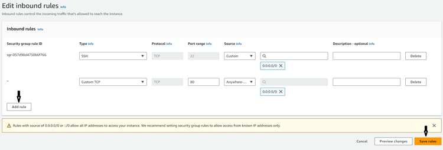
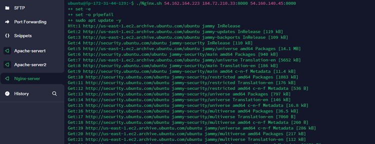
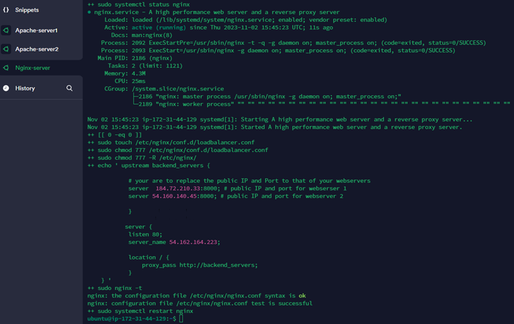

# Automating Load Balancer Configuration with Shell Scripting

Load balancing automation involves using scripts or software tools to create, update, monitor, and delete load balancers along with their associated rules and policies. 

Automating the load balancer configuration can lead to a reduction in human intervention, help cut out configuration mistakes, and aid adjustment to changing traffic patterns and server conditions.

Some of the benefits of load balancing automation are:

- Improves server administration

- Saves time and resources

- Enhances reliability and security

- Improves scalability and flexibility

- Optimizes performance and availability

## Automating the Deployment and Configuration of Apache Webservers

In the previous project (Project 7), we implemented two Apache backend servers with an Nginx load balancer distributing traffic between both servers. The whole process in Project 7 was done manually. However, for this project we'll be automating the process from start to finish by using a shell script to run our commands.

To automate the deployment and configuration of Apache webserver EC2 instances, we'll need to follow the steps below:

### Provision two EC2 instances running on the Ubuntu OS**

**Step 1: Click on the 'Launch instances' tab on the AWS dashboard**


**Step 2: Fill out the details of the servers, selecting the Ubuntu OS, and attaching (or creating) a key pair, then click on 'Launch instance' at the bottom of the page**


Check that the instances are up and running


### Open Port 8000 to Allow Traffic from Anywhere

**Step 1: Edit the 'inbound rules' under the Security Group tab of the EC2 instances**


Click on 'Add rule' to add the necessary rule details and click on 'Save rules' 


### Connect to the Webservers

**Step 1: We'll connect to the webservers through the Termius software**


### Deploy and Configure the Webservers Using a Script

We'll use the shell script below to deploy and configure the Apache webservers

```
#!/bin/bash

####################################################################################################################
##### This automates the installation and configuring of apache webserver to listen on port 8000
##### Usage: Call the script and pass in the Public_IP of your EC2 instance as the first argument as shown below:
######## ./install_configure_apache.sh 127.0.0.1
####################################################################################################################

set -x # debug mode
set -e # exit the script if there is an error
set -o pipefail # exit the script when there is a pipe failure

PUBLIC_IP=$1

[ -z "${PUBLIC_IP}" ] && echo "Please pass the public IP of your EC2 instance as an argument to the script" && exit 1

sudo apt update -y &&  sudo apt install apache2 -y

sudo systemctl status apache2

if [[ $? -eq 0 ]]; then
    sudo chmod 777 /etc/apache2/ports.conf
    echo "Listen 8000" >> /etc/apache2/ports.conf
    sudo chmod 777 -R /etc/apache2/

    sudo sed -i 's/<VirtualHost \*:80>/<VirtualHost *:8000>/' /etc/apache2/sites-available/000-default.conf

fi
sudo chmod 777 -R /var/www/
echo "<!DOCTYPE html>
        <html>
        <head>
            <title>My EC2 Instance</title>
        </head>
        <body>
            <h1>Welcome to my EC2 instance</h1>
            <p>Public IP: "${PUBLIC_IP}"</p>
        </body>
        </html>" > /var/www/html/index.html

sudo systemctl restart apache2
```
**Step 1: The above shell script will be added to a file named `install.sh` on both `Apache-server1` and `Apache-server2` with the some modifications made to the script to reflect our webservers using the command `sudo nano install.sh`**


**Step 2: Make the shell script executable on the two webservers by using the command `sudo chmod +x install.sh`**


**Step 3: Run the shell script on `Apache-server1` and `Apache-server2` using the command `./install.sh PUBLIC_IP` where 'PUBLIC_IP' is the individual public IP of the servers**


## Deploying Nginx as a Load Balancer Using a Shell Script

After successfully deploying and configuring the two Apache webservers, we'll use a script to deploy and configure an Nginx load balancer and open `Port 80` to allow connection from anywhere. To do this, we'll take the following steps:

### Provision an EC2 instance running on the Ubuntu OS**

**Step 1: Click on the 'Launch instances' tab on the AWS dashboard**


**Step 2: Just like we did for the Apache servers, fill out the details of the server, selecting the Ubuntu OS, and attaching (or creating) a key pair, then click on 'Launch instance' at the bottom of the page. Confirm that the instance is up and running**


### Open Port 8000 to Allow Traffic from Anywhere

**Step 1: Edit the 'inbound rules' under the Security Group tab of the EC2 instance**


Click on 'Add rule' to add the necessary rule details and click on 'Save rules' 




### Connect to the Nginx Load Balancer

**Step 1: We'll connect to the load balancer through the Termius software**


### Deploy and Configure the Load Balancer Using a Script

We'll use the shell script below to deploy and configure the load balancer

```
#!/bin/bash

######################################################################################################################
##### This automates the configuration of Nginx to act as a load balancer
##### Usage: The script is called with 3 command line arguments. The public IP of the EC2 instance where Nginx is installed
##### the webserver urls for which the load balancer distributes traffic. An example of how to call the script is shown below:
##### ./configure_nginx_loadbalancer.sh PUBLIC_IP Webserver-1 Webserver-2
#####  ./configure_nginx_loadbalancer.sh 127.0.0.1 192.2.4.6:8000  192.32.5.8:8000
############################################################################################################# 

PUBLIC_IP=$1
firstWebserver=$2
secondWebserver=$3

[ -z "${PUBLIC_IP}" ] && echo "Please pass the Public IP of your EC2 instance as the argument to the script" && exit 1

[ -z "${firstWebserver}" ] && echo "Please pass the Public IP together with its port number in this format: 127.0.0.1:8000 as the second argument to the script" && exit 1

[ -z "${secondWebserver}" ] && echo "Please pass the Public IP together with its port number in this format: 127.0.0.1:8000 as the third argument to the script" && exit 1

set -x # debug mode
set -e # exit the script if there is an error
set -o pipefail # exit the script when there is a pipe failure


sudo apt update -y && sudo apt install nginx -y
sudo systemctl status nginx

if [[ $? -eq 0 ]]; then
    sudo touch /etc/nginx/conf.d/loadbalancer.conf

    sudo chmod 777 /etc/nginx/conf.d/loadbalancer.conf
    sudo chmod 777 -R /etc/nginx/

    
    echo " upstream backend_servers {

            # your are to replace the public IP and Port to that of your webservers
            server  "${firstWebserver}"; # public IP and port for webserser 1
            server "${secondWebserver}"; # public IP and port for webserver 2

            }

           server {
            listen 80;
            server_name "${PUBLIC_IP}";

            location / {
                proxy_pass http://backend_servers;   
            }
    } " > /etc/nginx/conf.d/loadbalancer.conf
fi

sudo nginx -t

sudo systemctl restart nginx
```

**Step 1: The above shell script will be added to a file named `Nginx.sh` on `Nginx-server` with the some modifications made to the script to reflect our webservers using the command `sudo nano Nginx.sh`**


**Step 2: Make the shell script executable on `Nginx-server` by using the command `sudo chmod +x Nginx.sh`**


**Step 3: Run the shell script on `Nginx-server` using the command `./Nginx.sh PUBLIC_IP Webserver-1 Webserver-2` where 'PUBLIC_IP' is the public IP of the load balancer (`Nginx-server`), 'Webserver-1' is the public IP and Port of the first web server (`Apache-server1`) and 'Webserver-2' is the public IP and Port of the second web server (`Apache-server2`)**






