# Implementing WordPress Website With LVM Storage Management

## What is a 3-Tier Architecture?

The 3-tier architecture is a client-server architecture that separates the user interface (presentation layer), application processing (application layer), and data management (data layer) into three distinct tiers or layers. It is commonly used in modern web solutions and enterprise systems because it provides scalability, security, and flexibility.

The diagram below shows a 3-tier architecture setup:

Here is a brief description of each tier in the 3-tier architecture:

**Presentation Tier**: This is the user interface or client layer of an application or web solution. It is responsible for presenting data to the user and receiving input from the user. This layer can be a desktop application, mobile app, or web browser.

**Application Tier**: This is the middle layer of the 3-tier architecture. It is responsible for processing and managing the business logic of the web solution or application. This tier communicates with the presentation tier to receive user input and communicates with the data management tier to retrieve or store data. This tier includes application servers, web servers, or Application Programming Interfaces (APIs).

**Data Management Tier**: This is the third layer of the 3-tier architecture. It is responsible for managing and storing data. This tier includes data warehouses, databases, or data lakes. The data management tier communicates with the application tier to receive or store data.

For DevOps engineers, a deep understanding of the core components of web solutions and the ability to handle common challenges, troubleshoot issues, and effectively manage a website's resources are essential. Thus, the main thrust of this project is to implement a web solution using different technologies. 

My 3-tier architecture setup for this project will be:

1. A PC to serve as a client

2. An EC2 Linux server (the web server running on RedHat Linux OS), where I'll install WordPress

3. An EC2 Linux server (the database server running on RedHat Linux OS)

## Configuring a Web Server and Implementing LVM Storage Subsystem on It

To configure a web server, here are the steps to follow:

### Create A Web Server

Launch an EC2 instance to use as the Web Server.  

**Step 1: Login into AWS and then click on `Launch instance` on the EC2 Dashboard**

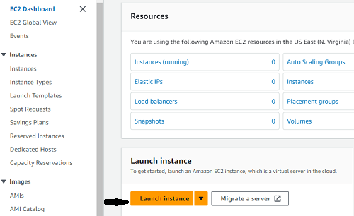

**Step 2: On the 'Launch an instance' page, fill in the details of the EC2 instance**

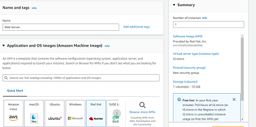

**Step 3: Check that the instance is up and running**

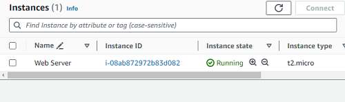

### Create Storage Volumes

Create 3 storage volumes of 10GiB each in the same Availability Zone (AZ) as the Web Server.

**Step 1: Click on the 'Volumes' link on the EC2 Dashboard**

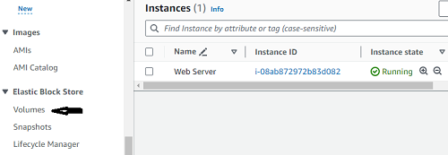

**Step 2: On the 'Volumes' page, click on 'Create volume'**

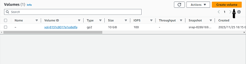

**Step 3: On the Volume Creation page, enter the Volume settings then click on 'Create volume'**

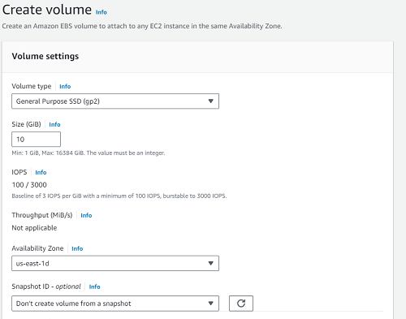

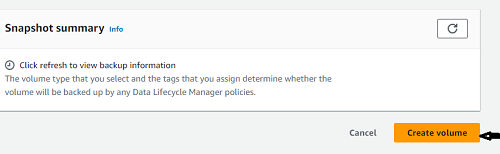

**Step 4: Repeat 'Step 3' to create two more 10GiB volumes**

The three newly created volumes are shown below

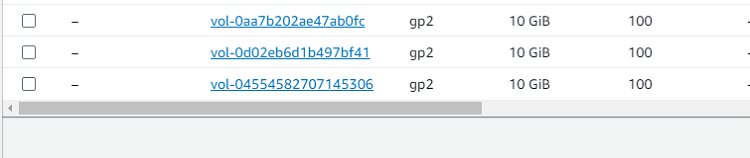

### Attach the Newly Created Storage Volumes to the EC2 Instance

To attach the storage volumes created in the last section, follow these steps

**Step 1: Click on the 'Volume ID' of one of the Volumes to go into the Volume Details**

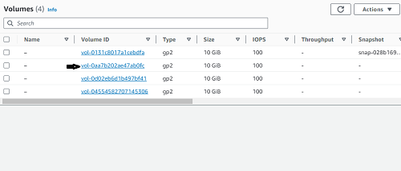

**Step 2: Under the 'Actions' tab, click on 'Attach Volume'**

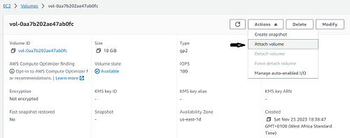

**Step 3: On the 'Attach volume' page, select the relevant EC2 instance, then click on 'Attach volume' at the bottom of the page**

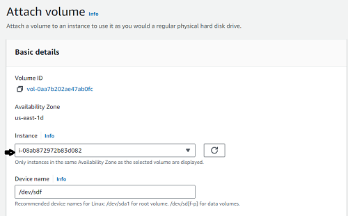

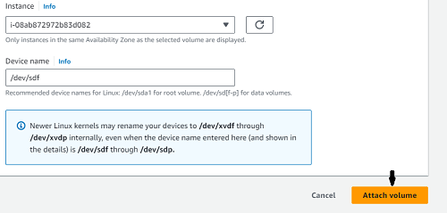

**Step 4: Repeat Steps 1 to 3 above to attach the other Storage Volumes to the EC2 instance, then check under the 'Storage' tab of the EC2 instance to confirm that they have been attached**

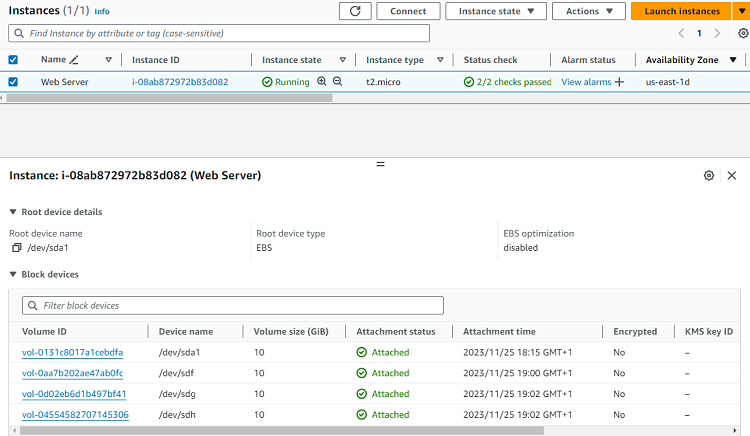

### Implement LVM Storage Configuration on the Web Server

After provisioning the Web Server EC2 instance, the next thing is to configure the LVM Storage Subsystem.

The steps to do this are as follows:

**Step 1: Connect to the Web Server using its public IP address on the Termius software**

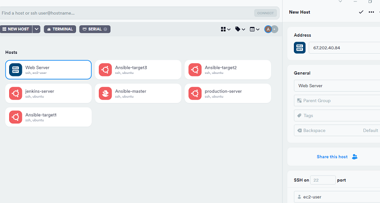

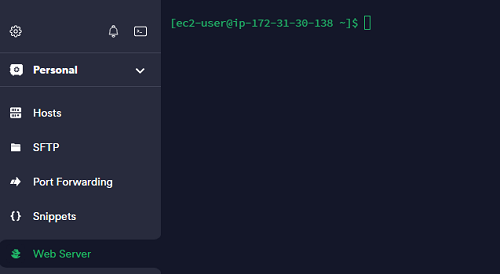

**Step 2: Use the `lsblk` command to check the block devices attached to the Web Server and the `df -h` command to see all mounts and free space on the Server**

The `lsblk` command shows that `xvdf`, `xvdg`, and `xvdh` are attached.
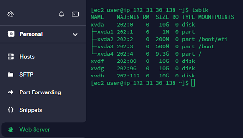

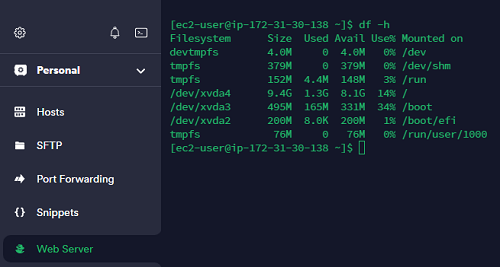

**Step 3: Create a single partition on each of the 3 disks using the `gdisk` utility, using the command `sudo gdisk /dev/xvdf` for the first disk and the relevant names for the other two disks**

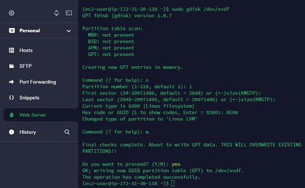

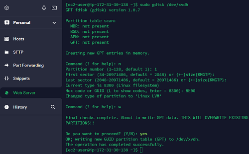

**Step 4: Use the `lsblk` command to view the newly-configured partitions on the disks**

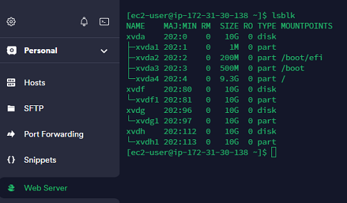

**Step 5: Install the `lvm2` package by running the `sudo yum install lvm2` command, then run `sudo lvmdiskscan` command to check for available partitions**

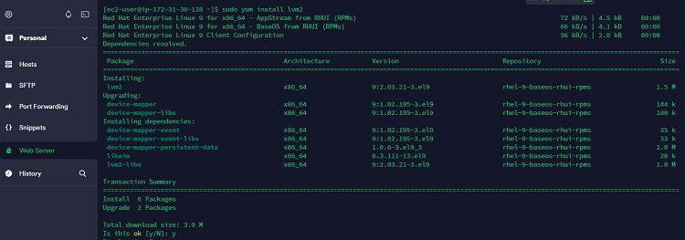

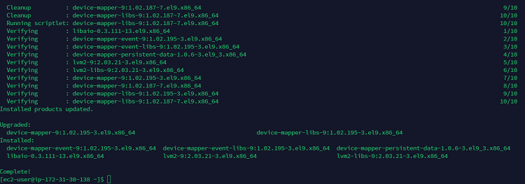

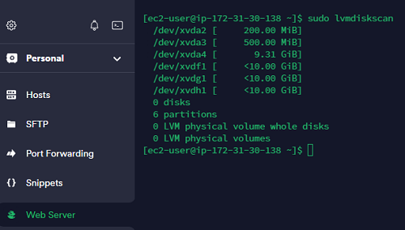

**Step 6: Mark each of the three disks as Physical Volumes (PVs) to be used by LVM by running the command `sudo pvcreate /dev/partition`**

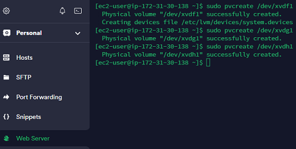

**Step 7: Confirm that the PVs have been created by running the command `sudo pvs`**

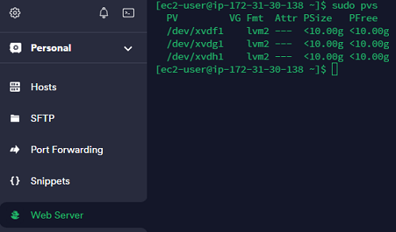

**Step 8: Add all 3 Physical Volumes (PVs) to a Volume Group (VG) named `webdata -vg` using the command `sudo vgcreate webdata-vg /dev/xvdh1 /dev/xvdg1 /dev/xvdf1`**

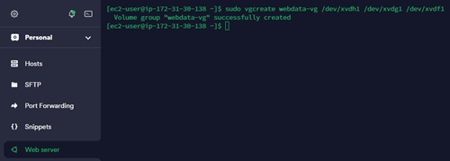

**Step 9: To check if the VG has been successfully created run the command `sudo vgs`**

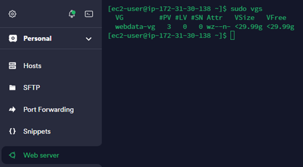

**Step 10: Create 2 logical volumes `apps-lv` and `logs-lv` using the lvcreate command. `apps-lv` will be used to store data for the website and `logs-lv` will be used to store data for logs**

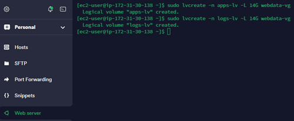

**Step 11: Verify that the Logical Volume (LV) has been created successfully by running `sudo lvs`**

**Step 12: Verify the complete setup by running the commands `sudo vgdisplay -v #view complete setup - VG, PV, and LV` and `sudo lsblk`**

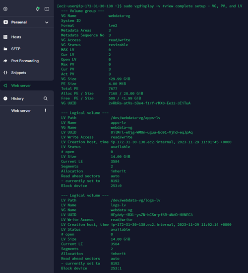
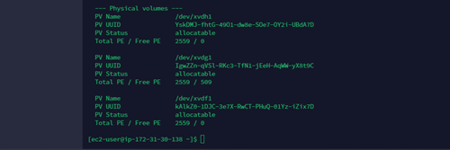

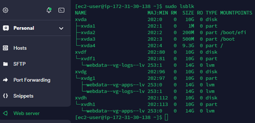

**Step 13: 

 

