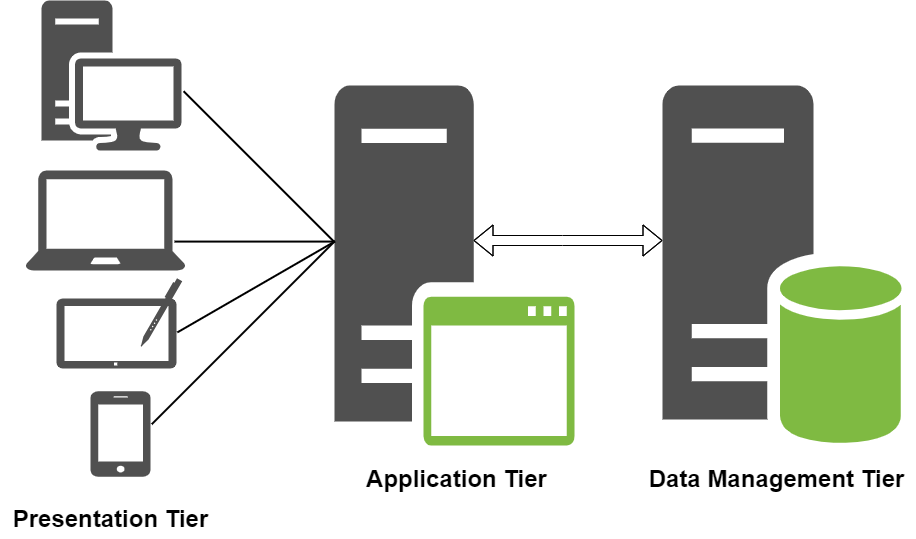

# Implementing WordPress Website With LVM Storage Management

## What is a 3-Tier Architecture?

The 3-tier architecture is a client-server architecture that separates the user interface (presentation layer), application processing (application layer), and data management (data layer) into three distinct tiers or layers. It is commonly used in modern web solutions and enterprise systems because it provides scalability, security, and flexibility.

The diagram below shows a 3-tier architecture setup:

Here is a brief description of each tier in the 3-tier architecture:

Presentation Tier: This is the user interface or client layer of an application or web solution. It is responsible for presenting data to the user and receiving input from the user. This layer can be a desktop application, mobile app, or web browser.

Application Tier: This is the middle layer of the 3-tier architecture. It is responsible for processing and managing the business logic of the web solution or application. This tier communicates with the presentation tier to receive user input and communicates with the data management tier to retrieve or store data. This tier includes application servers, web servers, or Application Programming Interfaces (APIs).

Data Management Tier: This is the third layer of the 3-tier architecture. It is responsible for managing and storing data. This tier includes data warehouses, databases, or data lakes. The data management tier communicates with the application tier to receive or store data.

For DevOps Engineers, a deep understanding of the core components of web solutions and the ability to handle common challenges, troubleshoot issues, and effectively manage a website's resources are essential. Thus, the main crux of this project is implementing a web solution using different technologies. 