# Implementing WordPress Website With LVM Storage Management

## What is a 3-Tier Architecture?

The 3-tier architecture is a client-server architecture that separates the user interface (presentation layer), application processing (application layer), and data management (data layer) into three distinct tiers or layers. It is commonly used in modern web solutions and enterprise systems because it provides scalability, security, and flexibility.

The diagram below shows a 3-tier architecture setup:


Here is a brief description of each tier in the 3-tier architecture:

**Presentation Tier**: This is the user interface or client layer of an application or web solution. It is responsible for presenting data to the user and receiving input from the user. This layer can be a desktop application, mobile app, or web browser.

**Application Tier**: This is the middle layer of the 3-tier architecture. It is responsible for processing and managing the business logic of the web solution or application. This tier communicates with the presentation tier to receive user input and communicates with the data management tier to retrieve or store data. This tier includes application servers, web servers, or Application Programming Interfaces (APIs).

**Data Management Tier**: This is the third layer of the 3-tier architecture. It is responsible for managing and storing data. This tier includes data warehouses, databases, or data lakes. The data management tier communicates with the application tier to receive or store data.

For DevOps engineers, a deep understanding of the core components of web solutions and the ability to handle common challenges, troubleshoot issues, and effectively manage a website's resources are essential. Thus, the main thrust of this project is to implement a web solution using different technologies. 

My 3-tier architecture setup for this project will be:

1. A PC to serve as a client

2. An Oracle VirtualBox Linux server (DB001 - the Database Server running on RedHat Linux OS). 

3. An Oracle VirtualBox Linux server (WB001 - the Web Server running on RedHat Linux OS), where I'll install WordPress. 

## Configuring the Database Server and Implementing LVM Storage Subsystem on It

After creating a VirtualBox VM and installing RHEL8 on it to setup the Database Server, the next step is to create a LVM storage subsystem on the server. The steps to do that are as follows:

**Step 1: Create three (3) Virtual Hard Disks of 10GiB each named xvdf.vdi, xvdg.vdi, and xvdh.vdi in the Hard Disk Selector panel of Oracle VM VirtualBox Manager**


**Step 2: Attach the Virtual Hard Disks to the Virtual Machine (DB Server)**

- Click on `Settings` at the top of the VirtualBox Manager, then click on `Storage` in the pop-up box and select `Controller:SATA`


- Click on the `+` sign to add a hard disk, then select the Virtual Hard Disks that were created earlier and click on `Choose`to add them to the Virtual Machine

- Click on `Ok`


**Step 3: Start the Virtual Machine and use the `lsblk` command to check the block devices attached to the Database Server (DB001)**


**Step 4: Use the `df -h` command to see all mounts and free space on the Server**


**Step 5: Create a single partition on each of the three (3) disks using the `gdisk` utility, running the command `sudo gdisk /dev/sdb` for the first disk and the relevant names for the other two disks**


**Step 6: Use the `lsblk` command to view the newly-configured partitions on the disks**


**Step 7: Run `sudo lvmdiskscan` command to check for available partitions**


**Step 8: Mark each of the three partitions as Physical Volumes (PVs) to be used by LVM by running the command `sudo pvcreate /dev/partition`**


**Step 9: Confirm that the PVs have been created by running the command `sudo pvs`**


**Step 10: Add all 3 Physical Volumes (PVs) to a Volume Group (VG) named `dbdata-vg` by running the command `sudo vgcreate dbdata-vg /dev/sdb1 /dev/sdc1 /dev/sdd1`**


**Step 11: To check if the VG has been successfully created, run the command `sudo vgs`**


**Step 12: Create one (1) logical volume `db-lv` of 20GiB size by running the command `sudo lvcreate -n db-lv -L 20G dbdata-vg`**

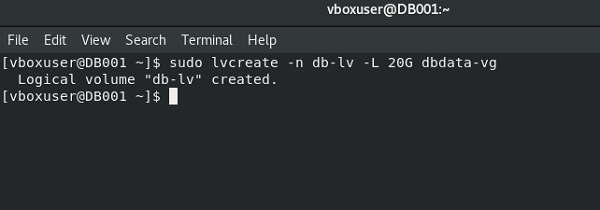

**Step 13: Verify that the Logical Volume (LV) has been created successfully by running `sudo lvs`**


**Step 14: Verify the complete setup by running the commands `sudo vgdisplay -v #view complete setup - VG, PV, and LV` and `sudo lsblk`**


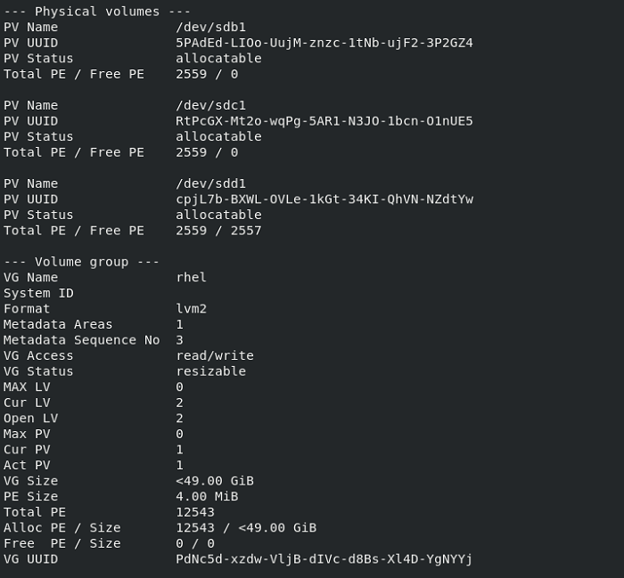

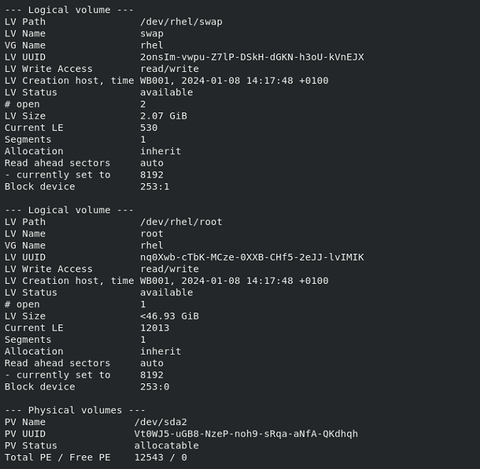


**Step 15: Format the Logical Volume to the `ext4` filesystem by running the command `sudo mkfs -t ext4 /dev/dbdata-vg/db-lv`**

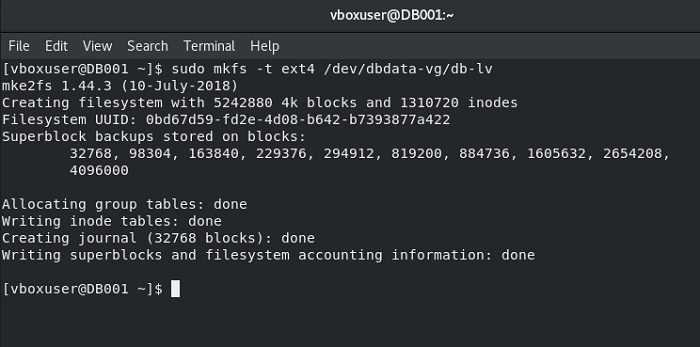

**Step 16: Create the /db directory to store database files by running the command `sudo mkdir /db`**


**Step 17: Mount `/db` on the `db-lv` logical volume by running the command `sudo mount /dev/dbdata-vg/db-lv /db/`**

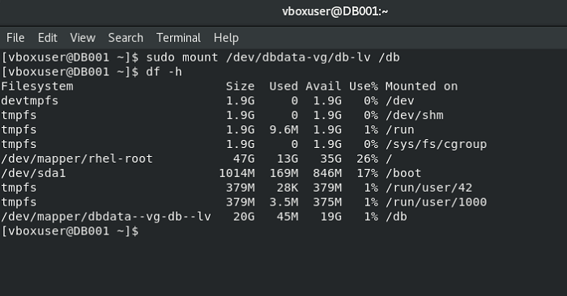

**Step 18: Update the `/etc/fstab` file to enable auto-mount every time the Database Server is restarted. The UUID of the device will be used to update `/etc/fstab`**

Run `sudo blkid` command to get the UUIDs

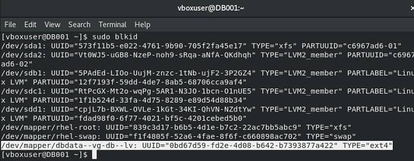

Then run `sudo vi /etc/fstab`

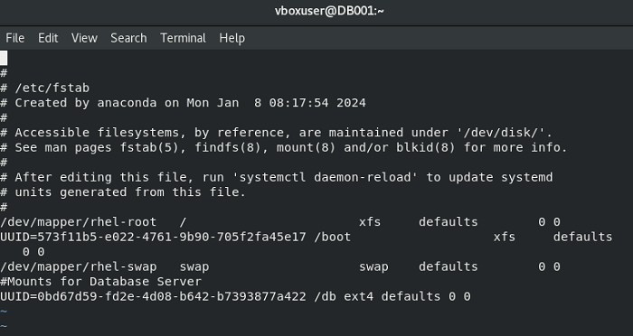

**Step 19: Test the configuration and reload the daemon by running the commands `sudo mount -a` and `sudo systemctl daemon-reload`**

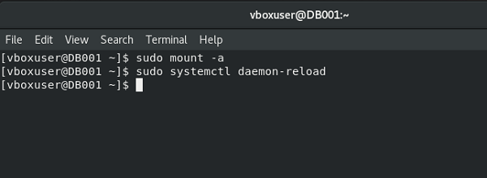

**Step 20: Verify the setup by running `df -h`**


## Configuring a Web Server and Implementing LVM Storage Subsystem on It

To create and setup the Web Server (WB001), steps 1 to 20 above are replicated on another VirtualBox Virtual Machine. The outcome of running these steps is shown below by verifying the setup through the `df -h` command:


## Installing WordPress on the Web Server

To install WordPress on the Web Server, we need to follow the steps below:

**Step 1: Update the repository by running the command `sudo yum update -y`**

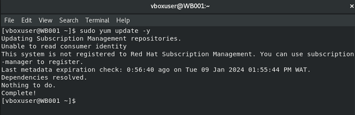

**Step 2: Install wget, Apache, and its dependencies**

Run the command `sudo yum -y install wget httpd php php-mysqlnd php-fpm php-json` to install the necessary packages.

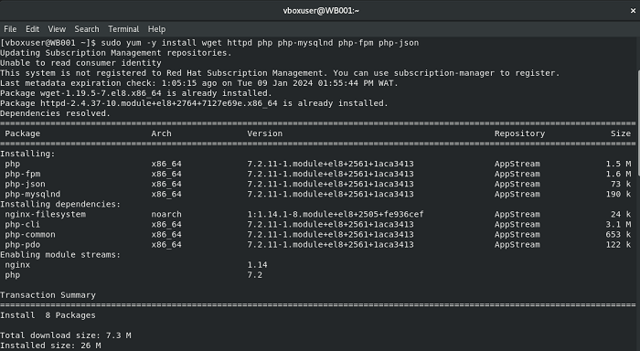

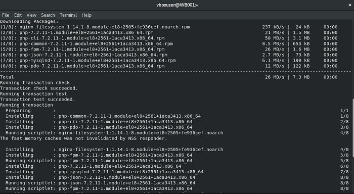


As shown in the information at the start of the installation process, the wget and httpd packages have already been installed.

**Step 3: Confirm that Apache is running on the Web Server by executing the command `sudo systemctl status httpd`**


**Step 4: Install PHP and Its Dependencies**

To install PHP and its dependencies, we'll need to run the following commands 
```
sudo yum install https://dl.fedoraproject.org/pub/epel/epel-release-latest-8.noarch.rpm
sudo yum install yum-utils http://rpms.remirepo.net/enterprise/remi-release-8.rpm
sudo yum module list php
sudo yum module reset php
sudo yum module enable php:remi-7.4
sudo yum install php php-opcache php-gd php-curl php-mysqlnd
sudo systemctl start php-fpm
sudo systemctl enable php-fpm
setsebool -P httpd_execmem 1
```
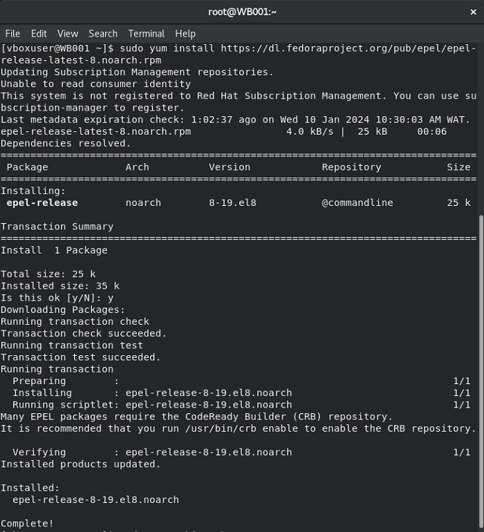


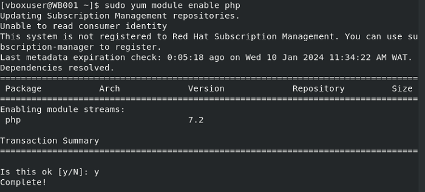


**Step 5: Restart Apache on the Web Server**


**Step 6: Download the WordPress package, unpack it, and copy it to the `/var/www/html` directory on the Web Server**

Run these series of commands:
```
mkdir wordpress
cd   wordpress
sudo wget http://wordpress.org/latest.tar.gz
sudo tar xzvf latest.tar.gz
sudo rm -rf latest.tar.gz
cp wordpress/wp-config-sample.php wordpress/wp-config.php
cp -R wordpress/. /var/www/html/
```


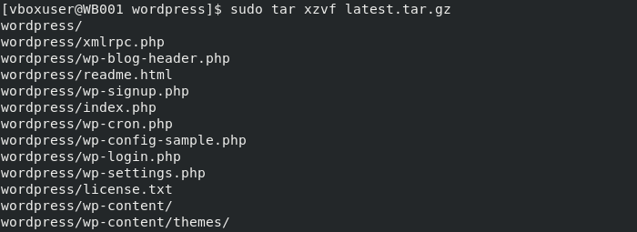


**Step 7: Configure SELinux Policies**

Run the following commands to setup SELinux Policies:
```
 sudo chown -R apache:apache /var/www/html/wordpress
 sudo chcon -h system_u:object_r:httpd_sys_content_t /var/www/html/wordpress -R
 sudo setsebool -P httpd_can_network_connect=1
```
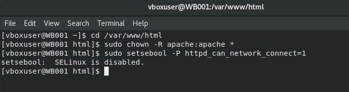

## Installing MySQL on the Web Server and Database Server

**Step 1: To install MySQL on both the Web Server and the Database Server, run the following commands**

```
sudo yum update
sudo yum install mysql-server
```

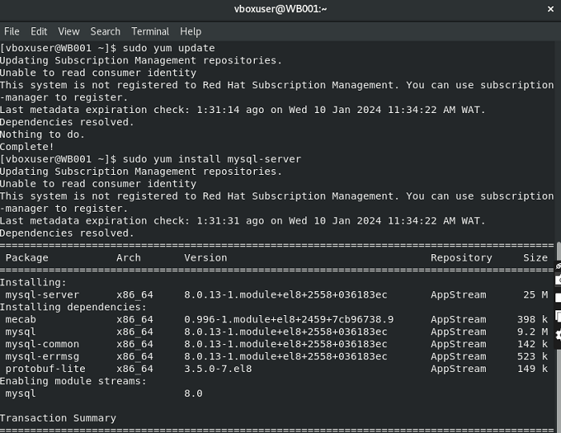


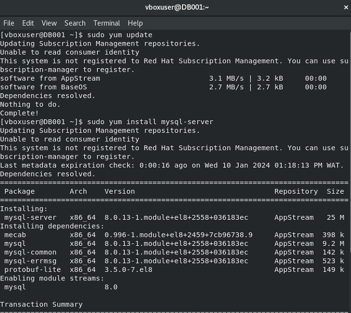


**Step 2: Verify that the MySQL service is up and running on both the Web Server and the Database Server**

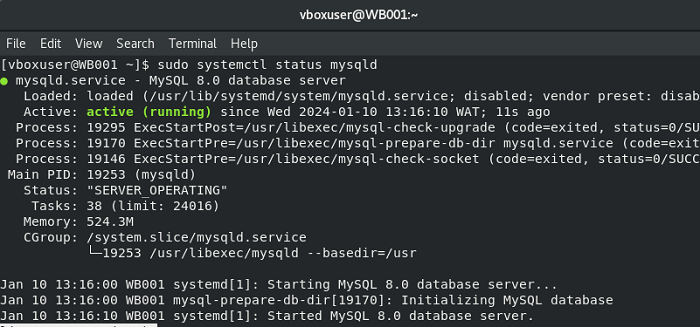


## Configuring the Connection Between the Database and WordPress

**Step 1: It's important to run a security script on the MySQL server installation on the Database Server to remove insecure default settings and lockdown access to the database management system**

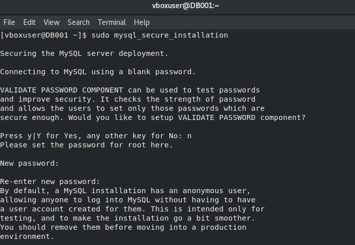

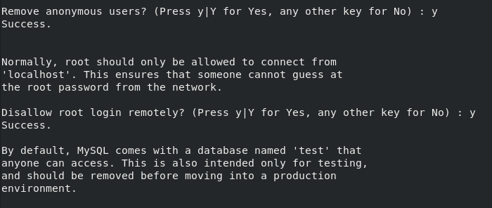


**Step 2: Then run these commands sequentially**
```
sudo mysql -u root -p
CREATE DATABASE wordpress;
CREATE USER 'mydbuser'@'%' IDENTIFIED WITH mysql_native_password BY '**********';
GRANT ALL PRIVILEGES ON *.* TO 'mydbuser'@'%' WITH GRANT OPTION;
FLUSH PRIVILEGES;
SHOW DATABASES;
exit
```
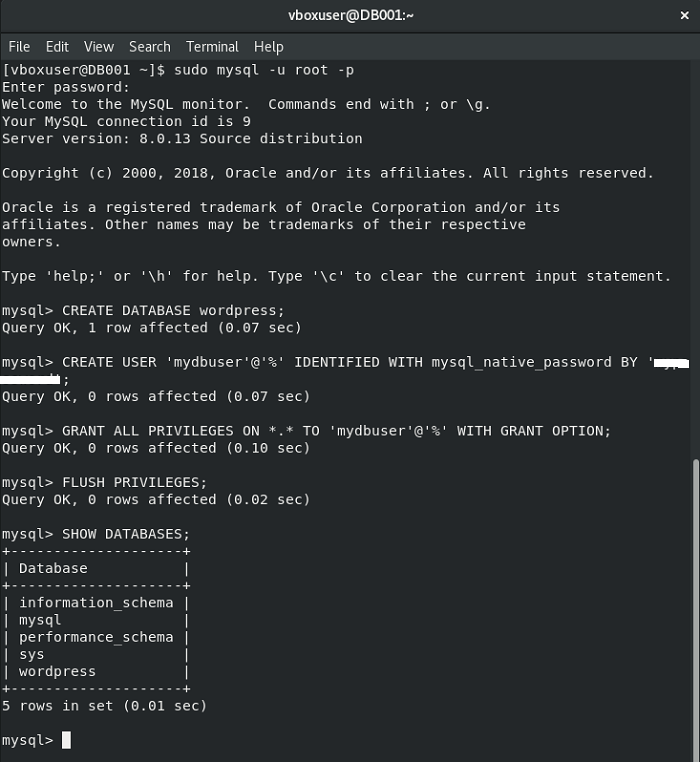

**Step 3: Configure WordPress to Connect to Remote Database**

**Hint:** It's important to open up MySQL port 3306 on the Database Server. To do this, we run the following commands on the Database Server

```
sudo firewall-cmd --zone=public --permanent --add-port=3306/tcp
sudo firewall-cmd --zone=public --permanent --add-service=mysql

```


**Step 4: Reload the firewall rules to apply the changes by running the command `sudo firewall-cmd --reload`**

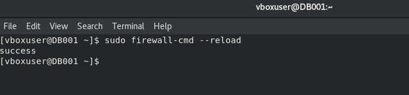

**Step 5: Verify the firewall rules by running the command `firewall-cmd --list-all`**


**Step 6: Set the Bind Address on the Database Server by editing the database configuration file (`my.cnf`) in `/etc`, running the command `sudo vi /etc/my.cnf`**

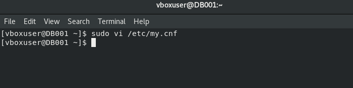

The below entries are added to the file:


**Step 7: Restart the `mysqld service` for the changes to take effect by running the command `sudo systemctl restart mysqld`**


## Configuring the Web Server to Connect to the Database Server

**Step 1: Edit the `wp-config.php` file on the Web Server and populate it with the relevant details which are the `DB_NAME, DB_USER, DB_PASSWORD, and DB_HOST` settings**


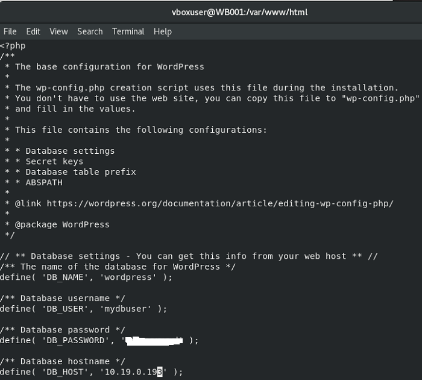

**Step 2: Restart the `httpd` service by running the command `sudo systemctl restart httpd`**

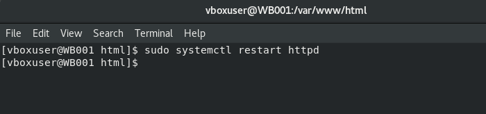

**Step 3: Rename the Apache welcome page**


**Step 4: Connect to the Database Server from the Web Server by running the command `sudo mysql -u 'user' -p -h <DB-Server-Private-IP-address>`, where `user` is the database user created earlier and `<DB-Server-Private-IP-address>` is the Private IP address of the database server.**


From the above, it's clear that the Web Server can access the database hosted on the Database Server.

**Step 5: Let's run a query from the Web Server database client to the Database Server**


**Step 6: Enable inbound rules for TCP port 80 on the Web Server**


**Step 7: Access WordPress through the browser on the Web Server**


 

