# Documentation for the LAMP Stack Implementation Project

There are different technology stacks used in the development of various solutions such as software, applications, websites, etc. These technology stacks are known as Web Stacks and they include the LAMP, LEMP, MERN, and MEAN stacks. As a DevOps Engineer, it is important to have a good knowledge and understanding of how to implement these technology stacks.

What is a Technology Stack?

A technology stack is a set of tools and frameworks used to build or develop software products. They are specifically used together in the creation of functional software or applications. These technology stacks are named using the acronyms of the individual technologies involved in developing a particular product.

Examples of technology stacks are:

- LAMP (Linux, Apache, MySQL, PHP (or Python or Perl))

- LEMP (Linux, NginX, MySQL, PHP (or Python or Perl))

- MERN (MongoDB, ExpressJS, ReactJS, NodeJS)

- MEAN (MongoDB, ExpressJS, AngularJS, NodeJS)

## Introduction to LAMP Stack Architecture

The LAMP stack consists of four (4) different software technologies that developers use to build web applications and websites. The LAMP stack is quite popular among developers because all four technologies are open source; they are maintained by a community and freely available for everyone to use. They are free of cost, easy to use, easy to maintain, and flexible.

The LAMP architecture is great for creating, hosting, and maintaining web content.

The acronym LAMP can be broken down as follows:

- L (Linux operating system)

- A (Apache web server)

- M (MySQL database server)

- P (PHP programming language)

## Spinning up an EC2 instance and Creating an Ubuntu Linux Server OS

Amazon Web Services (AWS) is a cloud services provider that facilitates on-demand delivery of IT resources over the internet through a pay-as-you-go pricing template.

For this project, I'll be using free-tier servers on the AWS platform known as EC2 (Elastic Compute Cloud) running on the Ubuntu Server OS.

To spin up the required EC2 instances for my project, I'll need to log into my AWS account

To create the EC2 instances, I follow these steps;

1. Clicked on 'Launch a Virtual Machine'

2. On the 'Launch an instance' page, fill in the details for my servers and the number of instances I need, then select Ubuntu as my preferred OS.

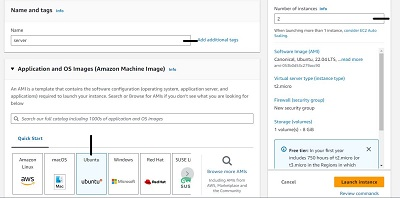

3. Select a 'free-tier eligible' AMI (Amazon Machine Image) 

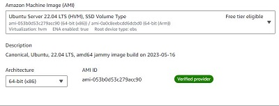

4. Create a key pair for secure connection to my EC2 instances or select an existing (saved) key pair

5. Click on 'Launch instance' at the bottom of the page to launch the EC2 instances

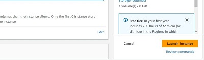

6. The two EC2 instances have been created and they are both running on the Ubuntu Server OS

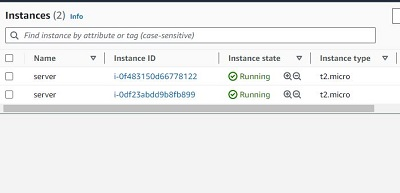

7. The servers can be renamed to indicate their individual identities

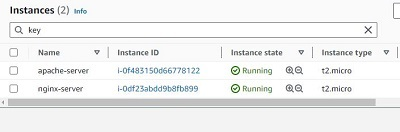

## Connecting to the Apache EC2 Instance

To connect to the Apache server I just created on AWS, I'll be using a software known as Termius.

To connect to the Apache server:

1. Click on 'NEW HOST' on the termius software

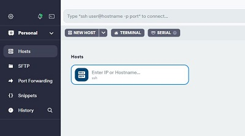

2. Copy the Public IPV4 address from the Apache server instance on AWS

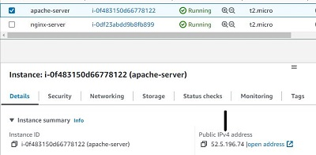

3. Paste the IP address in the New Host configuration pane in Termius

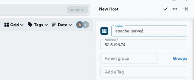

4. Set the Username as 'ubuntu', and import the key file saved earlier from AWS. Note that SSH uses TCP port 22 for connections and this is usually open by default on our EC2 instance.

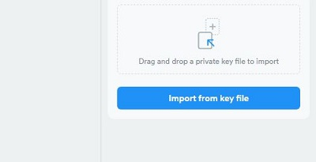

5. Save the imported key file

 
 6. Launch the server by double-clicking on the host created in Termius

 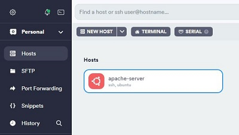

 Successful connection to the Apache EC2 instance

 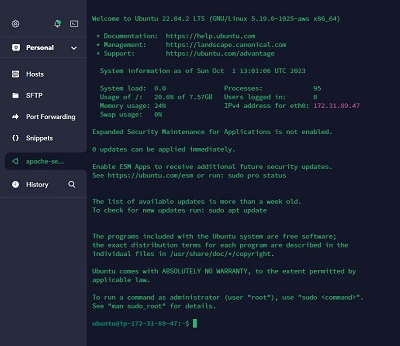

 To connect to the Nginx server, all we need to do is follow the steps 1 to 6 above. However, I won't be connecting to the Nginx web server for this project.

 ## Installing Apache and Updating the Firewall

 Created and managed by the Apache Software Foundation, Apache is an open-source software. It is the most widely-used web server software. 

 To install Apache on the server, follow these steps:

 1. Update the list of packages using the Ubuntu package manager by running the command `sudo apt update`

 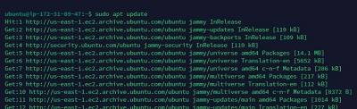

 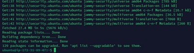

 2. Install Apache by running the command `sudo apt install apache2`

 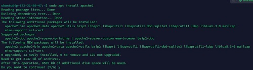

 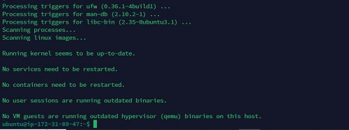

3. Verify that apache2 is running by using the command `systemctl status apache2`

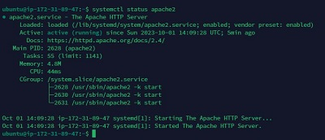

The result shows that the service is enabled and active (running)

### Updating the Firewall rules

For the Apache web server to accept inbound traffic, we need to open up TCP port 80 on the Apache EC2 instance. Web browsers use port 80 to access web pages on the internet. 

The steps to do this are shown below:

1. Click on the relevant EC2 instance and go to the security tab

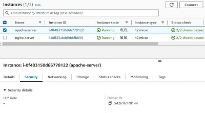

2. Click on the security groups link

3. Click on 'Edit inbound rules'

4. To add HTTP (port 80) to the list of rules, click on 'Add rule' and select HTTP from the drop down menu. Change the source to 'Anywhere-IPV4'. Then click on 'Save rules'

- To access the Apache web server locally, run the commands `curl http://localhost:80` or `curl http://127.0.0.1:80` in the web server instance:

a. `curl http://localhost:80`

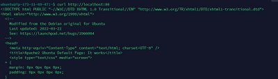

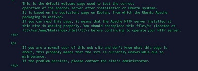

b. `curl http://127.0.0.1:80`

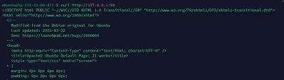

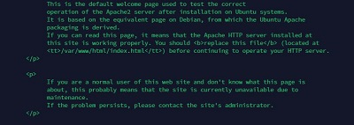

The above outputs show that we can connect successfully to the Apache server.

- To access the Apache web server through a web browser, type the command `http://52.5.196.74` in a web browser (where 52.5.196.74 is the public ip address of the Apache web server) and hit enter.

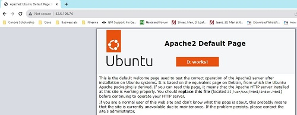

The above page shows that the web server is correctly installed and accessible through the local firewall.

## Installing MySQL

MySQL is a Database Management System (DBMS) that allows us to store and manage data. 

To install MySQL, I followed the steps below:

1. Run `sudo apt install mysql-server` in the Apache web server

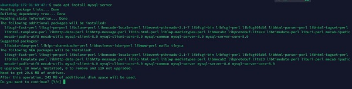

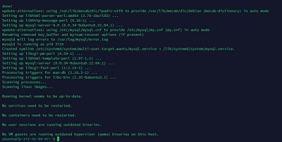

2. Verify the MySQL installation by logging into console through the command `sudo mysql`

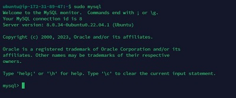

3. It's important to run a security script on the MySQL installation to remove insecure default settings and lockdown access to the database management system.

The command to run to set the MySQL password of this installation to 'PassWord.SQL' is `ALTER USER 'root'@'localhost' IDENTIFIED WITH mysql_native_password BY '********.***'`

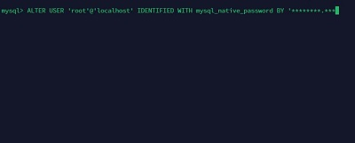

To start the interactive script, run `sudo mysql_secure_installation`

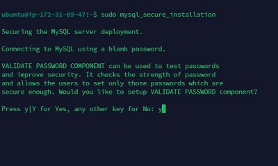

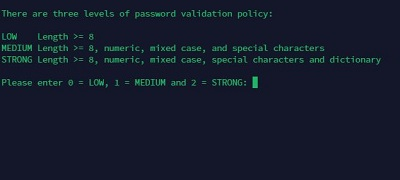

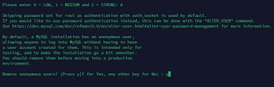

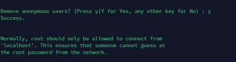

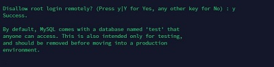

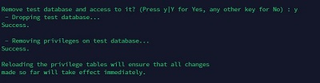

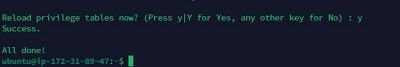

4. Run the command `sudo mysql -p` to test if I can access the MySQL console using the set password.

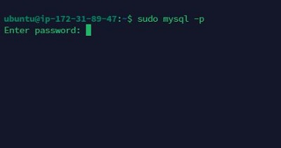

The login is successful after entering my password.

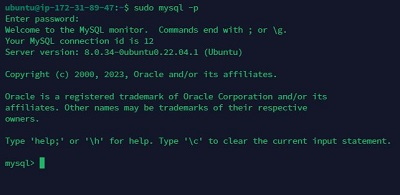

## Installing PHP

PHP is the last component in the LAMP stack. It is a server-side scripting language responsible for processing code to create and display dynamic content as well as interact with databases.

To install PHP, it's essential to install the PHP package alongside php-mysql, a PHP module that allows PHP to communicate with MySQL databases and the libapache2-mod-php library that enables Apache to handle PHP files.

The command to run these three packages at once is `sudo apt install php libapache2-mod-php php-mysql`

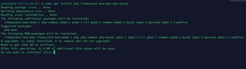

PHP is installed successfully

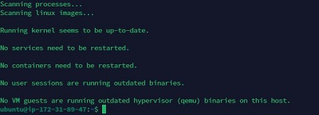

To verify the version of PHP installed, we can run the command `php -v`

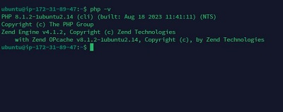

### Enabling PHP on a Wesbsite

Apache has a directory index setting that gives the index.html precedence over index.php file. Index.html is great for maintenance purposes or for creating informative messages for visitors. As the index.html page takes precedence over the index.php page, the former becomes the landing page for the application. Once maintenance is over, we can then rename or remove the index.html file from the document root. 

To change this behavior, we can edit the **/etc/apache2/mods-enabled/dir.conf** file and change the order in which the index.php file is listed, using the command `sudo nano /etc/apache2/mods-enabled/dir.conf`

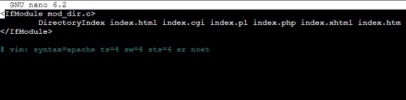

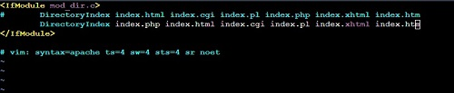

For the changes to take effect, reload Apache using the command `sudo systemctl reload apache2`

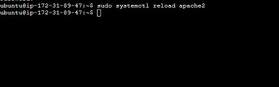

Lastly, we'll need to create a PHP test script to verity that PHP is correctly installed on the server.

Firstly, we'll need to create an index.php file in the custom web root folder `/var/www/html`.

After creating the php.index file, add the following code to it;

*<?php
phpinfo();*

We then remove or rename the existing index.html file in the custom web root folder.

When I load the web page using the public ip address of the server, the PHP welcome page loads up.

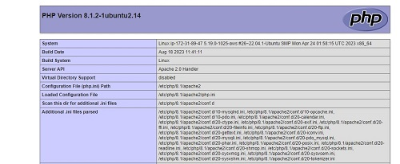

The above image proves that the PHP installation is working perfectly.

Once it's been ascertained that the PHP installation is successful, I'd have to remove the index.php file from the web root folder using the `rm` command, and rename the index.html file so that Apache installation homepage can load up normally again.

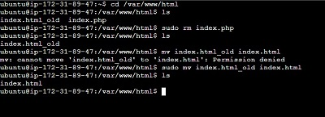

## Creating an Apache Virtual Host for Website Files and Folders

Now that all the components of the LAMP Stack have been installed, we can test the functionality by creating a Virtual Host that'll allow us to host multiple websites on a single machine.

